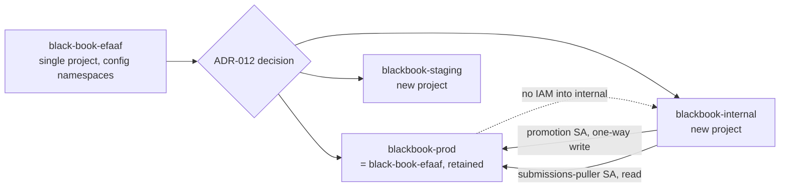

# ADR-012: Production environment re-split (multi-project isolation)

- **Status:** Accepted
- **Date:** 2026-07-17
- **Bead:** BB-078
- **Depends on:** ADR-005, ADR-006, ADR-009, ADR-010, ADR-011, D-013
- **Supersedes:** D-013 (single-project production) and the single-project mode described in
  `docs/security/environment-isolation.md` prior to this ADR
- **Implements toward:** BB-079 (production cloud apply), BB-089 (pre-launch resilience)

## Scaffold vs target

| Aspect | Today (verified) | Target (this ADR) |
|--------|-------------------|--------------------|
| GCP/Firebase projects | One: `black-book-efaaf` (`332234323945`), staging/research as configuration namespaces inside it | Three: `blackbook-prod` (= `black-book-efaaf`, retained), `blackbook-staging` (new), `blackbook-internal` (new) |
| Firestore | Single `(default)` database in `black-book-efaaf` | `(default)` database in `blackbook-prod`/`blackbook-staging`; two **named databases** `raw-ingest` and `curated` in `blackbook-internal` |
| Admin console | Designed as Cloud Run + IAP, but the only written IAP design (`infra/gcp/iap/`) assumes an external HTTPS load balancer + serverless NEG | Cloud Run + IAP with **direct** IAP-on-Cloud-Run (no load balancer/NEG) |
| Submissions flow | Public intake writes quarantine/submissions in the same project research/publication already share | Public intake stays in `blackbook-prod`; `blackbook-internal` **pulls** from it. No push from internal into prod's intake path |
| Promotion | Same-project IAM (`publication`/`api-internal` roles) | Cross-project: one identity in `blackbook-internal` is the only writer into `blackbook-prod`'s canonical/public data |
| CI/CD identity | One WIF pool + one production deploy SA, optional same-project staging SA | One WIF pool (hosted in `blackbook-prod`), three per-project deploy SAs, CEL conditions pinning repository + ref + protected environment per project |
| Local dev | `demo-black-book` emulators | Unchanged |

## Context

D-013 (2026-07-16) collapsed the original four-project target (`blackbook-dev`, `blackbook-staging`,
`blackbook-prod`, `blackbook-research-prod`) into the single live project `black-book-efaaf`, with
"staging" and "research" as configuration namespaces rather than project boundaries. ADR-009 itself
recorded that decision as accepting "weaker blast-radius isolation than a project split," and both
D-013 and `docs/security/environment-isolation.md` named the explicit re-split triggers: independent
billing/residency/org-policy/incident/recovery boundaries becoming required, or non-production needing
production-like data or destructive tests.

Two things changed since D-013:

1. **Owner brief (2026-07-17):** "this project is production... isolating for security purposes... I'd
   like to stay in Firebase" — full judgement granted on how to execute the split, provided it stays
   inside Firebase/GCP.
2. **Nothing is live.** `black-book-efaaf` is still pre-Blaze: no App Hosting backend, no provisioned
   service accounts, no bucket, no Firestore database enabled, no production data, no deployed traffic
   (see `docs/security/environment-isolation.md` verified/designed table). This is the cheapest point
   in the project's life this migration will ever be — every bead executed against `black-book-efaaf`
   so far shipped design and repo scaffolding, not live cloud state.

Firebase's own guidance is one project per environment; running multiple environments inside one
project is explicitly discouraged for App Hosting. Cloud Firestore's named-database feature (GA)
gives per-database IAM/rules/billing visibility *within* a project — useful for separating pipeline
stages, but not a substitute for a project boundary between environments or between public-facing and
research/admin workloads.

Separately, Google Cloud shipped direct IAP support for Cloud Run: a Cloud Run service can now enable
IAP on the service itself, without an external HTTPS load balancer, serverless NEG, or backend service
in front of it. The only IAP design written for this repo, `infra/gcp/iap/README.md` (BB-027), assumes
the older external-LB pattern ("An external HTTPS load balancer is the only public entry point... Create
the serverless NEG, external HTTPS load balancer, and backend service"). `docs/security/service-surfaces.md`
and `infra/gcp/isolation-matrix.json` already describe the admin surface correctly at the level of
"Cloud Run + IAP" — they do not commit to App Hosting for admin — but the one concrete provisioning
design (`infra/gcp/iap/`) is now stale on the LB requirement and needs a fast-follow correction (see
Consequences; that directory is out of scope for this bead's file ownership).

## Decision

Adopt a **three-project** topology, all inside the existing Firebase account:

### 1. `blackbook-prod` — public serving

- **GCP project ID:** `black-book-efaaf` (project number `332234323945`), **retained, not recreated**
  (see "Why keep `black-book-efaaf`" below).
- Firebase App Hosting backend for `apps/web` (public UI), `apps/api-public` (Cloud Run, public read),
  `apps/api-submissions` (Cloud Run, public intake).
- Firestore `(default)` database: public projections under `public/**` plus a **create-only**
  `submissions` collection. No other writers to `public/**` than the cross-project `promotion`
  identity (see below); `api-submissions` writes only `submissions`, never `public/**`.
- Buckets: `public-media`, `exports`, `quarantine` (co-located with the public intake surface that
  creates quarantine objects).
- Firebase Auth, App Check **enforced** (not metrics-only).
- Secret Manager: production secrets only. No staging or research secret ever lives here.
- Budget: **no billing kill-switch that can silently take prod dark.** Budget alerts are notify-only
  escalation; automatic hard shutdown is not wired to this project (matches the existing
  `autoDisablePublicCorpus = false` principle in `docs/security/cost-resource-controls.md`).

### 2. `blackbook-staging` — pre-production mirror

- New project. Mirrors `blackbook-prod`'s shape 1:1 (same App Hosting backend name pattern, same
  Cloud Run services, same Firestore collection layout) so staging is a true rehearsal environment,
  not a namespace.
- **Synthetic data only.** No production export, no production credential, ever imported here.
- `minInstances: 0` everywhere — staging is not expected to hold warm capacity; cold starts are
  acceptable for a pre-production rehearsal environment.
- Its own Secret Manager namespace, its own budget, and (per the existing WIF pattern) an
  **optional** deploy identity gated by a variable, not a default-on identity.

### 3. `blackbook-internal` — research pipeline + admin

- New project. Hosts `workers/research`, `workers/publication` (promotion pipeline), `workers/security`,
  and the admin console (`apps/admin`).
- **Named Firestore databases** (GA feature) instead of one `(default)` database:
  - `raw-ingest` — high-volume, bursty writes from research source adapters. Isolating this as its own
    named database keeps ingestion write hotspots from contending with, or sharing a billing/rules
    surface with, curated/reviewed data.
  - `curated` — reviewed/normalized data staged for promotion. Distinct IAM and rules from
    `raw-ingest`: research writes `raw-ingest` only; the curation step reads `raw-ingest` and writes
    `curated`; the cross-project `promotion` identity reads `curated` only.
  - Per-database IAM conditions (`resource.name.startsWith("projects/blackbook-internal/databases/<id>")`)
    enforce this — see `infra/gcp/terraform/multi-project/firestore.tf`.
- Bucket: `private-evidence` (raw research evidence; never public, never readable by any `blackbook-prod`
  principal).
- **Admin console runs as a plain Cloud Run service behind Identity-Aware Proxy, with IAP attached
  directly to the Cloud Run service.** No external HTTPS load balancer, serverless NEG, or backend
  service is required — this is a change from the only concrete IAP design in the repo
  (`infra/gcp/iap/README.md`, BB-027), which assumed the load-balancer pattern because that was the
  only way to put IAP in front of a Cloud Run service when it was written. App Hosting backends
  **cannot** sit behind IAP at all (Firebase App Hosting does not expose the backend-service seam IAP
  attaches to), so admin was never a candidate for App Hosting — `docs/security/service-surfaces.md`
  and `infra/gcp/isolation-matrix.json` already say "Cloud Run + IAP" for admin and do not need
  correction. What needs correction is `infra/gcp/iap/README.md`'s *mechanism* (LB+NEG to direct
  Cloud-Run-attached IAP); that file is outside this bead's file ownership (see Consequences).
- Billing kill-switch (automatic hard budget stop) is **acceptable here, and only here.** Research and
  admin workloads may go dark under a cost spike; public serving must not.

### 4. Local development — unchanged

`demo-black-book` Firestore/Auth/Storage emulators remain the only local development target. No
project split changes this; AC-ISO-1 restated below still resolves the same way locally.

### Why keep `black-book-efaaf` as `blackbook-prod`

GCP/Firebase project IDs are immutable — there is no "rename" operation. The only way to get a
project literally named `blackbook-prod` is to create a new project and migrate into it. We choose
**not** to do that:

- `black-book-efaaf` currently holds nothing that a migration would need to move: no Blaze upgrade, no
  App Hosting backend, no provisioned service account, no bucket, no enabled Firestore database, no
  production data. The only things registered against it are the Hosting site placeholder
  (`black-book-efaaf.web.app`) and two Firebase app registrations (`infra/firebase/registered-apps.json`).
  Recreating those in a fresh project buys nothing.
- The project ID is an internal identifier, not the public brand. Public traffic is expected to reach
  the product through a custom domain, not `black-book-efaaf.web.app`; the ID's cosmetic mismatch with
  `blackbook-prod` naming is a non-issue once a custom domain is configured (tracked separately, not
  this bead).
- Every place in the repo that already encodes `black-book-efaaf` (`isolation-matrix.json`,
  `service-accounts.matrix.md`, WIF trust conditions, `.firebaserc`) stays correct for the production
  project without a rename sweep, reducing the surface for a copy/paste isolation mistake during the
  highest-risk phase of this change.

`blackbook-staging` and `blackbook-internal` get clean names because they are genuinely new projects
with no history to preserve.

## One-way promotion IAM asymmetry

The core security property of this ADR: **compromising `blackbook-internal` cannot publish to
`blackbook-prod` beyond exactly one narrow, auditable write path, and compromising `blackbook-prod`
cannot reach `blackbook-internal` at all.**

| Direction | Principal | Grant | Purpose |
|-----------|-----------|-------|---------|
| internal → prod | `promotion@blackbook-internal.iam.gserviceaccount.com` | Firestore write on `public/**` projections (prod, `(default)` DB); `roles/storage.objectAdmin` on `public-media`, `exports` | The **only** identity — including any `blackbook-prod`-native identity — that writes public projections. `api-internal` in prod no longer holds a promotion-equivalent write grant; promotion is pushed from internal, not pulled or triggered from prod. |
| internal → prod | `security@blackbook-internal.iam.gserviceaccount.com` | `roles/storage.objectAdmin` on `quarantine` (prod); `roles/storage.objectCreator` on `public-media` (post-scan promotion) | Scans and promotes quarantined uploads without needing quarantine to live in `blackbook-internal`. |
| internal → prod | `submissions-puller@blackbook-internal.iam.gserviceaccount.com` | Firestore read on `submissions` collection (prod, `(default)` DB) | Reverses the old same-project submissions flow: `blackbook-internal` **pulls** new submissions from prod's create-only collection for triage, instead of submissions being written into a shared research-adjacent store. |
| prod → internal | **none** | **none** | Invariant. No `blackbook-prod` principal (`web-runtime`, `api-public`, `api-submissions`, `github-deploy-prod`, or any human production-access grant) holds any IAM binding in `blackbook-internal`. |

`api-submissions@blackbook-prod` keeps its existing same-project, create-only write to the `submissions`
collection and the `quarantine` bucket — that grant does not change; what changes is that nothing
downstream of it lives in the same project, and nothing reads it except the puller.

This is intentionally the entire cross-project grant list. `infra/gcp/isolation-matrix.json`'s
`crossProjectGrants` array now has exactly these four entries (see Terraform in
`infra/gcp/terraform/multi-project/iam-cross-project.tf`); anything not in that list is denied by
project boundary alone, which is the isolation improvement this ADR buys over D-013's same-project
IAM-only boundary.

### Optional hardening: VPC Service Controls (documented only, not built)

A VPC-SC perimeter around `blackbook-internal` with a single egress rule permitting only the
`promotion` and `security` service accounts to reach `blackbook-prod`'s Firestore/Storage APIs would
make the one-way flow **policy-enforced** (violations blocked at the API-control-plane layer,
independent of any IAM misconfiguration) rather than convention-plus-IAM-enforced. This is not built in
this bead:

- VPC-SC perimeters require an Access Context Manager policy, which in turn requires the project to sit
  under a GCP organization (see "No GCP org yet" below) — provisioning it now would be speculative
  Terraform against resources that cannot exist yet.
- It is additive hardening on top of an already-asymmetric IAM design, not a replacement for it; the
  IAM asymmetry above is the load-bearing control.

Revisit as a fast-follow once an org exists (see Consequences).

## CI/CD identity split

Extends `infra/gcp/wif/` (BB-010) rather than duplicating it. One Workload Identity Pool, hosted in
`blackbook-prod` (the pool is a project-scoped resource; principals it mints can be granted IAM in any
project, which is exactly what per-project deploy SAs need). Three deploy identities:

| Deploy SA | Project | Trust (CEL, on the shared provider) |
|-----------|---------|--------------------------------------|
| `github-deploy` (unchanged name) | `blackbook-prod` | `repository_id` + `repository_owner_id` match, `ref == refs/heads/main` (the release branch), `environment == "production"` (protected GitHub Environment) |
| `github-deploy-staging` (already existed, optional) | `blackbook-staging` | same repository/owner match, `environment == "staging"` |
| `github-deploy-internal` (new, optional) | `blackbook-internal` | same repository/owner match, `environment == "internal"` |

The repository + ref pinning was already correct for production in the BB-010 design
(`infra/gcp/wif/trust-conditions.md`); this ADR's change is making the deploy **service account** and
its IAM binding project-scoped per environment, so a compromised or misconfigured `staging`/`internal`
deploy context has no path to a `blackbook-prod` credential — the provider's attribute condition and
the target SA's project are now both part of the boundary, not just the environment claim string.

### No GCP organization yet

There is currently no GCP organization resource wrapping these projects (personal/no-org Google Cloud
account). `iam.disableServiceAccountKeyCreation` is an organization policy; it cannot be attached
without an org. This repeats the exact situation BB-010 already documented and solved the same way:
`manage_org_policies` stays a Terraform variable defaulting to `false`, gated per project, with the
equivalent enforced by convention until an org exists:

- No SA key is ever created for any of the eleven+ identities across the three projects (WIF only).
- `infra/gcp/wif/deploy-roles.md` and `service-accounts.matrix.md` both list "no exported keys" as a
  hard must-not-have, checked in the deny checklists.
- The moment an org is created (a one-time human action, not part of this bead), flip
  `manage_org_policies = true` per project and the same Terraform applies the real constraint —
  no design change required.

## Migration plan (from `black-book-efaaf`)

Full step-by-step is in `docs/runbooks/production-environment-resplit-migration.md`. Summary order:

1. Create `blackbook-staging` and `blackbook-internal` projects; link billing.
2. Provision per-project service accounts, Firestore databases (including the two named databases in
   `blackbook-internal`), and buckets from `infra/gcp/terraform/multi-project/`.
3. Apply the cross-project IAM bindings (promotion, security, submissions-puller) and confirm the
   negative case (no `blackbook-prod` principal resolves any role in `blackbook-internal`).
4. Extend WIF: add `github-deploy-internal`; re-point `github-deploy-staging` at the new
   `blackbook-staging` project instead of the same-project optional identity.
5. Re-provision `apps/admin` as a Cloud Run service in `blackbook-internal` with IAP attached directly
   to the service (no load balancer) — this also means `infra/gcp/iap/` needs a follow-up rewrite (see
   Consequences); this bead documents the target design in this ADR but does not touch that directory.
6. Move `workers/research`, `workers/publication`, `workers/security` deploy targets to
   `blackbook-internal`.
7. Confirm `black-book-efaaf` (`blackbook-prod`) keeps only public-serving resources; decommission any
   resource that should have moved to `blackbook-staging`/`blackbook-internal` but was provisioned in
   the shared project under the old D-013 design (there should be none, since nothing was applied).
8. Run the AC-ISO-1..5 cross-project invariant checks (below) before declaring the migration complete.

Nothing in steps 1–8 has been executed by this bead. All of it is `terraform validate`-only design.

## AC-ISO-1..5 restated as cross-project invariants

Restates `docs/security/environment-isolation.md`'s BB-005 acceptance invariants for the three-project
topology. Machine encoding: `infra/gcp/isolation-matrix.json` (`acceptanceCriteria[].enforcedBy`, each
now carries both the historical same-project bullets and a `[Target topology]`-prefixed cross-project
bullet). Test encoding: `infra/gcp/terraform/multi-project/tests/isolation-invariants.test.mjs`.

- **AC-ISO-1 — Development credentials cannot access production.** Now a **real project-separation
  claim** again (D-013 had marked this N/A). `demo-black-book` emulators remain local-only;
  `blackbook-staging` gives cloud-based pre-production testing a real project boundary from
  `blackbook-prod` for the first time, without touching production credentials, data, or quota.
- **AC-ISO-2 — Research workers cannot publish.** `research@blackbook-internal` has no grant in
  `blackbook-prod` at all (not even read). Only `promotion@blackbook-internal` can write prod's
  `public/**`, and `promotion` itself has no write grant on `raw-ingest` (it reads `curated` only) —
  a compromised research adapter cannot reach `promotion`'s prod grant by writing directly to a
  database `promotion` also has write access to, because there is no such shared database.
- **AC-ISO-3 — Public services cannot read private evidence.** `private-evidence` now lives in a
  project (`blackbook-internal`) that `web-runtime`/`api-public` (in `blackbook-prod`) have no project
  membership in, not just no bucket IAM. Project boundary plus bucket IAM, not bucket IAM alone.
- **AC-ISO-4 — Quarantine objects cannot be served publicly.** Quarantine stays in `blackbook-prod`
  (co-located with the public intake surface that creates it) with PAP enforced and UBLA on; the only
  cross-project reader is `security@blackbook-internal`, which has no publish or release-activation
  grant anywhere.
- **AC-ISO-5 — Submissions compromise cannot publish.** `api-submissions@blackbook-prod` still has
  exactly `submissions`-collection create and `quarantine`-bucket create, same as D-013; the project
  split adds that even a full `blackbook-prod` compromise (not just `api-submissions`) still cannot
  reach `blackbook-internal` to fabricate a promotion, because the promotion path is a pull initiated
  from `blackbook-internal`, not a callable prod endpoint.

## Rejected alternatives

| Alternative | Why rejected |
|-------------|---------------|
| Four-project split (restore the original `blackbook-dev`/`staging`/`prod`/`research-prod` target verbatim) | A cloud `dev` project buys little over `demo-black-book` emulators, which already give zero-cost, zero-blast-radius local development; a fourth project is ongoing IAM/billing surface for a workflow that doesn't need cloud credentials. Re-evaluate only if cloud-based development or destructive integration testing against realistic data becomes required (unchanged trigger from D-013/ADR-009). |
| Recreate `black-book-efaaf` as a fresh `blackbook-prod` project | Rejected above ("Why keep `black-book-efaaf`") — no live resource justifies the churn, and it multiplies the chance of an isolation mistake during the highest-risk phase of the change. |
| Keep admin on the same project as research but put it behind an external HTTPS LB + IAP (the BB-027 design as written) | Works, but is strictly more infrastructure (LB, serverless NEG, backend service) than the direct Cloud-Run-attached IAP integration GCP now supports, for identical security properties. Extra infrastructure is extra attack surface and extra Terraform to keep synchronized. |
| Two-way promotion (prod calls into internal to trigger promotion, or internal pushes on a webhook prod exposes) | Any callable path from prod into internal is a path a prod compromise could walk. A pull initiated entirely from `blackbook-internal`, reading a create-only collection prod already exposes to its own intake surface, needs no new prod-side attack surface at all. |
| VPC-SC perimeter built now | No GCP org exists yet to host the Access Context Manager policy; building the Terraform before the prerequisite resource can exist is speculative and can't be `terraform validate`d meaningfully beyond syntax. Documented as a fast-follow instead. |

## Consequences

- Three projects to keep in sync (Terraform, WIF, Secret Manager, budgets) instead of one — accepted
  cost of real isolation, consistent with ADR-005's "more deployables and IAM to manage" trade-off.
- `infra/gcp/iap/README.md` and `infra/gcp/iap/admin-iap-policy.json` (BB-027) still describe the
  external-LB IAP pattern and need a follow-up rewrite to the direct Cloud-Run-attached IAP mechanism
  this ADR specifies. That directory is outside this bead's file ownership (BB-078 owns
  `infra/gcp/terraform/**`, `infra/gcp/wif/**`, and `infra/gcp/isolation-matrix.json`, not
  `infra/gcp/iap/**`) and is flagged as follow-up work, not silently left inconsistent.
  BB-021's own docs (`docs/security/service-surfaces.md`, `infra/gcp/isolation-matrix.json`) already
  said "Cloud Run + IAP" for admin and required no correction on that point.
  `docs/security/admin-identity.md` (BB-027) is also unaffected at the application-authorization layer
  (IAP JWT + Firebase MFA layering is unchanged by which mechanism attaches IAP to Cloud Run).
- `workers/submissions-puller` (the pull-based internal ingestion worker) is a new logical surface this
  ADR names and gives an identity to, but its implementation is out of scope for this bead
  (`workers/` is outside BB-078's file ownership). A follow-up bead must implement it; until it exists,
  `submissions-puller@blackbook-internal`'s Firestore-read grant in prod is declared but unconsumed.
- `apps/admin`'s SA moves projects; any hardcoded `black-book-efaaf` reference in admin's own runtime
  config (outside this bead's file ownership) will need updating when BB-079 actually applies this.
- Cost: three Firebase/GCP projects instead of one has a small fixed per-project overhead (separate
  budgets, separate Secret Manager namespace, separate audit log sink) but avoids the larger risk this
  ADR exists to close — a same-project IAM mistake collapsing prod/research/admin isolation, which
  ADR-009 already flagged as the accepted weakness of the D-013 design.

## Reversibility

Two-way door in principle (projects can be deleted and traffic pointed back at a single project), but
expensive once real production data and traffic exist — which is exactly why this ADR times the split
for "before anything is live." Reversing after BB-079 applies this would mean either a live data
migration back into one project or accepting permanent three-project overhead; reversing **before**
BB-079 applies it costs nothing beyond discarding unapplied Terraform.

## References

- `docs/security/environment-isolation.md` — restated as current topology by this ADR
- `infra/gcp/isolation-matrix.json` — machine encoding, `crossProjectGrants` + restated `acceptanceCriteria`
- `infra/gcp/terraform/multi-project/` — unapplied Terraform for the three-project topology
- `infra/gcp/wif/` (BB-010) — extended, not duplicated, for per-project deploy identities
- `docs/runbooks/production-environment-resplit-migration.md` — human-executable migration runbook
- ADR-005 (service surface separation), ADR-009 (research isolation), ADR-011 (Firestore system of record)
- `.cx/decisions/D-013-single-project-production.md` — superseded by this ADR (marked, not deleted)
- Google Cloud documentation (primary sources, not reproduced verbatim here): Firestore named databases
  (GA, per-database IAM conditions), IAP direct integration for Cloud Run, Workload Identity Federation
  attribute conditions, Firebase App Hosting environment guidance
