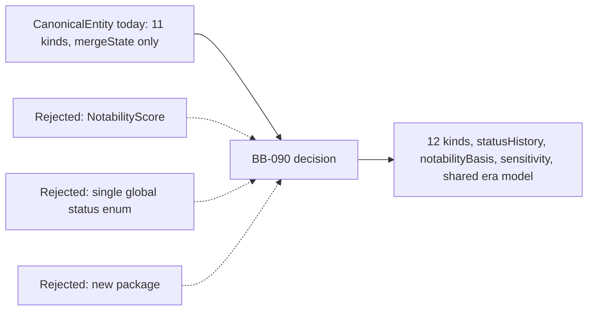

# ADR-015: Entity ontology — kind-specific status lifecycle, notability basis, and era model

- **Status:** Accepted
- **Date:** 2026-07-17
- **Bead:** BB-090
- **Depends on:** ADR-011 (Firestore system of record)
- **Implements toward:** BB-086 (FactRecord spec), BB-087 (legal landscape badges), BB-088
  (editorial trust / methodology definitions), BB-092 (history graph substrate), BB-094
  (vetted-corpus bulk intake), BB-095 (sensitivity presentation)

## Scaffold vs target

| Aspect | Today (verified, pre-BB-090) | Target (this bead) |
|--------|------------------------------|---------------------|
| Entity lifecycle status | Only `EntityMergeState.status` exists (active/merged_away/superseded) — no notion of "is this place still standing" | Kind-specific `statusHistory[]` on `CanonicalEntity`, time-scoped, current status always derived |
| Inclusion rubric | Emergent from relevance+confidence gates only, invisible to readers ("why is X in and Y out" has no auditable answer) | `notabilityBasis[]` — structured, evidence-backed records; >=1 required to publish |
| Era/decade model | `era` is a free string in the web seed (`apps/web/src/data/public-seed.ts`); decades are computed only inside `packages/firebase/src/embeddings/text.ts`'s local `deriveEraBucket` | `datePrecision` + `deriveEraBuckets` defined once in `@repo/domain`, consumed everywhere |
| Entity kinds | 11 (person, place, school, organization, institution, event, law, case, publication, artifact, other) | 12 — adds `movement` (Civil Rights Movement, Great Migration, Black Power, Black Arts Movement, etc.) |
| Sensitivity | No schema at all | Schema-only `sensitivity[]` classification; presentation is BB-095 |

## Problem

`CanonicalEntity` (BB-014) already carries `mergeState` — a lifecycle for *merge* status — but
nothing answers "is this place still standing," "is this law still in force," or "was this
school active in 1930." Every kind that plausibly has a lifecycle (place, school, organization,
institution, law) currently has no status field at all; BB-087's law badges and BB-082's
place-condition work both need one but have nothing to import.

Separately, inclusion in this product is deliberately narrow — "not all rappers who are Black,
but icons, firsts, hall-of-famers" (owner brief) — but the *reason* a given entity cleared that
bar today lives only inside relevance-gate internals (`packages/domain/src/relevance/`), which
are about discovery signal strength and geographic/thematic corroboration, not about "why is this
specific person notable enough to include." A reader auditing "why is X in this index" has no
structured answer, and a data-quality reviewer has no field to check.

Finally, "era" is a free string in the web seed and a duplicate, singular decade-bucketing
function lives inside `packages/firebase/src/embeddings/text.ts` (`deriveEraBucket`), with no
shared vocabulary for date precision (a `circa` date and an exact day are currently
indistinguishable in the type system) and no way to compute every decade a multi-year span
touches (needed for "show me the 1960s" queries against entities like people whose life spans
multiple decades).

## Context

- BB-014 already ships `CanonicalEntity` (11 kinds), `EntityAlias`/`EntityLocation`/
  `EntityRelationship`'s shared `validFrom`/`validTo?: string | null` idiom, and per-kind field
  bags (`PersonFields`, `SchoolFields`, etc.) as optional bags on the same document.
- BB-015 (living-person compliance) already defines `LivingStatus` and `treatAsLiving()` —
  unknown status is treated as living. Person status in this bead must derive from that single
  source, not duplicate it.
- BB-040 (deterministic relevance engine) already runs 7 sequential gates
  (`packages/domain/src/relevance/gates.ts`) over a `DiscoveryCandidateRecord`, before a
  canonical entity exists, and already bans numeric scores from public output
  (`assertPublicRelevanceHasNoScore`, `assertExplanationHasNoNumericScore`).
- BB-082 (historic safety and place-context engine, still open) needs its own time-scoped,
  evidence-backed layer for area/condition designations (sundown-town, redlining grade, exclusion
  infrastructure). An earlier draft of this bead's design conflated that with entity-lifecycle
  status; the amendment correcting that is captured in Decision 2 below.
- `packages/domain/src/school.ts` already has a field also named `statusHistory`
  (`SchoolFields.statusHistory: readonly SchoolStatusEntry[]`, shape
  `{status: string, at: string, evidenceIds?, notes?}`) — a free-text operational timeline, not a
  closed-vocabulary lifecycle. This collides in name (not in TypeScript path, but in a reader's
  mental model of "the entity's statusHistory") with the new entity-level field this bead adds.
- Standing product policy bans numeric notability/relevance scores from any public payload
  (already enforced for relevance in `relevance/public.ts`; extended here to notability).

## Decision

1. **Kind-specific status vocabularies, not one global enum.** `place`/`school`/`organization`/
   `institution` share `active | historic | inactive`; `law` gets
   `in_force | amended | repealed | struck_down | enjoined` (the exact vocabulary BB-087 imports);
   `movement` gets `active | historic` (no `inactive` — a movement concludes, it doesn't pause);
   `person` has **no independent status field** — it derives from the existing `livingStatus` via
   `personStatusFromLiving()`; `event` has **no status field at all** — its when-span
   (`EventFields.startAt`/`endAt`) is authoritative. All vocabularies and the derivation function
   live in `packages/domain/src/entity-status.ts`.
2. **`statusHistory` is entity-lifecycle status only — never area/condition designations.**
   `StatusHistoryEntry` is `{status, validFrom?, validTo?, datePrecision, basisClaimIds}`, added
   as `CanonicalEntity.statusHistory?: readonly StatusHistoryEntry<EntityStatusValue>[]`. Current
   status is derived, never hand-edited: `currentStatus()` picks the open-ended
   (`validTo` omitted/null) record; `statusAsOf()` answers point-in-time queries. BB-082's own
   sundown-town/redlining-grade/exclusion-infrastructure layer records are explicitly **not**
   this field — they get their own, separately-typed record in BB-082's territory, following the
   same time-scoped pattern but never merged into this array. Both `entity.ts` and
   `entity-status.ts` carry an explicit code-comment guardrail to this effect (see "Scope
   guardrail" callouts in both files).
3. **Notability is an auditable basis record, never a score.** `NotabilityBasisRecord` is
   `{criterion, note, evidenceIds}` with `criterion` drawn from an 8-value enum
   (`first_to_do_x | major_honor_or_hall_of_fame | landmark_or_national_register |
   court_precedent | movement_significance | documented_site | community_anchor |
   only_or_oldest`). `CanonicalEntity.notabilityBasis?: readonly NotabilityBasisRecord[]`; at
   least one record is required to publish (`hasRequiredNotabilityBasis()`). This is wired as an
   **8th** `RelevanceGateId` (`notability_basis`,
   `packages/domain/src/relevance/types.ts` `RELEVANCE_GATE_IDS`), evaluated by
   `evaluateNotabilityGate()` / enforced (fail-closed) by
   `assertPublishableEntityHasNotabilityBasis()`
   (`packages/domain/src/relevance/notability-gate.ts`) — additive to, and sharing the exact
   `RelevanceGateResult` shape as, the 7 existing discovery-time gates, never replacing any of
   them. Per-criterion rubric text (`NOTABILITY_RUBRIC`) is committed as reviewable prose destined
   for BB-088's methodology section. The cultural-figure calibration ships as
   `icons_and_firsts_only` (`CULTURAL_FIGURE_NOTABILITY_CALIBRATION`): hall-of-fame induction, a
   major national honor, a documented first, or documented movement significance qualify;
   commercial milestones (certifications, chart position, sales, box-office) never qualify alone.
   This calibration is pending owner ratification before BB-094 auto-derives candidate notability
   from it.
4. **Shared era model, one function, everywhere.** `packages/domain/src/era.ts` defines
   `DatePrecision = day | month | year | decade | circa` and `EraSpan =
   {validFrom, validTo?, datePrecision}` (reusing the existing validFrom/validTo idiom rather than
   inventing a new start/end shape). `deriveEraBuckets(span)` maps any span to every overlapping
   decade inclusive of both ends (`1948–1972 → 1940s,1950s,1960s,1970s`) and is the single
   canonical implementation. `packages/firebase/src/embeddings/text.ts`'s local `deriveEraBucket`
   (singular, anchor-only — feeds a single-value Firestore pre-filter field per ADR-014) now
   delegates its decade arithmetic to `deriveEraBuckets` instead of duplicating
   `Math.floor(year / 10) * 10` inline; it keeps its existing anchor-preferring, single-bucket
   *return signature* unchanged (a deliberate, minimal-risk choice — see Rejected alternatives)
   because changing that signature would touch ADR-014's composite vector-index design, which is
   out of this bead's scope.
5. **Sensitivity is schema-only in this bead.** `EntitySensitivity =
   {class, note, basisClaimIds}` with `class` drawn from `contested_legacy |
   perpetrator_associated | violence_associated | enslaver_or_segregationist`.
   `CanonicalEntity.sensitivity?: readonly EntitySensitivity[]`. Presentation (disclaimers,
   content warnings, UI treatment) is explicitly BB-095's job. This is a distinct concern from two
   similarly-adjacent ones that must not be conflated with it: BB-015 living-person compliance
   (privacy/consent for the living) and location sensitivity classes (BB-082's own place-condition
   designations).
6. **`movement` is a 12th, first-class entity kind**, not a long-duration `event`. Field bag
   (`packages/domain/src/movement.ts`): `{startYear?, endYear?, ongoing?, keyOrganizationIds?,
   keyPersonIds?, regionJurisdictionIds?, summary?}`. Status vocabulary is `active | historic`
   (Decision 1). `movement_significance` (Decision 3) now explicitly applies to movement-kind
   entities themselves, not only to entities associated with one.
7. **School's pre-existing `statusHistory` is renamed to `milestones`, not merged into the new
   generic mechanism.** See "School naming-collision resolution" below.

## School naming-collision resolution

`packages/domain/src/school.ts` already had `SchoolFields.statusHistory: readonly
SchoolStatusEntry[]` with shape `{status: string, at: string, evidenceIds?, notes?}` — a
free-text, single-timestamp operational timeline ("opened" in 1868, "relocated" in 1954). This
bead's new entity-level `CanonicalEntity.statusHistory` has an incompatible shape (closed
`EntityStatusValue` vocabulary, `validFrom`/`validTo` window, `datePrecision`,
`basisClaimIds`) and different semantics (current-status derivation, point-in-time queries).

Two options were considered:

- **Fold the school-specific entries into the new generic mechanism.** Rejected: the existing
  values (`'opened'`, `'relocated'`) are not lifecycle-status values in the
  `active|historic|inactive` vocabulary — they are point-in-time milestones. Coercing them into
  the new vocabulary would either lose information (collapsing "opened" into "active") or corrupt
  the vocabulary (adding milestone-like values to a vocabulary meant to answer "is this school
  currently open").
- **Rename the pre-existing field** (chosen). `SchoolFields.statusHistory` → `SchoolFields.
  milestones`; `SchoolStatusEntry` → `SchoolMilestone` (with `SchoolStatusEntry` kept as a
  `@deprecated` type alias for source compatibility). The school's free-text institutional
  timeline is a genuinely different, still-useful concept — it now lives at `school.milestones`,
  while "is this school currently active" is answered by the new top-level
  `CanonicalEntity.statusHistory` / `currentEntityStatus()`. A code comment in `school.ts` and in
  `entity.ts` documents the distinction and the collision history so a future reader does not
  reintroduce it.

This rename required touching Zod mirrors (`packages/firebase/src/firestore/types.ts`
`schoolFieldsSchema`), the one production consumer of the field
(`packages/firebase/src/embeddings/text.ts`'s `resolveEntityYearSpan`), and two literal
object fixtures outside this bead's primary file-ownership list
(`packages/domain/src/resolution.test.ts`, `packages/firebase/fixtures/firestore-seed.ts`) — both
edits were a single-key rename (`statusHistory:` → `milestones:`), made to keep the domain and
firebase packages' typecheck/test suites green after the rename, not a scope expansion.

## Rationale

Kind-specific vocabularies over one global enum: a person is never "inactive," an event is not
"active" or "historic" (its when-span already says everything), and forcing every kind through
one enum makes every kind that doesn't fit lie by omission or by overloading a value. Person
status derives from `livingStatus` because a second, independently-editable field would drift
against the BB-015 compliance lane — exactly the kind of dual-source-of-truth bug this decision
prevents by construction (`personStatusFromLiving` is the only path). Status is a *history* of
time-scoped records, not a scalar, because both the decade/all-time graph views (BB-092) and
BB-082's own sundown modeling need "status as of decade D" answered, and a scalar structurally
cannot answer that — `statusAsOf()` exists specifically to prove this works
(`entity-status.test.ts`). Notability is an auditable basis record, never a score, because
standing policy already bans numeric relevance scores from public payloads
(`relevance/public.ts`) for the same reason: a number invites "why 0.63 and not 0.65" instead of
"why hall-of-fame induction and not just chart success," and a visible criterion is the
defensible, gameable-resistant answer. Era buckets are derived from dates, not stored
authoritative, so there is exactly one place a decade-boundary bug can live.

## Rejected alternatives

| Alternative | Why rejected |
|-------------|---------------|
| A separate `NotabilityScore` (numeric) | Banned by standing product policy (numeric scores are gameable and invite exactly the "why 0.63 not 0.65" question a criterion-based record avoids) and directly contradicts the existing relevance-score ban this bead extends. See `relevance/notability-gate.test.ts`'s hard-rule test asserting no numeric leaf ever appears in a public entity payload. |
| A single global `EntityStatus` enum across all kinds | Forces every kind through the same vocabulary. A person would need an "inactive" it doesn't have; an event would need a status its when-span already expresses; a movement would gain a meaningless "inactive" the owner explicitly rejected ("a movement doesn't pause, it concludes"). Kind-specific vocabularies (Decision 1) avoid all three failure modes at the type level. |
| A new package for the ontology (instead of extending `entity.ts`) | The substrate (`CanonicalEntity`, kind field bags, `EntityKind`) already lives in `@repo/domain`; a parallel package would either duplicate `EntityKind`/`CanonicalEntity` or force every consumer to depend on two packages for one entity model. Extending `entity.ts` in place (plus small, purpose-named sibling modules `entity-status.ts`, `era.ts`, `movement.ts` — matching the existing `school.ts`/`specialized.ts` split, not one giant file) keeps one entity model, one import. |
| Folding `SchoolFields.statusHistory` into the new generic entity-level `statusHistory` | Covered above under "School naming-collision resolution" — the existing values are milestones, not lifecycle-status values, and coercing them would lose or corrupt information. |
| Changing `deriveEraBucket`'s (singular) return signature in `packages/firebase/src/embeddings/text.ts` to return every overlapping decade | Would change the shape of the Firestore vector pre-filter field it feeds (`EntityVectorFilters.eraBucket: string`, a scalar equality pre-filter per ADR-014's composite indexes) to an array, which is ADR-014's design surface, not this bead's. `deriveEraBucket` instead delegates its arithmetic to the new shared `deriveEraBuckets` while keeping its existing single-value contract; a caller that wants every overlapping decade can call `deriveEraBuckets` directly. |
| Movement modeled as a long-duration `event` instead of its own kind | An event is a discrete happening; a movement is a sustained, multi-actor, multi-decade phenomenon that individual events/organizations resolve into via `part_of`. Conflating the two would blur exactly the distinction the decade/all-time graph view (BB-092) exists to show. |
| Requiring `notabilityBasis` universally at the schema level (Zod `.min(1)`) | Rejected in favor of an application-level gate (`assertPublishableEntityHasNotabilityBasis`) kept optional at the Firestore-document schema level. A schema-level minimum-1 constraint would make it impossible to store a *draft*, not-yet-notable entity during research — the gate belongs at publish time, not at document-write time, mirroring how `RelevanceAssessment`'s own gates are evaluated at decision time rather than baked into the candidate schema. |

## Consequences

- `packages/domain/src/entity.ts` gains `statusHistory`, `notabilityBasis`, `sensitivity`,
  `movement`, and the `currentEntityStatus()` helper; `packages/domain/src/entity-kinds.ts` gains
  the 12th `movement` kind; `packages/domain/src/entity-status.ts` (new) and
  `packages/domain/src/movement.ts` (new) hold the added vocabularies/types;
  `packages/domain/src/era.ts` (new) holds the shared date-precision/decade model.
- `packages/domain/src/relevance/types.ts`'s `RelevanceGateId` grows from 7 to 8 values
  (`RELEVANCE_GATE_IDS`, additive — the first 7 are unchanged, see
  `notability-gate.test.ts`'s ordering assertion); `packages/domain/src/relevance/
  notability-gate.ts` (new) is the 8th gate's evaluator and fail-closed assertion.
- **Wiring point, documented but not live-wired**: the real projection/release build
  (`packages/domain/src/publication/`) should call `assertPublishableEntityHasNotabilityBasis`
  before including an entity in a release. That package is outside this bead's file-ownership
  boundary (it belongs to the publication/release machinery landed under BB-019), so this bead
  lands the gate function and its fail-closed test but does not wire the call site. This mirrors
  ADR-014's own documented-not-live-wired integration points for the same reason (file/bead
  ownership boundaries in a multi-session build).
- `packages/firebase/src/firestore/types.ts` gains Zod mirrors for all of the above
  (`datePrecisionSchema`, `statusHistoryEntrySchema`, `notabilityCriterionSchema`,
  `notabilityBasisRecordSchema`, `sensitivityClassSchema`, `entitySensitivitySchema`,
  `movementFieldsSchema`), all wired as `.optional()` on `canonicalEntitySchema` (an
  application-level gate, not a schema-level one — see Rejected alternatives), plus four
  non-numeric additions to `publicEntityProjectionSchema` (`status`, `eraBuckets`,
  `notabilityLabels`, `sensitivityClass`).
- `apps/web/src/data/public-seed.ts`'s `PublicEntityView` gains the same four non-numeric fields;
  the free-text `era` field is marked `@deprecated` in favor of `eraBuckets` but left in place for
  existing filter/display call sites until they migrate — not this bead's scope to chase down
  every consumer.
- `packages/firebase/src/embeddings/text.ts`'s `deriveEraBucket` now delegates to
  `@repo/domain`'s `deriveEraBuckets`; its `resolveEntityYearSpan`'s school case reads
  `entity.school?.milestones` (was `.statusHistory`).
- Two files outside this bead's primary ownership list needed a single-key mechanical rename to
  stay green after the school-field rename: `packages/domain/src/resolution.test.ts` and
  `packages/firebase/fixtures/firestore-seed.ts` (both `statusHistory:` → `milestones:`, values
  unchanged).
- BB-087 (law badges), BB-086 (FactRecord spec), BB-092 (history graph substrate), and BB-095
  (sensitivity presentation) now have a single, already-tested vocabulary source to import
  (`@repo/domain`'s `LAW_STATUSES`, `DatePrecision`/`deriveEraBuckets`,
  `EntityStatusValue`/`StatusHistoryEntry`, `SensitivityClass`/`EntitySensitivity` respectively)
  instead of needing to invent their own.

## Reversibility

Two-way door for the schema additions themselves — every new field on `CanonicalEntity` and
`canonicalEntitySchema` is optional, so removing or reshaping any of them affects only documents
that have started populating them (none yet, in production). The `school.milestones` rename is
also reversible (rename back, `SchoolStatusEntry` alias already documents the old name). The
harder-to-reverse piece is the cultural-figure `icons_and_firsts_only` calibration once BB-094
starts auto-deriving candidate notability from `NOTABILITY_RUBRIC` — reversing that calibration
after auto-derivation ships would require re-reviewing whatever it already auto-included, so
ratifying the calibration (or narrowing/widening it) before BB-094 lands is the intended checkpoint.

## References

- `packages/domain/src/entity.ts`, `entity-kinds.ts`, `entity-status.ts`, `era.ts`, `movement.ts`,
  `school.ts`
- `packages/domain/src/relevance/types.ts`, `notability-gate.ts`
- `packages/firebase/src/firestore/types.ts`, `embeddings/text.ts`
- `apps/web/src/data/public-seed.ts`
- ADR-011 (Firestore system of record), ADR-014 (vector search — the composite pre-filter design
  `deriveEraBucket`'s singular return signature was deliberately kept compatible with)
