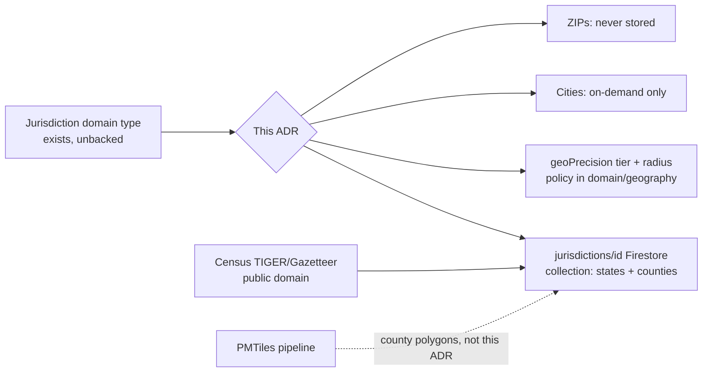

# ADR-016: Jurisdiction reference data — scope, storage shape, and precision-radius policy

- **Status:** Accepted
- **Date:** 2026-07-17
- **Depends on:** ADR-004, ADR-008, ADR-013, ADR-020
- **Amended:** 2026-07-22 (depends-on SoR path)

## Problem

`Jurisdiction` has existed as a domain type since
(`packages/domain/src/geography/location.ts` — `country | state | county | city | district |
school_district | other`, with `validFrom`/`validTo` for historical validity) but backs no
storage. `LawFields.jurisdictionId` and `EntityLocation.jurisdictionIds` /
`PlaceFields.jurisdictionIds` are plain strings today — references with nowhere to resolve.
Concretely: a law entity cannot state which state or county it applies to in a way that
resolves to anything; the map cannot aggregate by county; 's area-conditions engine has
no jurisdiction to bind a condition to; 's containment-chain graph has no county node to
attach a "part of" edge to. The owner's brief was explicit that jurisdiction is a first-order
organizing axis ("anchor most things around state ... a law: federal, state, county") and
asked directly whether the product stores all ZIPs, all states, all counties, all cities — a
scoping question this ADR answers with a rule, not a case-by-case judgment call each future
bead has to re-derive.

The cost of not deciding: every future bead that touches geography ( area conditions,
 law effect-areas,  containment chains,  bulk intake) would either invent its
own ad hoc jurisdiction representation or block on this one, and "how close to the known
location as possible" (the owner's other brief line) has no deterministic answer without a
radius policy tied to something governed, not a hand-typed number per record.

## Context

Three adjacent decisions already bound this one:

- **ADR-008** (search and geocoding): U.S.-only scope, 50 states + D.C., no territories — the
  same scope line `packages/domain/src/map/us-geography.ts`'s `US_STATES` table already draws.
  This ADR does not reopen that; it inherits it.
- **ADR-011** (Firestore system of record): no PostGIS, no Cloud SQL geometry column; Firestore
  documents carry geohash/lat/lng, not polygons. County boundary polygons are therefore
  structurally the wrong shape for a Firestore doc regardless of this ADR's other decisions.
- **ADR-013** (map stack): `packages/domain/src/map/map-source.ts` already aggregates by state
  using `US_STATES`' approximate bboxes, and its "Known gaps" section already flags that county
  aggregation has no backing polygon data — "real polygon-based county attribution if/when
  justified" was deferred to a later pass.  (the map data platform bead this ADR depends
  on) shipped the PMTiles tile-build pipeline that is the correct home for that polygon data
  when it lands; it is closed and out of this bead's scope to extend.

## Decision

### 1. States and counties are stored wholesale; cities are on-demand; ZIPs are never stored

| Tier | Stored? | Count | Why |
|------|---------|-------|-----|
| Country (US) | Yes, one row | 1 | Root of the containment chain every state parents to. |
| State (+ D.C.) | Yes, wholesale | 51 | Small, essential, already a committed single-source table (`US_STATES`). The organizing axis the owner named first. |
| County | Yes, wholesale | ~3,143 | The unit of the historical record — sundown towns, county-scoped ordinances, county splits are all county-scoped facts this product exists to hold. ~3,143 small docs (id, name, FIPS, bbox, centroid) is trivial storage; the alternative (fetching/deriving counties on demand) adds latency and inconsistency to a dataset that barely changes. |
| City / place | **On-demand only** | 0 stored up front (of ~19,000 Census incorporated places) | Cities are churny (annexation, incorporation, dissolution) and the overwhelming majority are never referenced by any entity or geocode result in this product. Creating a doc at first reference (keyed by Census place FIPS) means every city doc that exists was actually needed. |
| ZIP | **Never stored as reference data** | 0 (of ~42,000 ZCTAs) | ZIP Codes are a USPS delivery-routing artifact, not an administrative or historical boundary — they are reassigned, split, and retired on a schedule set by mail logistics, not jurisdiction. `packages/domain/src/geography/location.ts` already guards this (`ZipCodeRole = 'modern_input' | 'modern_lookup'`, `assertZipNotHistoricalBoundary`); this ADR does not weaken that guard, it ratifies the storage-scope consequence of it. |

City/place docs, when they are created on-demand, use the same `jurisdictions/{id}` collection
and Census place FIPS as the id scheme, so they compose with the same containment-chain and
precision-radius machinery this ADR defines for states/counties — on-demand is a *timing*
decision, not a *shape* decision.

### 2. Firestore doc shape: bbox + centroid only, no polygon geometry

Each `jurisdictions/{id}` document (`packages/firebase/src/jurisdictions/schema.ts`) carries:
`id`, `kind`, `name`, `parentId`, `fipsCode`, `postalCode` (states)/`stateFips` (counties),
`bbox` ([west, south, east, north]), `centroid` ({lat, lng}), `bboxSource` (provenance of the
bbox — see below), `validFrom`/`validTo` (present, populated on-demand, not backfilled by this
bead), `sourceDataset`/`sourceVersion`, `createdAt`/`updatedAt`. No polygon field exists on
this document by design (ADR-011's "no PostGIS" plus ADR-013's PMTiles pipeline already own
polygon-shaped data — duplicating it into Firestore would bloat every doc and desynchronize
from the tile source of truth the moment either one is refreshed independently).

Ids are deterministic and FIPS-keyed: `us`, `us-{2-digit state FIPS}`,
`us-{2-digit state FIPS}-{3-digit county FIPS}`. Deterministic ids make the load script
idempotent by construction — re-running it against the same source data always resolves to the
same document ids, so a re-run is a compare-and-skip, never a duplicate insert.

### 3. Load pipeline: `US_STATES` for states, Census Gazetteer for counties, one idempotent script

State rows are derived from the *already-committed* `packages/domain/src/map/us-geography.ts`
`US_STATES` table — not re-fetched or re-typed from anywhere else. This was a hard requirement,
not a convenience: a second state table would immediately drift from the first one
already ships and every future geography feature depends on. County rows are parsed from the
U.S. Census Bureau's national county Gazetteer file (tab-delimited; FIPS/GEOID, name, land/
water area, internal-point centroid) — see `packages/firebase/src/jurisdictions/
tiger-gazetteer.ts` for the parser and the exact download URL. Territories (Puerto Rico, Guam,
etc.) present in the Gazetteer file are filtered out at load time, matching ADR-008's 50-states-
+-D.C. scope.

`packages/firebase/src/jurisdictions/load-cli.ts` runs both sources through one idempotent
CLI, structured like the existing `embeddings/backfill-cli.ts` precedent: dependency-injected
writer, pure orchestration function unit-tested without Firestore, a guarded `import.meta.url`
block for the real CLI entry point. County bboxes computed from the Gazetteer file are an
**approximation** (a square of matching area centered on the Census internal point,
`bboxSource: 'census-gazetteer-area-approximated'`) — the Gazetteer file does not carry a
bounding box, only a centroid and area. A survey-grade bbox (`bboxSource:
'census-cartographic-boundary'`) can be backfilled later from the Census cartographic boundary
shapefiles 's tile pipeline already processes for county polygons — see "County polygon
geometry" below for why that integration is a documented follow-up, not built in this pass.

### 4. Precision-radius policy: one geoPrecision tier vocabulary, deterministic radius mapping

`packages/domain/src/geography/precision.ts` adds the canonical `exact-site | block | locality
| county | state` tier vocabulary (`GeoPrecisionTier`) — the single definition 's
fact-registry spec (`FactRecord.geoPrecision`) imports rather than redefines. This is a
*different* scale from `packages/security/src/redaction.ts`'s `PRECISION_RANK` (country|
state|county|city|neighborhood|...|exact_coordinates), which governs public-output redaction;
`GeoPrecisionTier` governs the geographic anchor tier a location is documented/geocoded at and
the map display radius that follows from it. The two scales are related in direction
(finest→coarsest) but are not merged into one enum, because they answer different questions at
different layers.

Radius mapping is deterministic, not a free per-entity number: `exact-site` and `block` get
fixed radii (30m / 200m — a building site or a city block does not scale with the size of the
county it happens to sit in); `locality`, `county`, and `state` radii are *derived* from the
relevant jurisdiction's bbox (`boundingRadiusMeters` — half the corner-to-corner diagonal,
scaled for latitude). A location whose tier requires a jurisdiction bbox and has none throws
rather than guessing (fail closed).

`precisionBasis` (`source-documented | geocoded | approximated | redacted-by-rule`) is stored
per location so "why is this coarse" is always answerable, and — this is the load-bearing
policy point — **`redacted-by-rule` is reserved for the exception path only**.
`resolveEntityLocationPrecision` never coarsens on its own initiative; it only reflects a
redaction decision the caller has already made (a  rule firing). Bulk-loaded records with
a documented or geocoded coordinate keep that tier and basis untouched by default. See
`packages/domain/src/geography/precision.test.ts` for the test proving this: a mixed batch
where only the record with `redactionRequired: true` coarsens, and every other record's tier
and basis pass through unchanged. `redactLocationForPublic` and `PRECISION_RANK` in
`packages/security/src/redaction.ts` remain the sole authority over what may be *published*;
this policy governs storage-time defaults one layer earlier and does not call into, weaken, or
replace them.

### 5. Dangling jurisdiction references fail closed at projection build

`packages/domain/src/geography/jurisdiction-refs.ts` adds
`assertJurisdictionReferencesResolve` (and a non-throwing `evaluateJurisdictionReferences` for
aggregate reporting): given every `jurisdictionId`/`jurisdictionIds` a claim/entity/location
carries and a resolver backed by the real `jurisdictions` collection, it throws if any
reference does not resolve to a real document. This follows the exact "INTEGRATION POINT,
documented not live-wired" convention `packages/domain/src/citations/completeness-gate.ts`
already established for 's citation-completeness gate: the actual claim-to-projection
assembly step lives outside this bead's file ownership (and, per ADR-007, largely outside this
TypeScript package for the primary publish path), so this ADR specifies the exact call site and
contract rather than reaching into files this bead does not own to wire it live.

## Rationale

Counties wholesale, cities on-demand, ZIPs never is not an arbitrary three-way split — each
line follows from a different property of the underlying data:

- **Counties are stable and load-bearing.** County lines change only via legal action
  (consolidation, a state legislature vote) — a handful of times per decade nationally, not
  per year. They are also the actual unit several other beads need *now* (county-scoped
  ordinances, sundown-town research, county-level map aggregation). Storing all ~3,143 trades
  effectively nothing (a few KB of Firestore storage) for removing an entire class of future
  "does this county exist yet" round-trips.
- **Cities are unstable and mostly irrelevant.** ~19,000 incorporated places exist; the
  fraction ever referenced by an entity or geocode result in this product is a small minority.
  Loading all of them wholesale would mean thousands of dead documents for one useful one.
  On-demand creation (first entity/geocode reference triggers the doc, keyed by Census place
  FIPS so it is still a governed id, not a free-text string) gets the same referential integrity
  guarantee as wholesale loading without the waste.
- **ZIPs have no administrative meaning.** They are USPS routing codes, reassigned and split on
  a delivery-logistics schedule with no relationship to legal jurisdiction or historical
  boundary. Storing them as jurisdiction reference data would imply a permanence and
  authoritativeness they do not have — precisely the failure mode `location.ts`'s existing
  `assertZipNotHistoricalBoundary` guard was written to prevent. This ADR's scope decision is
  the storage-layer expression of that same principle already established by .

Bbox+centroid in Firestore, polygons in tiles is not a duplication-avoidance nicety; it is the
direct consequence of ADR-011 (no PostGIS/geometry column in the primary store) plus ADR-013
('s PMTiles pipeline already owns the polygon-shaped asset). A Firestore-stored polygon
would need independent refresh discipline from the tile source and would bloat every jurisdiction
document for a shape most reads (map center, rough radius, "is this near that") never need at
full fidelity.

Deriving the display radius from the jurisdiction bbox instead of storing a free radius number
per entity is a governance choice: a hand-typed radius drifts entity by entity with no way to
audit "why is this circle this big," while a bbox-derived radius is reproducible from the
jurisdiction doc alone and changes only when the jurisdiction reference data changes (which is
itself versioned and auditable via `sourceDataset`/`sourceVersion`).

## Rejected alternatives

**Exhaustive historical county boundary reconstruction now.** County lines have moved
throughout U.S. history (splits, renamings, consolidations — the Newberry Atlas of Historical
County Boundaries is the standard reference for this). Modeling every historical boundary
change up front is a multi-week research and digitization project on its own, not launch
substrate for a bead whose job is to stand up *current* jurisdiction reference data. `validFrom`
and `validTo` fields exist on every `jurisdictions/{id}` doc and are ready to receive
historical-boundary records the moment a specific entity's research actually needs one — this
ADR defers the bulk backfill, not the capability. Newberry is noted here as the future source
when that work is prioritized; it is not ingested by this bead.

**A paid geocoding/boundary API (Google Maps, Mapbox Boundaries, etc.).** Every other ADR in
this repo (ADR-002 through ADR-013) has preferred free/public-domain/self-hosted options over
paid vendor dependencies until measured need proves otherwise, and this bead has no such need:
U.S. Census TIGER/Gazetteer files are free, public domain (17 U.S.C. § 105 — U.S. Government
Works), and already cover states, counties, and places at exactly the granularity this ADR
requires. Introducing a metered API for data the government already publishes for free would
add a runtime billing dependency and a new failure mode (rate limits, API key rotation, vendor
outage) with no corresponding benefit.

**Storing radius as a free number per entity.** Considered and rejected because it is
ungovernable: nothing would stop two otherwise-identical `county`-precision entities from
carrying different, unreconciled radii, and there would be no way to answer "why is this
number what it is" beyond "someone typed it." Deriving the radius from the geoPrecision tier
and (for locality/county/state) the jurisdiction's bbox makes the radius a *function* of
governed reference data, auditable and reproducible, and directly reconcilable with
`PRECISION_RANK`'s tier-comparison semantics in `packages/security/src/redaction.ts` (both
scales coarsen in the same direction, even though they are not merged into one enum).

## Consequences

**Easier:** law entities, area conditions, and containment-chain edges can reference a real
`jurisdictionId` and have it actually resolve; the map's county aggregation (currently
bbox-only per ADR-013's "Known gaps") gains a governed bbox/centroid source to aggregate
against; any future entity/geocode flow that needs a city jurisdiction has a defined creation
path (Census place FIPS, on-demand) instead of an open question. Every `FactRecord.geoPrecision`
value  emits is guaranteed to mean the same thing everywhere it appears, because there is
exactly one place the vocabulary is defined.

**Harder:** any caller that wants a fine-grained historical county boundary (a county as it was
in 1850, not as it is today) will not find one in this collection yet — `validFrom`/`validTo`
exist but are empty until a specific research need populates them. Any caller that wants a
precise (not approximated) county bbox before the Census cartographic-boundary integration
lands will see `bboxSource: 'census-gazetteer-area-approximated'` and must treat the radius
accordingly — this is the same "deliberately coarse, never survey-grade" posture
`us-geography.ts` already documents for state bboxes, now extended to counties.

**Locked in:** the `exact-site | block | locality | county | state` geoPrecision vocabulary is
now the one every future bead ( and beyond) must import, not redefine — changing it later
is a cross-cutting migration, not a local edit.

## Reversibility

Two-way door on the storage scope (counties wholesale / cities on-demand / ZIPs never): if a
future need requires wholesale city storage, the same load pipeline shape (deterministic
FIPS-keyed ids, Census source, idempotent script) extends directly — it is additive, not a
redesign. If ZIP-adjacent lookup is ever needed for a genuinely modern-only purpose (e.g.
current mailing-address validation), `location.ts`'s existing `modern_input`/`modern_lookup`
roles already cover that without touching this ADR's "never stored as reference data" line.

One-way-ish on the geoPrecision vocabulary: once  and other consumers import
`GeoPrecisionTier`, renaming or restructuring the five tiers becomes a coordinated migration
across every consumer, not a local change — this is the trade this ADR deliberately makes by
centralizing the definition instead of leaving each bead to invent its own.

## References

- U.S. Census Bureau Gazetteer Files: <https://www.census.gov/geographies/reference-files/time-series/geo/gazetteer-files.html>
  — public domain (17 U.S.C. § 105, U.S. Government Work; no fee, no license restriction).
- U.S. Census Bureau Cartographic Boundary Files (1:500k):
  <https://www.census.gov/geographies/mapping-files/time-series/geo/carto-boundary-file.html>
  — the future source for `bboxSource: 'census-cartographic-boundary'` and for 's PMTiles
  county polygons.
- Newberry Library, Atlas of Historical County Boundaries — noted future source for on-demand
  `validFrom`/`validTo` historical county records; not ingested by this bead.
- ADR-008 (search and geocoding), ADR-011 (Firestore system of record), ADR-013 (map stack) —
  the scope and storage-shape constraints this ADR inherits rather than re-derives.
- `packages/domain/src/geography/location.ts` — the existing `Jurisdiction` domain type and
  ZIP modern-input-only guard this ADR instantiates into storage.
- `packages/domain/src/citations/completeness-gate.ts` — the "documented, not live-wired
  INTEGRATION POINT" convention this ADR's jurisdiction-reference gate follows.
