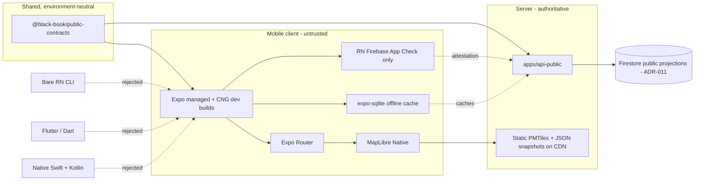

# ADR-020: Mobile stack — Expo, MapLibre Native, RN Firebase App Check, and the offline SQLite cache

- **Date**: 2026-07-19
- **Status**: Proposed
- **Deciders**: mobile-program-review (agent draft); owner sign-off pending an independent red-team pass
- **Supersedes**: none
- **Bead**: MOB-002 (architecture, threat model, contract boundary ADRs)
- **Depends on**: ADR-004, ADR-005, ADR-008, ADR-010, ADR-011, ADR-013
- **Blocks**: MOB-003, MOB-006, MOB-010, MOB-011

## Problem

BlackStory today is a public web reader (`apps/web`) rendering released, immutable
public projections (ADR-004) through a bounded read surface (`apps/api-public`, ADR-005),
with a self-hosted MapLibre GL JS map backed by static Protomaps PMTiles (ADR-013). The
program now commits to shipping a production-quality native iOS and Android reader that
matches that web experience — truth, evidence, map, dignity, brand, and correction
posture — without duplicating canonical data or weakening the security boundary
(mobile epic, program invariants 1–7).

A native app forces a set of foundational technology choices that are expensive to
reverse once a store binary, a signed release, and a bundle identifier exist in the
world (`app.blackbook.mobile`, per MOB-001). The forcing tension is that these choices
are mutually constraining — the framework dictates which map, storage, and Firebase
modules are even installable; the Firebase-access choice determines the security
boundary; the native-directory policy determines how builds are reproduced — and every
one of them is a one-maintainer operational commitment. Deciding them ad hoc at scaffold
time (MOB-006), one `npm install` at a time, is how a solo project accretes an
unmaintainable native toolchain it cannot upgrade. This ADR fixes the stack, states the
reversal cost of each choice honestly, and records the load-bearing native-build
requirements that a scaffold must carry from day one.

## Context

Forces beyond the core problem that bound the decision space:

- **The read boundary is fixed and non-negotiable** (ADR-005, ADR-011, epic invariant 2).
  Canonical and research data stay behind `apps/api-public`; clients read only released
  `public/**` projections and snapshots. The mobile app is a *reader*, not a second
  system of record. This eliminates any option whose main appeal is "direct database
  access from the client."
- **Clients are untrusted for authorization** (ADR-010 trust assumptions 3, 8). Browser
  and mobile clients get *attestation* (App Check), never authorization. A compromised
  client must not gain a canonical write path (epic invariant 6). App Check on mobile is
  App Attest (iOS) / Play Integrity (Android), not reCAPTCHA — a native-module concern.
- **Only environment-neutral contracts and pure behavior cross the web/mobile line**
  (epic invariant 3): no app-to-app imports, no server-only transitive dependencies. The
  shared surface is a versioned contracts package (`@black-book/public-contracts`,
  MOB-003), which strongly rewards a stack that speaks the same TypeScript as the web app.
- **The map decision is already half-made.** ADR-013 chose MapLibre GL JS for the web on
  a license/vendor-independence/self-host rationale, with a dark, desaturated
  "archive of record" basemap served as static PMTiles from the same Firebase Hosting/CDN
  as every other public snapshot. Mobile must inherit that rationale and that tile
  strategy, not open a new vendor relationship.
- **Cost and independence doctrine runs through every prior ADR** (ADR-002→ADR-011,
  ADR-013): free-tier-first, no fixed subscription or vendor API key in the render path
  before measured need, stay inside economics the project already pays for.
- **One maintainer.** The project's operating principle is "runs itself within reason" —
  budget-capped, kill-switch, free-tier-first. Any stack that demands two native
  toolchains, two languages, or a full-time build engineer is disqualified on operational
  grounds regardless of technical merit.
- **Launch scope is deliberately small** (epic non-goals): U.S.-only, no accounts, no
  push, no social, no full offline basemap at launch. The stack is sized for that scope,
  with measured upgrades governed by MOB-022 — not pre-built for hypothetical futures.

## Decision

The BlackStory mobile app is an **Expo React Native application (managed workflow with
Continuous Native Generation and custom development builds)** using **Expo Router**,
**MapLibre Native** for the map, **React Native Firebase for App Check only**, and
**`expo-sqlite`** for the offline cache. It lives at `apps/mobile` in the existing pnpm
monorepo. The specifics:

### 1. Framework: Expo (managed workflow, CNG / custom dev builds) + Expo Router

The app uses **Expo's managed workflow with Continuous Native Generation (CNG)** and
**custom development builds** (`expo-dev-client`) — explicitly *not* bare React Native
CLI, Flutter, or native Swift/Kotlin. Navigation is **Expo Router** (file-based routing).

Rationale (the load-bearing drivers):

- **One TypeScript codebase that shares types with the web contracts.** The single
  largest maintenance win for a one-maintainer project is that the mobile app consumes
  `@black-book/public-contracts` (MOB-003) as the *same* TypeScript types the web app and
  `apps/api-public` compile against. A contract change surfaces as a mobile type error at
  build time, not a runtime divergence discovered in production. Flutter (Dart) and native
  (Swift/Kotlin) forfeit this entirely; they would re-hand-transcribe the contract into a
  second and third type system.
- **EAS build and update infrastructure.** Expo Application Services gives cloud native
  builds (no locally maintained Xcode/Gradle CI farm), managed signing credentials as a
  fallback against lost Apple/Google keys (a risk MOB-001's adversarial review flags), and
  over-the-air JS updates for immutable, atomically-activated, provably-rollback-able
  releases (epic invariant 4) that mirror the web's release-pointer discipline (ADR-004).
  A one-maintainer project cannot afford to hand-build the equivalent.
- **Dev velocity for the launch scope.** The launch feature set (a bounded reader: map,
  list, search, entity/evidence pages, correction submission) is squarely inside what
  managed Expo does well. CNG means `ios/` and `android/` are generated from
  `app.json`/config plugins rather than hand-maintained (see decision 6).
- **Expo Router keeps navigation declarative and deep-link-native.** File-based routes map
  cleanly to the universal-link scheme MOB-001 reserves (`blackbook.app/e/{entityId}`,
  `blackstory://`), so a single link resolves on web and native (MOB-008) without a
  bespoke linking configuration.
- **Custom dev builds, not Expo Go.** MapLibre Native and React Native Firebase are custom
  native modules absent from Expo Go, so the app requires a custom development build
  (`expo-dev-client`) from day one. This is still the *managed* workflow — CNG regenerates
  native projects — not a bare eject.

### 2. Map: MapLibre Native (`@maplibre/maplibre-react-native`)

The map renderer is **MapLibre Native** via `@maplibre/maplibre-react-native`, the direct
mobile parallel to ADR-013's MapLibre GL JS. The tile strategy, basemap register, and
security posture carry over unchanged: **self-hosted Protomaps PMTiles served as static
assets from the same Firebase Hosting/CDN** as the web (ADR-013 §2), the **fixed dark,
desaturated "archive of record" basemap** (ADR-013 §3, Black Ink `#0A0A0A` background,
Copper Pin `#B86B2A` points, Archive Paper `#F4EFE5` stroke, pulled from brand tokens,
never a bright tourism basemap), and the same GeoJSON `FeatureCollection` +
state/county-aggregate artifacts the release pipeline produces (ADR-013 §4–5). BSD
license, no vendor API key, no live third-party dependency in the render path — the exact
ADR-013 rationale.

What differs on mobile, and must be handled by MOB-011/MOB-012:

- **Native GPU rendering**, not WebGL. MapLibre Native renders through the platform GPU
  (Metal on iOS, OpenGL/Vulkan on Android) rather than a browser WebGL context. No browser
  vendor prefixes, no `maplibre-gl` CSS import, no SSR-safety concern — but style-spec
  parity must be verified per-platform rather than assumed from the web.
- **Offline tile caching is a native, on-device concern.** PMTiles range-request reads work
  over HTTP the same as web, but a mobile client can and will cache tiles on device. Per
  epic non-goals, **no full offline basemap ships at launch**; the cache posture is
  bounded, viewport-scoped tile caching only, with an explicit size ceiling (MOB-011 to
  set the budget). A full offline basemap is a measured MOB-022 upgrade, not a launch
  default — the same "static-first, measure before adding" discipline as ADR-008/ADR-013.
- **Attribution and failure strategy are per-platform** (MOB-011): the required PMTiles /
  Protomaps / OpenStreetMap attribution must render natively, and a tile-fetch failure must
  degrade to the same snapshot-backed presence view the web uses (ADR-013 degraded mode),
  never a blank or errored map.

### 3. Firebase access: React Native Firebase for App Check only

The app installs **`@react-native-firebase/app` + `@react-native-firebase/app-check`** and
**nothing else** from the Firebase family. App Check uses **App Attest on iOS** and
**Play Integrity on Android**. The app does **not** install
`@react-native-firebase/firestore`, `/auth`, `/storage`, or any other data-plane Firebase
module.

This is a direct enforcement of the read boundary (ADR-005, ADR-011 §7, epic invariant 2)
and the trust model (ADR-010 assumptions 2–4, epic invariant 6): canonical data stays
behind `apps/api-public`; the client reads only released public projections *through that
API*, and App Check is *attestation attached to those API calls*, not authorization and
not a direct database SDK. There is deliberately no Firestore or Auth SDK on the device to
misuse, leak rules through, or expand into a canonical write path. This mirrors the web,
where App Check guards `api-public` reads and the browser holds no canonical-write SDK.

### 4. Local storage: `expo-sqlite`

The offline cache is **`expo-sqlite`** — a real relational store for cached public
entities, evidence metadata, map aggregates, and correction-receipt status — not
AsyncStorage, MMKV, WatermelonDB, or Realm.

| Option | Bundle / footprint | Expo supported-modules maturity | Query capability | Verdict |
|---|---|---|---|---|
| **`expo-sqlite`** | Small; SQLite ships with the OS, module is a thin binding | **First-party Expo module**, on the supported-modules list, CNG config-plugin support, actively maintained by Expo | Full SQL: joins, indexes, `WHERE`/`ORDER BY`, migrations — fits caching related entity/evidence graphs and querying by place/kind offline | **Chosen** |
| AsyncStorage | Small | Community, widely used | Key–value only; no query, no relations. Cannot express "evidence for entity X" or offline filters without hand-rolling an index in JS | Rejected — insufficient query model |
| MMKV | Small, very fast | Community native module; works with dev builds but not a first-party Expo module | Key–value only; same query gap as AsyncStorage, just faster | Rejected — wrong data model for a relational cache |
| WatermelonDB | Larger; adds an ORM + reactive layer | Community; heavier native integration, more upgrade surface | Strong reactive relational queries — but sits *on top of* SQLite and adds a maintenance/upgrade burden disproportionate to a bounded read cache | Rejected — over-built for launch scope |
| Realm | Large native footprint | Community (MongoDB-owned); heavier native module, its own object model and licensing/roadmap risk | Strong object queries — but a whole second data engine, second schema language, and a vendor roadmap dependency the project doesn't need | Rejected — vendor + footprint cost without matching need |

`expo-sqlite` is the only option that is simultaneously (a) a first-party Expo module on
the supported list — lowest native-upgrade risk under CNG — and (b) a real query engine
able to serve offline entity/evidence lookups and migrations (MOB-009) without a JS-side
index. Schema versioning and migrations are owned by MOB-009.

### 5. Version pinning policy

Verified root pins (root `package.json`, this worktree): `"packageManager":
"pnpm@9.12.3"`, `"engines": { "node": ">=22" }`. No root `.npmrc` exists today. The mobile
app must pin its Expo/RN toolchain **without changing these root pins or breaking
`pnpm install` for the web apps.**

Policy:

- **Node and pnpm stay root-pinned and shared.** The mobile app does not fork the package
  manager or Node engine. It builds under the same `pnpm@9.12.3` / Node `>=22` the web apps
  use. Any bump to those is a monorepo-wide decision, not a mobile-local one.
- **Expo SDK and React Native are pinned in `apps/mobile/package.json` only.** Expo's SDK
  pins an exact, mutually-tested set of `expo`, `react`, `react-native`, and Expo module
  versions; `expo install` (not bare `npm add`) resolves compatible versions against the
  installed SDK. These pins live in the mobile package and are **not hoisted** in a way that
  forces a `react`/`react-native` version onto the web apps.
- **Metro + pnpm interaction is a known scaffold requirement.** Metro historically does not
  traverse pnpm's isolated (symlinked) `node_modules` cleanly. MOB-006 must configure the
  workspace so Metro resolves the mobile app's dependencies — via an `.npmrc`
  `node-linker`/`public-hoist-pattern` scoped so it does not disturb the web apps' install,
  and/or Metro `watchFolders`/`resolver` config. This is a scaffold acceptance criterion,
  not an afterthought (see Open questions).
- **Upgrade cadence: track Expo SDK N-1.** Adopt an Expo SDK one major behind the newest
  release (the N-1 stability window) rather than day-zero on `.0`. Bump on a deliberate
  cadence with a full `expo-doctor` + EAS build + device smoke pass, never silently. This is
  the same "measured, not reflexive" posture ADR-011/ADR-013 apply to platform changes.

### 6. Native-directory policy: `ios/` and `android/` are gitignored and CNG-generated

`apps/mobile/ios/` and `apps/mobile/android/` are **gitignored** and **regenerated by CNG /
`expo prebuild`** from `app.json` and config plugins. They are **not committed**.

Justification: with EAS Build, the native projects are a *build output*, not source. The
sources of truth are `app.json`, config plugins, and the pinned Expo SDK; `expo prebuild`
deterministically regenerates `ios/`/`android/` from them, and EAS Build does exactly that
in the cloud. Committing generated native directories invites the precise failure mode this
ADR guards against — hand-edits to generated files that silently drift from the config and
cannot be reproduced. Anything a raw native edit would express (the Podfile linkage in
requirement R1 below, entitlements, permission strings) is instead expressed as a config
plugin or an EAS build-profile setting, so it survives regeneration. Committing the native
dirs would also fight the gitignore and bloat the repo with derivable files.

### 7. Supported OS floor: iOS 16+, Android 8 (API 26)+

The proposed floor is **iOS 16+ and Android 8 / API 26+** (MOB-001). This avoids
maintaining polyfills for OS versions with negligible, declining share while staying at or
above what a current Expo SDK requires.

**This floor is provisional and MUST be re-verified against the actual current Expo SDK's
minimum requirements at MOB-006 scaffold time.** Expo/React Native raise their minimum iOS
and Android API floors roughly every ~3 months with each SDK release; the chosen floor can
only ever be `max(product-desired floor, SDK-required floor)`. MOB-006 records the exact
SDK version and its exact minimums, and this section is updated to match. Do not treat
iOS 16 / API 26 as settled — treat it as the *intended* floor pending that check.

## Evidence — proof-of-concept spike (real, already run)

A real proof-of-concept spike was executed in a disposable Expo app against the current
Expo SDK before this ADR was drafted (not repeated here; recorded as decision evidence):

- **Clean install, zero peer-dependency conflicts.** `npx expo install
  @maplibre/maplibre-react-native @react-native-firebase/app
  @react-native-firebase/app-check expo-sqlite expo-dev-client` installed the entire target
  stack cleanly against the current Expo SDK with **no peer-dependency conflicts** — i.e.
  Expo's SDK pin set (decision 5) and these native modules co-resolve.
- **`expo-doctor` passed 20/20 checks** on the resulting project — no config, plugin, or
  dependency-alignment warnings.
- **iOS native build succeeded** — `pod install` and the Xcode build completed — **but only
  with `USE_FRAMEWORKS=static`** in the Expo-generated Podfile
  (`use_frameworks! :linkage => :static`). React Native Firebase's Swift pods (AppCheckCore,
  FirebaseCoreInternal) require modular headers that plain static-library linking does not
  provide; static frameworks resolve it. This is the single most important operational
  finding of the spike, and it is recorded as a load-bearing requirement below rather than a
  footnote.

The spike de-risks the central integration question (do MapLibre Native + RN Firebase App
Check + expo-sqlite coexist under managed Expo?) with a positive, reproducible answer,
conditioned on the pod-linkage requirement.

## Load-bearing native-build requirements (numbered)

These are concrete, non-optional configuration commitments the mobile app must carry from
scaffold (MOB-006) onward. They exist because this ADR's chosen stack does not build
without them; leaving any as tribal knowledge is exactly the "native config drift" risk the
program's adversarial-review posture calls out.

- **R1 — `USE_FRAMEWORKS=static` is mandatory on iOS.** The iOS build **must** set static
  frameworks (`use_frameworks! :linkage => :static`) because React Native Firebase's Swift
  pods (AppCheckCore, FirebaseCoreInternal) need modular headers unavailable under plain
  static-library linking. Because `ios/` is generated and not committed (decision 6), this
  **must be expressed as an Expo config plugin / `app.json` setting** (so `expo prebuild`
  emits the correct Podfile) **and** carried in the **EAS Build profile**, so both local
  regeneration and cloud builds apply it identically. It must not live as a manual edit to a
  generated Podfile.
- **R2 — Custom dev client is required, not Expo Go.** MapLibre Native and RN Firebase are
  not in Expo Go; `expo-dev-client` custom development builds are the only supported dev
  path. CI/onboarding assume a dev build, not Expo Go.
- **R3 — App Check must be data-plane-only in configuration.** Only
  `@react-native-firebase/app` + `/app-check` are installed; adding any Firestore/Auth/
  Storage RN Firebase module is a boundary violation (ADR-005, ADR-011) and must fail
  review, not just linting.
- **R4 — `expo-doctor` must pass in CI.** The 20/20 spike result is the floor; MOB-019's CI
  runs `expo-doctor` as a gate so dependency/config drift is caught before it reaches a
  build.
- **R5 — Metro/pnpm resolution config is a scaffold deliverable.** The `.npmrc`/Metro
  configuration from decision 5 must be committed and proven with a passing EAS build at
  MOB-006, scoped so it does not alter the web apps' `pnpm install`.

## Rejected alternatives

### Framework

| Alternative | Concretely | Why rejected | Reversal cost if we'd chosen it |
|---|---|---|---|
| **Bare React Native CLI** | RN without Expo's managed workflow; hand-maintained `ios/`/`android/`, self-run signing and OTA | Forfeits EAS build/update, managed credentials, CNG, and config plugins; a one-maintainer project would hand-maintain two native toolchains and a CI farm. The spike stack installs cleanly under managed Expo — bare buys native control the launch scope does not need | Moderate — Expo↔bare is a documented, mostly-mechanical migration, but you lose the managed-services safety net |
| **Flutter (Dart)** | Separate Dart UI toolkit and rendering engine | Second language, second type system; **cannot share `@black-book/public-contracts` types** — the contract would be re-transcribed by hand, reintroducing exactly the web/mobile divergence invariant 3 prevents. MapLibre and Firebase App Check integrations exist but are separate ecosystems from the web's | High — a full rewrite; nothing but design intent transfers |
| **Native Swift + Kotlin** | Two fully separate native apps | Two codebases, two languages, two toolchains for one maintainer; maximal contract-duplication surface; slowest path to a bounded reader | Highest — two independent rewrites |

### Map

| Alternative | Why rejected |
|---|---|
| Mapbox Maps SDK (native) | Non-OSS since the MapLibre fork point and API-key/usage-billed — conflicts with ADR-013's explicit license/vendor-independence rationale and the project's cost doctrine |
| Google Maps SDK | Proprietary, API-key-gated, per-load billing from day one; conflicts with ADR-011/ADR-013 cost/independence posture and forfeits the shared PMTiles basemap |
| A different renderer than the web | Would fork the basemap style, tile pipeline, and attribution from ADR-013 for no benefit; MapLibre Native *is* the mobile MapLibre, keeping one style spec and one tile archive |

### Firebase access

| Alternative | Why rejected |
|---|---|
| RN Firebase Firestore/Auth direct on device | Violates the read boundary (ADR-005, ADR-011 §7, invariant 2) and the trust model (ADR-010); puts a canonical-capable SDK and rules surface on an untrusted client. The app reads only released projections through `apps/api-public` |
| `expo-firebase-*` / Firebase JS SDK for App Check | The JS SDK's web App Check (reCAPTCHA) is not the correct mobile attestation; App Attest / Play Integrity require the native RN Firebase App Check module |
| No App Check at all | Contradicts ADR-010 assumption 3 and invariant 6; expensive public reads must be attestable |

### Local storage

See the comparison table in decision 4 — AsyncStorage and MMKV lack a query model for a
relational entity/evidence cache; WatermelonDB and Realm add native/upgrade/vendor burden
disproportionate to a bounded launch-scope read cache; `expo-sqlite` is the only
first-party-Expo, real-query option.

### Native-directory policy

| Alternative | Why rejected |
|---|---|
| Commit `ios/`/`android/` | Generated build output committed as source invites hand-edits that drift from `app.json`/plugins and cannot be reproduced by EAS — the exact drift R1–R5 exist to prevent |

## Consequences

- **Easier:** one TypeScript codebase and shared contracts with the web; cloud native
  builds and OTA releases via EAS; a first-party, low-drift module set (`expo-sqlite`,
  Expo Router) that upgrades with the SDK; a map that reuses the web's tile archive, style,
  and attribution wholesale.
- **Harder / newly locked in:** the app now depends on the Expo SDK release train and its
  N-1 cadence (decision 5); it requires a custom dev client (R2) and the `USE_FRAMEWORKS=
  static` iOS linkage (R1) from day one; Metro/pnpm resolution becomes a standing monorepo
  concern (R5). Any future need for a data-plane Firebase capability on device is a boundary
  change requiring a new ADR, not a package add (R3).
- **Second-order:** EAS becomes a third root-account custody + spend surface alongside
  Apple/Google (MOB-001 open gates); the OS floor (decision 7) is now a moving target tied
  to SDK upgrades and must be re-verified each bump, not set once.

## Reversibility — reversal cost per decision

- **Framework (Expo managed).** Two-way door, but the width narrows over time. Expo →
  bare RN is a documented, largely mechanical migration (`expo prebuild` already produces
  the native projects), so leaving *managed* is cheap; leaving *React Native entirely* for
  Flutter or native is a full rewrite with no code reuse. Choosing Expo keeps the cheap exit
  (to bare RN) available while foreclosing only the expensive ones we would never want.
- **Map (MapLibre Native).** Two-way door and deliberately narrow. Because the renderer
  reads the same static PMTiles and GeoJSON artifacts the web produces (ADR-013), swapping
  renderers later is a component swap, not a data-pipeline change — the tile archive, style
  tokens, and attribution are unaffected. Reversal cost is a single map component.
- **Firebase access (App Check only).** Two-way door with low cost, and reversing *toward*
  more device Firebase is intentionally gated. Adding App Check elsewhere or swapping
  providers touches one thin attestation layer. Expanding to a data-plane Firebase SDK is
  *meant* to be expensive — it requires a new ADR because it moves the security boundary
  (R3), so the "cost" here is procedural by design, not accidental.
- **Local storage (`expo-sqlite`).** Two-way door, cost proportional to cache complexity.
  The cache is a rebuildable, non-canonical mirror of released projections (it can be
  dropped and repopulated from `api-public`), so switching stores mainly means rewriting the
  data-access layer in MOB-009 and shipping a migration — no canonical data is at risk.
- **Version pinning policy.** Fully reversible, low cost. Pins are per-package config;
  changing the SDK cadence or Metro/pnpm resolution is an edit plus a build-verify, with no
  external artifact locked in.
- **Native-directory policy.** Fully reversible, near-zero cost. Deleting the gitignore
  entries and committing a `prebuild` output (or vice-versa) is a one-time repo change; it
  affects reproducibility ergonomics, not any shipped binary or user.
- **Supported OS floor.** Reversible *upward* cheaply, *downward* with product cost. Raising
  the floor is a config bump. Lowering it below the current SDK's minimum is impossible
  without also downgrading the SDK; lowering it within SDK limits means re-adding polyfills
  and re-testing older-OS devices — a testing cost, not a rewrite. Because floors only move
  up with SDK upgrades, the practical reversal is "re-verify and raise at each bump"
  (decision 7).

## Open questions for the red-team pass

1. **Exact Expo SDK number and its OS minimums are unpinned** in this draft (decision 5,
   decision 7). The spike ran against "the current Expo SDK"; MOB-006 must record the exact
   version and confirm iOS 16 / API 26 is `>=` that SDK's floor, updating decision 7 if not.
2. **Metro + pnpm resolution (R5)** is stated as a requirement but not yet proven in this
   repo (no `apps/mobile`, no root `.npmrc` today). It must be demonstrated by a green EAS
   build at MOB-006 before this ADR is accepted as reproducible, not just plausible.
3. **`USE_FRAMEWORKS=static` (R1) side effects** — static frameworks can affect build times
   and, occasionally, other pods' linkage. The red-team should confirm no launch dependency
   conflicts with static linkage on a full (not disposable) build.
4. **Offline tile-cache ceiling** (decision 2) is asserted as "bounded" but the actual size
   budget and eviction policy are deferred to MOB-011 — the red-team should confirm that
   deferral is acceptable and does not smuggle in a full offline basemap against epic
   non-goals.

## References

- ADR-004 — public projection and immutable publication snapshots (release/rollback model)
- ADR-005 — public/submissions/internal/admin service-surface separation
- ADR-008 — search and geocoding (bounded, static-first, U.S.-only doctrine)
- ADR-010 — security and abuse assumptions (client-untrusted, App Check attestation)
- ADR-011 — Firestore as system of record (cost/independence doctrine, read boundary)
- ADR-013 — map stack (MapLibre GL JS, PMTiles tile strategy, dark archive basemap)
- `docs/mobile/mobile-app-epic.md` — program invariants and non-goals (MOB-EPIC)
- `docs/mobile/decisions/mobile-identity.md` — product identity, bundle IDs, OS floor (MOB-001)
- Proof-of-concept spike (this ADR, "Evidence") — real run: clean `expo install`,
  `expo-doctor` 20/20, iOS build under `USE_FRAMEWORKS=static`
