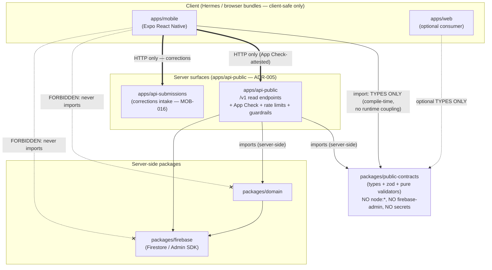

# ADR-022: Mobile data boundary — public contracts package, API v1 versioning, and the client/server line

- **Status:** Accepted (amended 2026-07-22: SoR ADR-020; attestation via client headers)
- **Date:** 2026-07-19
- **Amended:** 2026-07-20 adversarial review; 2026-07-22
- **Depends on:** ADR-004, ADR-005, ADR-020

> **Amendment (2026-07-22):** Reads go through `apps/api-public` (and optionally PostgREST
> published views for open developers per ADR-026). No client Firestore. Attestation is
> `X-BlackStory-Client` / request-integrity, not Firebase App Check. Historical App Check
> diagrams in the body are superseded for production posture.

## Adversarial review disposition (2026-07-20)

Verdict: **Accepted with amendments.** This is the strongest ADR of the set — its central decision is not
only sound but **already shipped and verified**: `packages/public-contracts` exists as a real `@repo` package
with subpath exports, `apps/api-public` serves the `/v1` read surface (`/v1/entity/{id}`, `/v1/search`,
`/v1/bootstrap`, `/v1/compatibility`, `/v1/health` in `src/http/router.ts`) and consumes the contracts via
`workspace:*`, and the **compile-time boundary gate is real and green**: `packages/public-contracts/scripts/check-boundary.mjs`
passes (17 files, only `zod` external, zero `node:*` built-ins, zero server-only imports). The §1/§2 CI-gate
and `/v1` mechanisms are therefore **implemented, not merely proposed**. Amendments:

1. **§1 scope claim was imprecise.** §1 states "confirmed the real scope in this repo — `packages/domain` is
   `@repo/domain`." Not literally true: `packages/domain` is still named **`@repo/domain`** in its
   `package.json` (the repo is mid-rebrand); it is only *aliased* to `@repo/domain` by consumers (e.g.
   `apps/api-public` declares `"@repo/domain": "workspace:*"`). What is unambiguously
   `@repo`-native is the **new** package this ADR creates, `@repo/public-contracts`. Corrected inline. The
   binding rule stands: mobile-facing packages use the rebrand-stable `@repo/*` scope; never `@repo/*`.
   The repo-wide rename of the remaining `@repo/*` packages is already tracked by **`repo-5uol` (OPEN)**.
2. **Consumption path differs for mobile.** `apps/api-public` consumes the contracts via `workspace:*`, but
   `apps/mobile` is excluded from the pnpm workspace (ADR-020 §5 amendment) and consumes it via a `file:`
   dependency resolved by Metro (`extraNodeModules` + the `development` export condition). The dependency
   direction the diagram in §4 asserts (types-only, no runtime coupling, no server-only imports) is preserved
   and enforced by the gate; only the resolver differs. Note `packages/public-contracts/dist/` is not
   currently built — the dev/test path uses the `development`→`src` condition, so non-Metro consumers relying
   on the `import`→`dist` condition require a prior `pnpm --filter @repo/public-contracts build` (build-order
   concern, not a boundary breach).

No decision reversed.

## Scaffold vs target

| Aspect | Today (verified) | Target (this ADR decides the boundary for) |
|--------|------------------|--------------------------------------------|
| Mobile app | Does not exist (`apps/mobile` not created; MOB-006) | Expo React Native reader consuming `apps/api-public` over HTTP only |
| Public contracts package | Does not exist | `packages/public-contracts` — versioned request/response types + zod schemas + pure validators, zero server-only deps (built by MOB-003) |
| Public API shape | `apps/api-public` serves web reads; guardrails, App Check, rate limits, vector search present (`apps/api-public/src`) | Same surface gains an explicit, versioned `/v1` read contract (MOB-004); no new deployable |
| API versioning | Unversioned; web is same-repo lockstep with the server | Explicit `/v1` URL prefix + client-version floor enforcement for independently-shipped store binaries |
| Contract sharing across clients | `@repo/domain` subpath exports, convention-enforced (web only) | A hard, compile-time client/server boundary usable by both `apps/web` (optionally) and `apps/mobile` |

## Context

The native mobile program (`docs/mobile/mobile-app-epic.md`, epic `black-book-mobile`) sets invariants this ADR must satisfy and cannot weaken:

- **Invariant 2 (read boundary):** `apps/api-public` is the mobile read surface. No direct canonical/research Firestore access from any client.
- **Invariant 3 (sharing):** only environment-neutral contracts and pure behavior are shared across web/mobile — no app-to-app imports, no server-only transitive deps.
- **Invariant 6 (client trust):** App Check is attestation, not authorization. The server stays authoritative; a compromised client must not gain a canonical write path.

Three accepted ADRs already set the doctrine this one extends rather than contradicts:

- **ADR-004** (public projection / immutable snapshots): the public API's live query surface is denormalized public projections and per-release JSON snapshots; canonical evidence/claims/research are not public-readable; responses carry release/revision metadata; degraded mode reads the immutable snapshot. Mobile is just another public reader of that same surface — it introduces no new read of canonical data.
- **ADR-005** (service surface separation): exactly one public read surface (`apps/api-public`); admin/internal/submissions are distinct surfaces; **shared logic lives in `packages/*`, not new deployables**; "packages cannot import apps; apps cannot reach across forbidden boundaries at runtime"; and — critically — migration trigger explicitly anticipates "Expo/mobile later consumes the same public/submissions contracts; do not invent mobile-only services now." This ADR is the concrete realization of that trigger.
- **ADR-011** (Firestore system of record): public clients may read only under `public/**`; privileged writes use the Admin SDK from Cloud Run/workers with distinct service accounts, never client SDKs. Firebase-admin is a server-only dependency by construction.

A concrete, already-felt hazard motivates the central decision. The repo already learned that the top-level `@repo/domain` barrel "pulls in server-only modules a browser bundle can't [import]" (`docs/ui/design-direction-v5.md`), which is why web code uses `@repo/domain`'s **subpath exports** (`@repo/domain/map/geography`, `@repo/domain/facts`, etc. — see `packages/domain/package.json` `exports`) rather than the package root. That subpath discipline is a **convention a developer must remember**. Next.js is forgiving: an accidental `node:crypto` or `firebase-admin` import in a server component simply runs on the server. A React Native / Hermes bundle is not forgiving — a stray node built-in or firebase-admin transitive import is a hard bundling/runtime failure with a confusing stack trace, discovered late (at native build or on-device), by whoever is unlucky. Mobile needs a **compile-time boundary**, not a convention.

## Decision

### 1. A new package `packages/public-contracts` with a hard client/server boundary

Create (in MOB-003, not here) `packages/public-contracts`, published under the rebrand-stable `@repo` scope. This ADR fixes its **boundary rules**; MOB-003 builds it. (**Corrected 2026-07-20:** the package ships natively as `@repo/public-contracts`. Note the repo is mid-rebrand — `packages/domain` is still *named* `@repo/domain` and only *aliased* to `@repo/domain` by consumers such as `apps/api-public` — so all new mobile-facing packages must be `@repo/*`-native, never `@repo/*`.)

**It MAY contain, and only these:**

- Versioned TypeScript request/response **types** for public API v1 shapes (path params, query params, response bodies, error envelopes).
- **zod schemas** for those same shapes, used by the server to validate/serialize and reusable by the client to parse responses defensively.
- **Pure, environment-neutral validation and helper functions** — client-side input validation, response parsing, version-compat checks, error-code enums — computed from their arguments with no I/O.
- Version constants (`API_VERSION`, `MIN_SUPPORTED_API_VERSION`) and the error-code enum the version floor uses (see §2).

**It MUST NOT contain (hard boundary — enforced, not requested):**

- Any **server-only code**: no route handlers, no Firestore/Admin-SDK access, no request-authenticated logic.
- Any **`firebase-admin`, `@repo/firebase` server surface, or direct Firestore import**, transitively or otherwise.
- Any **`node:` built-in** — no `node:crypto`, `node:fs`, `node:path`, `node:buffer`, etc. — nor any dependency that pulls one in. These break a Hermes bundle.
- Any **secret, credential, service-account reference, or environment-specific config**.
- Any dependency on `@repo/domain`, `@repo/security`, `@repo/observability`, or any package that itself carries server-only or node-only transitive deps.

**It MUST be importable by both `apps/web` (optionally) and the future `apps/mobile` without pulling in anything server-only.** This is the same discipline already established for `@repo/domain` subpath exports — extended into a dedicated package.

**Why a separate package rather than reusing `@repo/domain` directly.** `@repo/domain` is the server-side domain core: its barrel and many of its subpaths legitimately depend on `@repo/schemas`, `@repo/security` (dev), and node built-ins, because that is its job. Bolting mobile-safe contracts onto it would force every existing consumer to preserve a client-safe property across a large, fast-moving surface — a convention to remember, on a package that has no reason to honor it. A dedicated `packages/public-contracts` inverts that: its **entire purpose** is to be client-safe, so the property is checkable at the package boundary. Concretely:

- **Hard boundary, not a convention.** MOB-003 configures the package's own `tsconfig`/lint to forbid `node:*` and server imports, and its dependency list is short enough to eyeball. A CI check (proposed for MOB-003/MOB-019) bundles it under a React Native / Metro-like resolver and fails on any node built-in — a compile-time gate that `@repo/domain`'s subpath convention can never provide.
- **Mobile bundlers are stricter than Next.js.** The whole point is to fail in CI, not on a device. A separate package is the smallest unit that can carry that guarantee.
- **Independent versioning.** Contracts version with the wire protocol (§2), on their own cadence, decoupled from `@repo/domain`'s internal churn.

Following the repo's existing subpath convention, the package exposes **explicit subpath exports** (e.g. `@repo/public-contracts/v1/entity`, `@repo/public-contracts/v1/search`, `@repo/public-contracts/errors`) rather than one fat barrel — so a client imports exactly the shapes it uses, and the "don't import the root barrel" lesson from `@repo/domain` is designed out from day one.

### 2. API versioning and compatibility: URL-prefix major version + client-version floor header

**Mechanism: URL-prefixed major version (`/v1/...`) as the contract boundary, plus an HTTP request header carrying the client build's API version for floor enforcement. Both, each doing one job.**

- **`/v1` URL prefix — the wire contract.** All new public read endpoints for mobile live under `/v1/...` in `apps/api-public` (MOB-004). The prefix is the coarse, human-legible, cacheable, log-greppable boundary for **breaking shape changes**. A future incompatible shape is `/v2`, served alongside `/v1` for the deprecation window. URL versioning (not a version header for the shape) is chosen because it is trivially visible in CDN cache keys, access logs, and client code review, and because ADR-004 already makes public reads snapshot/CDN-friendly — a URL prefix slots cleanly into that cache story where a header-negotiated body shape would fracture cache keys.
- **`X-BlackStory-Client` request header — the version floor.** The client sends its own app/API build version (e.g. `X-BlackStory-Client: mobile/1.4.0; api=1`). The server does **not** use it to negotiate response shape (that is what `/v1` is for); it uses it only to enforce the **minimum-supported-app-version** floor. This is a header, not a URL element, because the floor is an operational policy that changes independently of the contract and must not require new routes to tighten.

**What "API N and N-1 compatibility" concretely means for this project:**

- The server supports the **current major version N and the immediately prior major N-1** simultaneously. When `/v2` ships, `/v1` remains served.
- **Deprecation window:** N-1 is supported for a **documented minimum of 90 days** after N becomes the default, and never removed while store analytics (MOB-018) show a non-trivial installed base still pinned to N-1. Removal of an old major is an explicit, evidence-gated decision (a bead), not a silent server change. Responses on a deprecated major carry a `Deprecation` / `Sunset`-style signal so clients can surface a soft upgrade nudge before the hard floor is hit.
- **Minimum-supported-app-version enforcement:** the server rejects requests whose `X-BlackStory-Client` version is **older than the supported floor** (older than N-1, or below an explicit minimum build the floor names) with a **specific, stable, machine-readable error code** — `CLIENT_VERSION_UNSUPPORTED` — in the shared error envelope (defined in `packages/public-contracts`). The client recognizes that code and shows a **forced-update prompt** (deep-link to the store listing) rather than a generic error. The error code and its HTTP status (`426 Upgrade Required`) are part of the contract package so both sides agree on them at compile time. App Check is unaffected and orthogonal — a valid attestation on an unsupported client still gets `CLIENT_VERSION_UNSUPPORTED` (invariant 6: attestation is not authorization).

### 3. Explicitly out of scope — of the contracts package and of the API v1 boundary

The following are **not** in `packages/public-contracts` and **not** in the `/v1` public read boundary:

- **No admin or internal endpoints or their shapes.** Admin (`apps/admin`), internal control (`apps/api-internal`), and their contracts never appear here (ADR-005). `/v1` is public-read only.
- **No research or raw-source data.** No canonical evidence, claims-in-progress, research cases, discovery/acquisition data, or raw source records — none of it is public-readable (ADR-004 §1, ADR-011 §7), so none of it has a v1 contract or a type in this package.
- **No write endpoints** beyond the single, explicit exception that **MOB-016 (corrections)** adds: opaque correction submission with a receipt/status read. That write path is a **corrections intake** and, per ADR-005, is served by the tightly-rate-limited **submissions** surface (`apps/api-submissions`), which produces quarantine writes only and **cannot publish**. Its request/response shapes may live in `packages/public-contracts` (they are environment-neutral wire shapes), but the boundary rule stands: **no direct entity mutation, no canonical write path from any client.** A compromised client can, at most, enqueue a quarantined correction — never alter a published entity (invariant 6).
- **No precise location, no sensitive classification leakage** in any v1 response shape — public responses carry only already-redacted/coarsened public-projection fields (ADR-004; the redaction discipline of ADR-013's map source). The contract types must not even be able to express a raw residential coordinate.

### 4. Dependency direction



ASCII equivalent (normative):

```
apps/mobile ──import (TYPES ONLY, no runtime coupling)──▶ packages/public-contracts
apps/mobile ──HTTP only (App Check-attested)───────────▶ apps/api-public ──▶ packages/domain ──▶ packages/firebase (Firestore/Admin)
apps/mobile ──HTTP only (corrections, MOB-016)─────────▶ apps/api-submissions

apps/mobile ──▶ packages/domain     ✗ FORBIDDEN (direct import — never)
apps/mobile ──▶ packages/firebase   ✗ FORBIDDEN (direct import — never)
apps/web    ──import (optional, TYPES ONLY)────────────▶ packages/public-contracts
```

Normative reading of the diagram:

- **`apps/mobile` → `packages/public-contracts` is types-only, no runtime coupling.** The contracts package's runtime footprint on the client is limited to pure zod schemas and pure validators; there is no shared runtime service, singleton, or transport in it.
- **`apps/mobile` reaches the server over HTTP only**, through `apps/api-public` (reads) and `apps/api-submissions` (corrections), both behind App Check + rate limits + guardrails.
- **`apps/mobile` NEVER imports `packages/domain` or `packages/firebase` directly** — those are server-side and carry node/firebase-admin deps. This is the compile-time line §1 exists to make unforgeable, and the restatement of invariants 2 and 3.
- The server side is unchanged from existing doctrine: `apps/api-public` imports `packages/domain` and `packages/firebase` server-side; `packages/domain` never imports an app (ADR-005).

### 5. Reversal cost

**Changing the API versioning scheme later.** Moderate but bounded, and deliberately front-loaded to be cheap:

- Adding a **new major** (`/v2`) is by design cheap — that is the mechanism working, not a reversal. `/v1` and `/v2` coexist for the deprecation window; the contracts package carries both `v1/*` and `v2/*` subpaths; old store binaries keep working until the floor retires N-1.
- Replacing the **scheme itself** (e.g. abandoning URL prefixes for header-negotiated shapes, or renaming/moving the version floor header) is expensive precisely because **installed store binaries cannot be patched** — an old app hard-codes whatever URL prefix and header names it shipped with. The mitigation is that the server must keep honoring the *old* scheme for the deprecation window regardless, so any scheme change is additive-then-deprecate, never a flip. Choosing URL-prefix + floor-header **now** — both simple, both independently visible — is the cheap insurance against needing a scheme change at all. Getting the error-code contract (`CLIENT_VERSION_UNSUPPORTED`) and the floor header right in MOB-003/MOB-004 is what makes every later version bump routine.

**If the contracts-package boundary is violated and has to be retrofitted after mobile already imports something server-only.** This is the expensive, asymmetric failure the whole ADR is structured to prevent:

- A server-only import (a `node:` built-in, `firebase-admin`, or a `@repo/domain` subpath that transitively pulls one in) that slips into `packages/public-contracts` may build fine under Next.js/web and only detonate at **native build or on-device runtime** for mobile — the worst place to discover it (late, per-platform, cryptic).
- Retrofitting means: identify the offending transitive dep, split the contract types away from whatever server logic dragged the dep in, re-publish a clean contract version, and **update every mobile call site** — but mobile call sites that already shipped in a **store binary cannot be recalled**, so the fix rides the normal store-release + version-floor timeline (days to weeks), not a hotfix.
- This is why §1 mandates a **compile-time gate (CI bundling check) rather than code review**: the reversal cost of a leaked server-only dep is measured in store-release cycles, so the boundary must fail closed in CI, before a byte ships. The dedicated package exists specifically so that gate has a place to live.

## Rejected alternatives

| Alternative | Why rejected |
|-------------|--------------|
| Reuse `@repo/domain` subpaths directly from mobile | Its barrel/subpaths carry server-only + node deps by design (`docs/ui/design-direction-v5.md`); mobile safety would be a convention to remember on a package with no reason to honor it, discovered on-device not in CI. |
| Header-negotiated response shape instead of `/v1` URL prefix | Fractures CDN cache keys (ADR-004 is snapshot/CDN-friendly), hides the contract boundary from logs and code review; URL prefix is the coarse, visible boundary, header is only the version floor. |
| URL versioning only, no client-version floor | No way to force-update dangerously stale store binaries; a header floor + `CLIENT_VERSION_UNSUPPORTED` gives a clean forced-update path independent of the wire contract. |
| A new mobile-only API service | Violates ADR-005 (one public read surface; migration trigger says "do not invent mobile-only services now"); mobile is just another public reader. |
| Client SDK reads straight from Firestore `public/**` | Violates invariant 2 (server-authoritative read boundary) and couples the app to Firestore document shapes; all reads go through `apps/api-public`. |
| Enforce the boundary by code review / convention only | Reversal cost of a leaked server-only dep is measured in store-release cycles; the gate must fail closed in CI, which requires a dedicated package to gate. |

## Consequences

- MOB-003 builds `packages/public-contracts` under `@repo`, with subpath exports and a CI bundling gate that fails on any node built-in or server-only transitive dep.
- MOB-004 adds `/v1` read endpoints to `apps/api-public` (no new deployable), validating requests and serializing responses against the shared zod schemas, and enforcing the `X-BlackStory-Client` floor with `CLIENT_VERSION_UNSUPPORTED` / `426`.
- `apps/api-public` responses continue to carry ADR-004 release/revision metadata; mobile gets the same immutable-snapshot / degraded-mode guarantees the web reader already has.
- Corrections (MOB-016) are the only client write, served by `apps/api-submissions` as quarantine-only intake — no canonical write path from any client (invariants 2, 6).
- `apps/web` may optionally adopt `@repo/public-contracts` for its own public reads later, converging web and mobile on one wire contract, but this ADR does not require that migration.

## Migration triggers

- Cut a new API major (`/v2`) only for a genuinely breaking response-shape change, coexisting with `/v1` for at least the 90-day deprecation window; retire N-1 only on evidence (MOB-018 analytics) that its installed base is negligible.
- Promote a contract shape from `public-contracts` into a wider shared package only if a non-mobile, non-web consumer appears — not preemptively.
- Reconsider the version-floor mechanism only if store analytics show the header approach is insufficient to drive forced updates in practice.

## Rollback considerations

- Roll back a bad `/v1` response change by activating a prior immutable release (ADR-004 release pointer) — the contract shape is stable across releases; only the data behind it moves.
- A bad contracts-package version is rolled back by pinning consumers to the prior published version; server and web can pin immediately, but **shipped mobile binaries pin to whatever they built against** — this asymmetry is the reason the CI gate (§1) must catch boundary violations before release, not after.
- Never "fix" the wire contract by mutating an active release in place; publish a new release or, for a shape change, a new major.

## Red-team resolutions

The independent second-model red-team resolved every question this ADR flagged (MOB-002 requires recorded
findings and dispositions). Each is a decision, not a deferral:

1. **Deprecation window length — resolved: keep the 90-day N-1 floor, add an earlier in-app soft-deprecation
   nudge; do not lengthen the hard floor by default.** The no-push constraint means the only channel is in-app, so
   the fix is *earlier signalling*, not a longer window: a client that detects it is on N-1 (via the
   `Deprecation`/`Sunset` response signal) surfaces a soft "update available" nudge well before the hard
   `CLIENT_VERSION_UNSUPPORTED` floor is reached. The 90 days is a *minimum* and is never enforced against a
   non-trivial installed base still on N-1 (MOB-018 analytics gate retirement), so a longer effective window is
   already available on evidence without hard-coding one now.
2. **Header spoofing — resolved: `X-BlackStory-Client` is a UX / forced-update affordance for honest clients, NOT
   a security control. Accept that a tampered client can spoof it; do not bind version to attestation.** App Check
   attests the *app*, not the declared *version*, and binding the two buys nothing: a client that lies about its
   version to dodge the floor gains no capability, because every request parameter is independently re-validated
   server-side (threat model T1/T3) and there is no client write path to reach (invariant 6). The only thing the
   floor protects is an *honest* stale client from misrendering `/vN` responses it cannot parse — a UX/correctness
   concern, not an authorization one. Spending attestation-binding complexity to stop a dishonest client from
   *opting itself back into* a supported code path it gains nothing from would be misplaced. The floor stays a
   soft signal for honest clients; the real boundary is server-side re-validation + quarantine-only writes.
3. **Corrections shapes' home — resolved: keep MOB-016 correction request/response shapes in
   `packages/public-contracts`; do not fork a submissions-only contract package.** They are environment-neutral
   wire shapes and belong on the client-safe side of the boundary. The fact that they route to
   `apps/api-submissions` rather than `apps/api-public` is a *server routing* concern, not a reason to stand up a
   second client-safe contracts package a one-maintainer operation must keep in sync. Isolate them behind their own
   subpath (e.g. `@repo/public-contracts/corrections`) so the surface split is legible without a second package.
   Revisit only if a second, non-mobile submissions consumer ever appears.
4. **CI gate fidelity — resolved: a Metro-config bundle-smoke test in CI is the required per-PR gate; a real
   EAS/on-device build is a periodic backstop, not a per-PR requirement.** A Metro/Hermes-resolver bundle of
   `packages/public-contracts` that fails on any `node:*` built-in or server-only transitive import faithfully
   reproduces the intolerance that matters and runs fast enough to gate every PR (MOB-003/MOB-019). Standing up a
   full native/EAS build on every PR is disproportionate; MOB-019 runs the real EAS build on the merge/`preview`
   lane as the backstop that catches anything the Metro-smoke resolver misses. The compile-time gate lives on the
   contracts package precisely so this smoke test has a single place to run.
