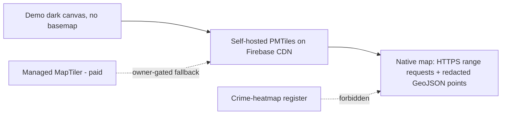

# ADR-025: Mobile map data — self-hosted PMTiles, native range requests, attribution, and failure strategy

- **Status:** Accepted (amended 2026-07-22: CDN host not Firebase-required; no RN Firebase)
- **Date:** 2026-07-19
- **Amended:** 2026-07-20 adversarial review; 2026-07-22
- **Depends on:** ADR-004, ADR-008, ADR-010, ADR-013, ADR-020, ADR-021

> **Amendment (2026-07-22):** PMTiles may be served from any static CDN (Vercel, Firebase
> Hosting, or GCS+CDN). RN Firebase is not required for MapLibre. Historical “Firebase CDN
> required” / RN Firebase reconciliation language is superseded.

## Adversarial review disposition (2026-07-20)

Verdict: **Accepted with amendments.** The data platform (self-hosted U.S. Protomaps PMTiles on the existing
Firebase/CDN, native `pmtiles://` HTTPS range requests, `206`/`Accept-Ranges` requirement, release-versioned
immutable paths, `MAP_BASEMAP_ENABLED` cost kill-switch, the flat-GeoJSON→vector-tile threshold, the tested
`classifyMapError` failure modes, always-visible attribution, and the inherited server-side redaction
invariant) is the correct mobile parallel of ADR-013 and survives the adversarial pass. `USE_FRAMEWORKS=static`
is confirmed set in `app.config.ts` (reconciling MapLibre + RN Firebase on iOS). Amendment:

1. **The "Deferred" section overstates what exists — no custom MapLibre config plugin is present.** It claims
   "its config plugin (`app.plugin.js` → `withMapLibre`) is present and valid." There is **no `app.plugin.js`
   and no `withMapLibre`** anywhere in `apps/mobile`, and `@maplibre/maplibre-react-native` is **not** in
   `app.config.ts`'s `plugins` array. The dependency **is** installed (`^11.3.6`). Per MapLibre RN v11's
   official 2026 guidance (maplibre.org/maplibre-react-native/docs/setup/expo/), the correct wiring is simply
   adding the package's **own** config plugin — `"plugins": ["@maplibre/maplibre-react-native"]` — which
   injects `$MLRN.post_install(installer)` into the iOS Podfile; **no bespoke `withMapLibre` plugin is needed
   or should be authored.** Corrected in "Deferred" below. Net effect unchanged: native MapLibre setup is a
   real MOB-012/build-gate task (register the official plugin + `expo prebuild` + `pod install`), still
   correctly deferred — but the claim that a custom plugin already exists is removed as inaccurate.

No decision reversed. `@maplibre/maplibre-react-native` v11 is verified new-arch-only and dev-build-only
(not Expo Go), consistent with ADR-020.

## Scaffold vs target

| Aspect | Today (this bead) | Target (MOB-012 and beyond) |
|--------|--------------------|------------------------------|
| Tile strategy | Decided; demo dark canvas rendered (no basemap archive yet) | Self-hosted U.S. Protomaps PMTiles on Firebase Hosting/CDN, read via native HTTPS range requests |
| Basemap style | `buildBasemapStyle` (dark-archive, token-sourced), demo variant = background only | Same builder, PMTiles vector source + glyphs/sprites attached |
| Per-point data | Redacted flat GeoJSON `FeatureCollection` from `apps/api-public` (release-coupled) | Same, until the migration threshold below is crossed |
| Attribution | Real, always-visible `MapAttribution` element on the native screen | Unchanged (license obligation, not optional) |
| Failure UI | Real degraded `ErrorState` per failure mode, driven by `classifyMapError` | Wired to live MapLibre `onDidFailLoadingMap` + connectivity |
| Native build | Dependency installed; expo-doctor green; full iOS prebuild/pod deferred (see "Deferred") | `withMapLibre` config plugin + `USE_FRAMEWORKS=static` reconciled with RN Firebase in the build gate |

This ADR **decides and justifies** the mobile map data platform and ships the native spike that proves the
rendering, attribution, and failure paths. It does **not** author the production PMTiles archive (real
geodata work) and does not run a paid vendor.

## Problem

ADR-021 fixed the mobile renderer (MapLibre Native, `@maplibre/maplibre-react-native`) but explicitly left the
**data/tiles/style** to this bead. A native reader has constraints the web map (ADR-013) does not: it reads tiles
over the network on a mobile data plan (cost-sensitive), it can cold-start with **no connectivity at all**, and it
persists tiles across launches. A production map cannot ship on the demo empty-tile style, and it must not quietly
acquire a paid per-map-load vendor dependency in the render path. The decision that cannot be deferred: **where do
the basemap tiles come from, under what license and cost model, and how does the map behave when that source is
unavailable — without turning a historical-harm dataset into a crime-heatmap and without silently defaulting to a
paid tier.**

## Context

Forces beyond the core problem that bound the decision space:

- **ADR-013 already fixed the web answer:** self-hosted Protomaps PMTiles on Firebase Hosting/CDN (preferred),
  managed MapTiler (fallback), MapLibre GL JS, a fixed dark/desaturated "archive of record" register, and a hard
  redaction invariant (`buildMapSource` never emits a raw coordinate). This ADR must land in the same place for the
  same reasons, differing **only** where the native runtime genuinely differs. It must not contradict ADR-013's
  licensing/vendor decisions.
- **ADR-021 fixed the renderer and the offline posture:** MapLibre Native reads the **same** self-hosted PMTiles via
  HTTPS range requests; a **full offline basemap is a launch non-goal** (MOB-022 governs any change); caching is
  scoped to a bounded ambient cache, not a pre-downloaded national pack.
- **Program invariant 2 / ADR-011 §7:** the client reads canonical data **only** through `apps/api-public`. The
  per-point GeoJSON is release-coupled data the API serves; the client never touches Firestore and never holds a raw
  coordinate.
- **`operating-principle-runs-itself-within-reason` (MOB-001):** budget-capped, kill-switch, free-tier-first, one
  maintainer. A per-load billing dependency in the render path is exactly what that principle exists to prevent.
- **`packages/domain/src/map/buildMapSource` already exists** (MOB-005/ADR-013) with a proven redaction invariant and
  a redaction regression test wired to the real `@repo/security` redactor. This ADR consumes that guarantee; it does
  not reimplement or weaken it.

## Decision

**Self-hosted U.S. Protomaps PMTiles served from Firebase Hosting/CDN is the mobile basemap source, read by
MapLibre Native over HTTPS range requests — the direct mobile parallel of ADR-013.** The per-point data ships as the
redacted flat GeoJSON `FeatureCollection` that `apps/api-public` already serves, until a measured threshold justifies
vector tiles. Managed MapTiler is a **fallback that requires explicit owner approval and a written cost ceiling** and
is never the silent default. The style is the fixed dark-archive register, token-sourced, and is **forbidden** from
rendering historical-harm data as a crime-heatmap.

### 1. Data sources and licenses

| Layer | Source | License | Obligation |
|---|---|---|---|
| Basemap geometry | Protomaps basemap build (`planetiler`) from **OpenStreetMap** data, U.S. extract | OSM data is **ODbL 1.0**; Protomaps tooling is BSD/MIT | Visible "© OpenStreetMap contributors" attribution wherever the basemap shows |
| Tile archive format | **PMTiles** (single-file archive, HTTP range reads) | BSD-2 (format + tooling) | None at runtime — it is our file on our CDN |
| Renderer | `@maplibre/maplibre-react-native` → MapLibre Native | BSD-2-Clause family | None |
| Per-point data | Our own released public projections, redacted by `buildMapSource` | Ours | Redaction invariant (ADR-013) |

No source in the render path is API-key-gated or per-load-billed. Protomaps is a **format and build tool**, not a
runtime service we call — an outage or price change there cannot affect a rendered map, because the archive already
lives on our own CDN (identical reasoning to ADR-013).

### 2. Native range-request behavior

MapLibre Native reads the PMTiles archive directly via the `pmtiles://` protocol over HTTPS **range requests**: a
client fetches only the byte ranges for its current viewport (tens of KB–few MB), never the whole archive. This is
the same range-request strategy ADR-013 fixed for web; on native it is a first-class supported path (no browser
fetch/CORS quirks). The CDN in front of the archive **must honor `Range` requests and return `206 Partial Content`**
with `Accept-Ranges: bytes`; a CDN or origin that collapses ranges to a full-body `200` breaks the economics and is
treated as a corrupt/unsupported response (see §7, `corrupt-tiles`).

### 3. CDN, cache headers, and egress model

- **Serving:** the archive is a static asset on Firebase Hosting/CDN (or a GCS bucket behind the same CDN used for
  public snapshots, ADR-004) — the same economics already paid for the rest of the public surface, no new platform.
- **Cache headers:** the archive is immutable per release. Serve it under a **release-versioned, content-addressed
  path** (e.g. `public/releases/{releaseId}/map/basemap.pmtiles`) with `Cache-Control: public, max-age=31536000,
  immutable`. A new release publishes a new path; the client's active-release pointer swaps to it (ADR-004), so the
  CDN and the on-device ambient cache never serve stale-but-wrong tiles and never need cache-busting query strings.
- **Egress model:** cost = storage (cents/GB/month) + CDN egress on range reads. Range reads keep per-session egress
  to the visited viewports, not the whole archive. On-device ambient caching (ADR-021, bounded/size-capped) further
  cuts repeat egress across launches. This is a bounded, measurable cost on infrastructure already in use.

### 4. Artifact size budget and update cadence

- **Basemap archive budget:** a dark-register U.S.-only extract (land/water/admin boundaries + place labels, no
  worldwide data, no rich POI) targets a **single-digit-to-low-tens-of-GB archive at most**, of which any one client
  ever downloads only its visited byte ranges. The archive is authored once and refreshed on a **quarterly-or-slower
  cadence** (OSM base geometry for U.S. administrative/hydrographic features changes slowly; there is no product need
  to chase daily OSM diffs). A refresh is a new immutable release path, not an in-place mutation.
- **Per-point GeoJSON budget:** ≤ **2 MB gzipped** for the full active-release population (mirrors ADR-013). Point
  properties stay minimal (`entityId`, `kind`, `displayName`, `precision`, state fields) — no claims/citations/media,
  which stay behind the per-entity fetch.

### 5. Flat-GeoJSON → vector-tile migration threshold (concrete)

Ship the per-point data as flat GeoJSON until it crosses **either** bound, then move per-point data to
PMTiles/vector tiles (same self-host-preferred strategy) rather than growing the flat file:

- **Payload:** the gzipped `FeatureCollection` exceeds **2 MB** (`MAP_FLAT_GEOJSON_MAX_GZIP_BYTES`), **or**
- **Point count:** the active-release feature count exceeds **50,000** (`MAP_FLAT_GEOJSON_MAX_FEATURE_COUNT`).

Both constants are exported from `apps/mobile/src/features/map/mapConfig.ts` so a release-size guard can assert
against them mechanically rather than relying on a prose threshold.

### 6. Kill-switch (tile cost spike)

The basemap tile source is gated by `MAP_BASEMAP_ENABLED` (`mapConfig.ts`), resolved from
`app.config` `extra.map.basemapEnabled`. When flipped **false** — via an OTA config push (EAS Update, ADR-021) or a
build config — the map attaches **no tile source at all** and renders entity points over the flat dark canvas with
**zero tile egress**. The app keeps working, degraded to points-only, instead of continuing to bill range requests
during a cost incident. This is the mobile analogue of the project's standing budget kill-switch (MOB-001).

### 7. Failure strategy (real degraded UI, not a crash)

MapLibre Native surfaces tile problems as native events a JS runtime cannot fire. Handling is split into a **pure,
tested classifier** (`classifyMapError`) mapping a raw signal to one of three product failure modes, and the
`MapScreen` rendering the matching degraded state via the shared `ErrorState` primitive (MOB-007) — the native map
view is **not mounted** in an error state, so a tile failure degrades rather than crashes:

| Mode | Trigger | UI |
|---|---|---|
| `offline-cold-start` | No connectivity, no cached tiles yet | "You're offline" + retry; other saved content still available |
| `provider-outage` | HTTP 5xx / 408 / 429 / timeout / CDN unreachable | "Map temporarily unavailable" + retry; rest of app works |
| `corrupt-tiles` | HTTP 416, or a parse/unsupported/truncated/range-collapse response | "Map could not be loaded" + retry |

This inherits ADR-021's **fail-safe-toward-reads** posture: a map outage never strands the reader. (Glyph/sprite
load failure and zoom-beyond-available-data are handled by the same "degrade, don't crash" path; on-device
low-memory cycling is deferred, §Deferred.)

### 8. Attribution placement (native)

Attribution is a **license obligation** (ODbL), so the native screen renders its own always-visible `MapAttribution`
element ("© OpenStreetMap contributors · Protomaps") anchored bottom-left over the map, with MapLibre's built-in
attribution/logo **disabled** so placement is under our control and cannot be silently dropped. The Explore
narrative sheet (MOB-012) must not fully occlude it (adversarial case "attribution hidden by sheet"); a device
screenshot check is a MOB-012 acceptance item.

### 9. Style / dignity invariant

The style (`mapStyle.ts`) is the fixed dark, desaturated "archive of record" register (ADR-013), sourced entirely
from the generated brand tokens (`@/ui`) — never a parallel hardcoded hex — so the two map surfaces cannot drift.
Entity points are a **single flat Copper Pin color at a fixed radius**. It is **forbidden** to render historical-harm
data as a **crime-heatmap**: no `heatmap` layer, and no data-driven (density/count) color ramp on points.
`assertNoHeatmapRegister` encodes this as a checkable invariant, exercised by `mapStyle.test.ts`.

### 10. Redaction (inherited, not weakened)

The client renders only the **already-redacted** GeoJSON `apps/api-public` serves; it never fetches or holds a raw
coordinate. The authoritative raw→redacted guarantee is `buildMapSource`'s existing invariant, proven by
`packages/domain/src/map/map-source.redaction.test.ts` against the real `@repo/security` redactor. The native spike
adds a **render-layer** regression (`MapScreen.redaction.test.tsx`) proving the screen is a faithful, non-amplifying
consumer: the raw living-person residential coordinate (a negative control) never reaches the native map source;
only the city-precision coarsened value does.

### 11. Release versioning

Map artifacts (basemap archive path + per-point GeoJSON) are release-coupled exactly like every other public
projection (ADR-004/ADR-013 §5): versioned per release, hashed into the signed release manifest, and rolled back with
the active-release pointer. No map-specific rollback code.

## Rationale

Self-hosted PMTiles wins for the same load-bearing reasons as ADR-013, sharpened by mobile: (1) **no per-load billing
in the render path**, which is the single most important property for a budget-capped one-maintainer operation on a
map that could be opened on every app launch; (2) **no runtime vendor dependency** — the archive is our file on our
CDN, immune to a vendor outage or price change; (3) **it reuses infrastructure already paid for** (Firebase
Hosting/CDN, ADR-004) rather than adding a managed platform; (4) it renders our redacted GeoJSON directly with no
translation layer. Native range requests make the "download only what you look at" economics a first-class supported
path, and the immutable release-versioned cache model means the CDN and the on-device cache are correct-by-swap, not
by cache-busting.

## Rejected alternatives

- **Managed MapTiler as the default.** Ready-made tiles/styles, but introduces the first **paid, per-map-load,
  API-key-gated** dependency in the mobile render path — precisely what MOB-001's budget/kill-switch posture and
  ADR-011/ADR-013's cost-independence rationale reject. Retained **only** as an owner-approved, cost-ceilinged
  fallback if authoring the self-hosted archive proves infeasible in the timeframe; **never a silent default** (see
  "Human gate").
- **Google Maps SDK (mobile).** Proprietary, API-key-gated, per-load billing from day one; cannot render our
  self-hosted PMTiles in the dark-archive register; breaks ADR-011/ADR-013/ADR-021 posture. Rejected identically to
  ADR-021.
- **Full offline basemap pack (pre-downloaded national tiles).** An explicit launch non-goal (ADR-021 / program
  non-goals): large first download, storage cost, and update complexity for a benefit MOB-022 has not justified on
  evidence. The bounded ambient cache covers the real "recently viewed" need.
- **A simpler owned-boundary-only map (no OSM basemap).** Considered per the bead's "simpler owned-boundary approach
  if it meets outcomes." Rejected as the *basemap* because state/county presence still needs geographic context
  (coastlines, admin boundaries) to be legible; but note the demo/kill-switch **points-over-dark-canvas** mode is
  effectively this, and is the honest fallback when no archive or during a cost incident.
- **Growing the flat GeoJSON past budget instead of migrating to vector tiles.** Rejected: a measured threshold (§5),
  not unbounded file growth, decides when to add complexity (ADR-011 migration-trigger pattern).

## Consequences

- `apps/mobile` gains its first map-rendering native dependency (`@maplibre/maplibre-react-native`), isolated to
  `src/features/map/**` with no route-tree change (MOB-012 wires it into Explore).
- A production map now requires **authoring the U.S. PMTiles archive** (out of this bead) and a CDN that honors range
  requests — a real, bounded piece of geodata work, not further data-platform code.
- The build gate must reconcile **`USE_FRAMEWORKS=static`**: both MapLibre Native and RN Firebase (MOB-010) require
  static frameworks on iOS. This is a single coordinated `app.config.ts` / `expo-build-properties` change owned by
  the scaffold/build beads, not a map-only edit (see "Deferred").
- Attribution and the three failure states are now real, tested UI surfaces MOB-012 inherits rather than reinvents.

## Reversibility

- **Tile source (self-hosted → MapTiler).** *Moderate, owner-gated.* Because the render binding and style are ours and
  the source is swapped behind `mapStyle`/`mapConfig`, moving to MapTiler is a source-swap, not a renderer swap — but
  it re-introduces API keys and per-load billing, so it is a **posture** reversal requiring the human gate below.
- **Flat GeoJSON → vector tiles.** *Low, planned.* Triggered by the §5 threshold; the client's source config changes,
  the redaction guarantee is unaffected.
- **Kill-switch flip.** *Trivial, two-way.* An OTA config push toggles the basemap on/off with no code change.
- **Basemap archive refresh.** *Trivial.* A new immutable release path; rollback restores the prior path via the
  active-release pointer.

## Human gate — paid fallback

Adopting MapTiler (or any paid, per-load map vendor) is **not** an engineering default. It requires **explicit owner
approval and a written monthly cost ceiling** before it may be wired, consistent with MOB-001's spend-ceiling gate.
This bead does **not** trigger that gate: it defaults to self-hosted PMTiles per ADR-013's precedent. If a future
bead cannot author the archive and must recommend the paid path, it must open the gate explicitly, not switch the
default silently.

## Deferred (honest, not fabricated)

- **Production PMTiles archive authoring** — real geodata work (planetiler build, dark styling, glyphs/sprites,
  refresh pipeline); out of scope for this decision bead. The spike renders the demo dark canvas + redacted points.
- **Full iOS `expo prebuild` + `pod install` for MapLibre Native** — deferred to the coordinated build gate.
  Rationale: it requires registering MapLibre RN's **own official config plugin** — add
  `"@maplibre/maplibre-react-native"` to `app.config.ts`'s `plugins` array (it injects
  `$MLRN.post_install(installer)` into the iOS Podfile; no custom plugin is authored) — **and** setting
  `USE_FRAMEWORKS=static` (already set in `app.config.ts`), which must reconcile with RN Firebase's identical
  static-frameworks requirement (MOB-010, just landed) and is **outside this bead's exclusive file ownership**.
  The dependency is installed and lockfile-consistent. **Corrected 2026-07-20:** an earlier draft of this
  section claimed a bespoke `app.plugin.js` → `withMapLibre` plugin was "present and valid" — that file does
  not exist and no custom plugin is needed; the official package plugin is the wiring path. The MapLibre plugin
  is **not yet registered** in `app.config.ts`, so a real `expo prebuild` does not yet set up the iOS pods —
  this is the deferred build-gate work. Tracked by follow-up bead **`repo-umwk`** (MapLibre Native iOS
  prebuild + `pod install` + device map benchmarks).
- **Device-based benchmarks** — cold/warm payload + memory traces, live CDN failure injection, real range-request
  `206` verification against a deployed archive, low-memory-device cycling, and attribution-not-occluded screenshots
  — require a deployed archive and physical devices (MOB-012/MOB-019/MOB-021). Documented, not faked.

## References

- ADR-013 — web map stack: MapLibre GL JS, self-hosted PMTiles preferred / MapTiler fallback, dark-archive register,
  `buildMapSource` redaction invariant (the web parallel this ADR mirrors).
- ADR-021 — mobile stack: MapLibre Native, same self-hosted PMTiles, range requests, bounded ambient cache,
  fail-safe-toward-reads, full offline basemap is a non-goal.
- ADR-004 — immutable release snapshots, atomic activation, proven rollback (the map artifact versioning model).
- ADR-011 — Firestore system of record; public clients read only via `apps/api-public`.
- ADR-010 — App Check is attestation not authorization; degraded-read doctrine.
- `packages/domain/src/map/` — `buildMapSource` and its redaction regression test (consumed, not modified).
- `apps/mobile/src/features/map/` — the native spike: style, config/kill-switch, failure classifier, attribution,
  MapScreen, and tests.
