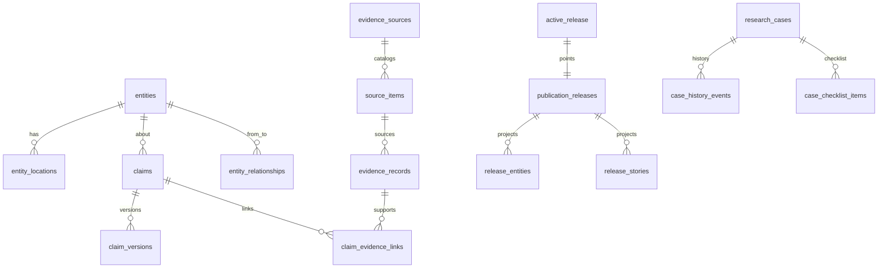

# Postgres schema design (BlackStory → Supabase)

**Status:** Design + DDL authored (remote apply gated)  
**ADR:** [ADR-020](../adr/ADR-020-supabase-postgres-system-of-record.md)  
**Target project:** `blackstory-app` (`twykhihqkcldpreuovay`, `us-west-2`)  
**Bead:** repo-ivh4

This document maps the Firestore product model to Supabase Postgres. It is the companion to
versioned SQL under [`supabase/migrations/`](../../supabase/migrations/). ETL and traffic cutover
are out of scope here.

## Principles

1. **Private `bb_*` schemas** — do not park product tables in `public`.
2. **Natural text PKs** where Firestore used semantic IDs; UUIDs where the domain already used them.
3. **Normalize** arrays-of-maps that are queried or audited (`case_history_events`, checklist items);
   keep truly schemaless bags as `jsonb` with CHECKs.
4. **ADR-004** — immutable release projections; one active release pointer; no in-place public edits.
5. **Research cannot publish** — RLS/grants enforce this.
6. **Authz in `app_metadata.bb_role` only** (Supabase Auth).
7. **Provenance quartet** on published statistics: `source`, `source_url`, `retrieved_at`, `content_hash`.
8. **Evidence requires** `source_item_id` (NOT NULL + FK).
9. **Claim versions are append-only** (no UPDATE/DELETE grants).
10. **Blobs stay outside Postgres** — storage object refs only.

## Logical schemas

| Schema | Purpose | Client access |
|--------|---------|---------------|
| `bb_auth` | Role helpers (`current_role()`, predicates) | execute for `authenticated`/`anon` as needed |
| `bb_public` | Active-release projections, search index, snapshots | SELECT (active only) for `anon`/`authenticated` |
| `bb_submissions` | Quarantined intake | INSERT quarantined; SELECT own or staff |
| `bb_research` | Research cases + normalized history/checklist | research/admin |
| `bb_evidence` | Sources, captures, evidence metadata, lineage | service_role write; research SELECT |
| `bb_canonical` | Entities, locations, claims, relationships, merges, embeddings | service_role write |
| `bb_publication` | Release records + promotion workflow | service_role / publication role via RPC |
| `bb_reference` | Jurisdictions + census/ACS/UCR/HOLC/OA stats | SELECT where product allows; closed tables stay service-only |
| `bb_ops` | Policy, kill switches, outbox, idempotency, catalog, story reviews | service_role |
| `bb_audit` | Append-only audit events | INSERT via service; SELECT staff |

## Entity-relationship (core)

## Firestore → Postgres mapping

### Ops / audit / auth

| Firestore | Postgres | Notes |
|-----------|----------|-------|
| Firebase Auth claims | `auth.users` + `raw_app_meta_data.bb_role` | Never `user_metadata` |
| `policy` / `policyVersions` | `bb_ops.policy_active`, `bb_ops.policy_versions` | |
| `killSwitches` | `bb_ops.kill_switches` | |
| `discoveryCampaignRuns` | `bb_ops.discovery_campaign_runs` | `public_effect` stays `none` |
| `auditEvents` | `bb_audit.events` | Append-only |
| `outboxMessages` | `bb_ops.outbox_messages` | `pending`/`processed`/`dead_letter` |
| `idempotencyKeys` | `bb_ops.idempotency_keys` | PK = key text |
| `outboxConsumerReceipts` | `bb_ops.outbox_consumer_receipts` | |
| `catalogDecisions` | `bb_ops.catalog_decisions` | Does not mutate live release |
| `adminStoryPacketReviews` | `bb_ops.story_packet_reviews` | Live-only; was missing from FIRESTORE_ROOT |

### Research

| Firestore | Postgres |
|-----------|----------|
| `researchCases` | `bb_research.cases` |
| `history[]` | `bb_research.case_history_events` |
| `checklist.items[]` | `bb_research.case_checklist_items` |

### Canonical

| Firestore | Postgres |
|-----------|----------|
| `canonicalEntities` | `bb_canonical.entities` |
| `canonicalEntities/{id}/locations` | `bb_canonical.entity_locations` |
| `entityRelationships` | `bb_canonical.entity_relationships` + `entity_relationship_evidence` |
| `entityMerges` | `bb_canonical.entity_merges` + `entity_merge_absorbed` |
| `entityEmbeddings` | `bb_canonical.entity_embeddings` (`vector(768)`) |
| `canonicalClaims` | `bb_canonical.claims` |
| `canonicalClaims/{id}/versions` | `bb_canonical.claim_versions` |
| `claimEvidenceLinks` | `bb_canonical.claim_evidence_links` |
| `claimPromotions` | `bb_canonical.claim_promotions` |
| `publicationCandidates` | `bb_canonical.publication_candidates` |

### Evidence

| Firestore | Postgres |
|-----------|----------|
| `sourceOrganizations` | `bb_evidence.source_organizations` |
| `sourceDomains` | `bb_evidence.source_domains` |
| `evidenceSources` | `bb_evidence.evidence_sources` |
| `sourceItems` | `bb_evidence.source_items` UNIQUE(source_id, stable_identifier) |
| `sourceCaptures` | `bb_evidence.source_captures` |
| `retrievalEvents` | `bb_evidence.retrieval_events` |
| `evidenceRecords` | `bb_evidence.evidence_records` |
| `evidenceLineage` | `bb_evidence.evidence_lineage` |

### Publication / public

| Firestore | Postgres |
|-----------|----------|
| `publicationReleases` | `bb_publication.releases` |
| `publicMeta/activeRelease` | `bb_public.active_release` (singleton) |
| `publicMeta/*` other | `bb_public.materialized_snapshots` |
| `publicReleases/{id}/entities` | `bb_public.release_entities` |
| `publicReleases/{id}/stories` | `bb_public.release_stories` |
| graph adjacency/decades/all-time | `bb_public.release_graph_adjacency`, `release_graph_decades`, `release_graph_all_time` |
| `publicSearchIndex` | `bb_public.search_index` (includes optional `geohash`) |

### Submissions

| Firestore | Postgres |
|-----------|----------|
| `submissionInbox` | `bb_submissions.intake_items` |

### Reference / stats

| Firestore | Postgres |
|-----------|----------|
| `jurisdictions` | `bb_reference.jurisdictions` |
| `censusCountyDecades` | `bb_reference.census_county_decades` |
| `censusNationalDecades` | `bb_reference.census_national_decades` |
| `censusStateDecades` | `bb_reference.census_state_decades` |
| `censusCountyHistoricalDecades` | `bb_reference.census_county_historical_decades` (no anon SELECT) |
| `acsCountyProfiles` | `bb_reference.acs_county_profiles` |
| `acsTractProfiles` | `bb_reference.acs_tract_profiles` (no anon full scan) |
| `ucrAgencies` | `bb_reference.ucr_agencies` |
| `opportunityAtlasTracts` | `bb_reference.opportunity_atlas_tracts` |
| `hateCrimeCountyYears` | `bb_reference.hate_crime_county_years` (no anon SELECT) |
| `ucrStateParticipation` | `bb_reference.ucr_state_participation` |
| `holcAreas` | `bb_reference.holc_areas` |
| — | `bb_reference.statistical_series` (metric definitions) |
| — | `bb_reference.statistical_observations` (typed estimates + provenance) |
| — | `bb_reference.derived_measurements` (derived/modeled; not raw observations) |
| — | `bb_reference.entity_context_bindings` (law/place ↔ indicator juxtaposition) |

### Datapack stubs (fail-closed)

| Concept | Postgres |
|---------|----------|
| `externalDatasets` | `bb_ops.external_datasets` (`registry_state` default `disabled`) |
| `externalDatasetVersions` | `bb_ops.external_dataset_versions` |
| `datasetSubscriptions` | `bb_ops.dataset_subscriptions` |
| `importBatches` | `bb_ops.import_batches` |
| `importValidationFindings` | `bb_ops.import_validation_findings` |
| `importQuarantines` | `bb_ops.import_quarantines` |

## Live vs typed inventory (2026-07-20)

**Live root collections on `black-book-efaaf`:**  
`acsCountyProfiles`, `acsTractProfiles`, `adminStoryPacketReviews`, `auditEvents`,
`censusCountyDecades`, `censusNationalDecades`, `censusStateDecades`, `entityEmbeddings`,
`entityRelationships`, `evidenceSources`, `hateCrimeCountyYears`, `holcAreas`, `idempotencyKeys`,
`killSwitches`, `opportunityAtlasTracts`, `outboxMessages`, `policy`, `policyVersions`,
`publicMeta`, `publicReleases`, `publicSearchIndex`, `publicationReleases`, `researchCases`,
`retrievalEvents`, `sourceCaptures`, `sourceItems`, `submissionInbox`, `ucrAgencies`,
`ucrStateParticipation`.

**Typed in `FIRESTORE_ROOT` but empty/absent live (still required in DDL):**  
`canonicalEntities`, `canonicalClaims`, `claimEvidenceLinks`, `entityMerges`,
`sourceOrganizations`, `sourceDomains`, `evidenceRecords`, `evidenceLineage`,
`outboxConsumerReceipts`, `discoveryCampaignRuns`, `jurisdictions`,
`censusCountyHistoricalDecades`, `catalogDecisions`, plus path-extra
`claimPromotions` / `publicationCandidates`.

Schema coverage must include **both** sets.

## Load-bearing invariants (checklist)

| # | Invariant | Enforcement |
|---|-----------|-------------|
| 1 | No anonymous canonical writes | No INSERT/UPDATE policies for `anon` on `bb_canonical` |
| 2 | Public sees active release only | Views / RLS join `bb_public.active_release` |
| 3 | One active release | Singleton table + CHECK / unique constraint |
| 4 | Release projections immutable | No UPDATE/DELETE for `authenticated`/`anon`; service inserts new release rows |
| 5 | Research cannot activate release | No policy; `activate_release` checks `publication`/`admin` |
| 6 | Evidence requires source item | `source_item_id NOT NULL` + FK |
| 7 | Claim versions append-only | Revoke UPDATE/DELETE |
| 8 | Discovery never auto-publishes | `public_effect = 'none'` CHECK on campaign runs |
| 9 | Statistic provenance | NOT NULL provenance columns on reference fact tables |
| 10 | Roles from app_metadata | `bb_auth.current_role()` |

## Extensions

Enabled in migration `0001`: `postgis`, `vector`, `pg_trgm`, `pgcrypto`, `uuid-ossp` (via `extensions` schema as Supabase conventions allow).

## RPC stubs

| Function | Purpose |
|----------|---------|
| `bb_publication.activate_release(release_id text)` | SECURITY DEFINER; role gate; swaps `active_release`; writes audit/outbox |
| `bb_ops.commit_with_audit(...)` | Optional helper for idempotent privileged commits (follow-up wiring) |

## Out of scope

- ETL / backfill from Firestore
- Dual-write
- App client rewire
- Supabase Storage blob migration
- Remote `db push` without explicit human approval
