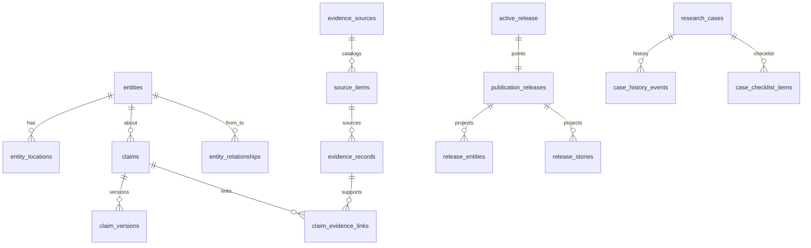

# Postgres schema design (BlackStory → Supabase)

**Status:** Supabase is the deployed canonical database. This document describes the storage
model; versioned SQL and live catalog inspection establish the actual schema. The last inspected deployment used `bb_*` schema
prefixes. Their replacement is implemented locally; production cutover is unverified.
See [architecture](../architecture.md) and the [research audit](../research/framework-audit.md).

## Principles

1. **Separate responsibility-based schemas**. The cutover removes `bb_*` prefixes without moving private tables into built-in `public`.
2. **Stable text identifiers** for domain records; UUIDs where the domain requires them.
3. **Normalize** arrays-of-maps that are queried or audited (`case_history_events`, checklist items);
   keep truly schemaless bags as `jsonb` with CHECKs.
4. **Release-scoped projections and one active release pointer.** Privileged corrections must
   reconcile all derived copies and release artifacts; public clients cannot edit projections.
5. **Research cannot publish** — RLS/grants enforce this.
6. **Authz in `app_metadata.app_role` only** (Supabase Auth).
7. **Provenance quartet** on published statistics: `source`, `source_url`, `retrieved_at`, `content_hash`.
8. **Evidence requires** `source_item_id` (NOT NULL + FK).
9. **Claim versions are append-only** (no UPDATE/DELETE grants).
10. **Blobs stay outside Postgres** — storage object refs only.

## Logical schemas

| Schema | Purpose | Client access |
|--------|---------|---------------|
| `access_control` | Role helpers (`current_role()`, predicates) | execute for `authenticated`/`anon` as needed |
| `published` | Active-release projections, search index, snapshots | SELECT (active only) for `anon`/`authenticated` |
| `submissions` | Quarantined intake | INSERT quarantined; SELECT own or staff |
| `research` | Research cases + normalized history/checklist | research/admin |
| `evidence` | Sources, captures, evidence metadata, lineage | service_role write; research SELECT |
| `canonical` | Entities, locations, claims, relationships, merges, embeddings | service_role write |
| `publication` | Release records + promotion workflow | service_role / publication role via RPC |
| `reference` | Jurisdictions + census/ACS/UCR/HOLC/OA stats | SELECT where product allows; closed tables stay service-only |
| `ops` | Policy, kill switches, outbox, idempotency, catalog, story reviews | service_role |
| `audit` | Append-only audit events | INSERT via service; SELECT staff |

## Entity-relationship (core)

```mermaid
erDiagram
  entities ||--o{ entity_locations : has
  entities ||--o{ claims : about
  claims ||--o{ claim_versions : versions
  claims ||--o{ claim_evidence_links : links
  evidence_records ||--o{ claim_evidence_links : supports
  source_items ||--o{ evidence_records : sources
  evidence_sources ||--o{ source_items : catalogs
  entities ||--o{ entity_relationships : from_to
  publication_releases ||--o{ release_entities : projects
  publication_releases ||--o{ release_stories : projects
  active_release ||--|| publication_releases : points
  research_cases ||--o{ case_history_events : history
  research_cases ||--o{ case_checklist_items : checklist
```

## Research execution and retrieval

`research` stores versioned profiles, questions, evidence needs, immutable run inputs, frontier
tasks, dependency edges, worker attempts, artifacts and model-invocation accounting. Lease tokens
bound completion to an active attempt. Actual model cost may be unknown; reserved budget is not
an invoice. Proposals cannot satisfy review gates by themselves.

`evidence` separates source identities, source items, byte captures and capture origins. Shared
bytes do not merge rights decisions or source lineage. Retrieval passages carry exact text hashes
and offsets. Full-text and vector results retain the passage and capture provenance; semantic
similarity is a retrieval signal, never entailment. Embedding model and text-hash mismatches are
excluded. Measure filtered recall and query plans before adding approximate indexes or a separate
vector service.

Private text retention requires a source-specific decision. Withdrawal erases passage text and
vectors, records minimal tombstones and queues private-object deletion. This is not a guarantee
that every downstream export, model log or public archive has been erased.

## Schema authority and cutover

`supabase/migrations/` is the executable schema history. Current application queries use the
responsibility names above. Historical migration identifiers remain unchanged. The namespace
cutover must be applied with the matching application version; there are no compatibility views
or dual writes. Production cutover is not established by local reset success.

Use [schema validation](schema-validation.md), [research operations](../research/research-operations.md)
and [recovery](../runbooks/backup-restore.md) before deployment. Table inventories belong in live
catalog inspection, not duplicated migration-era collection maps.
