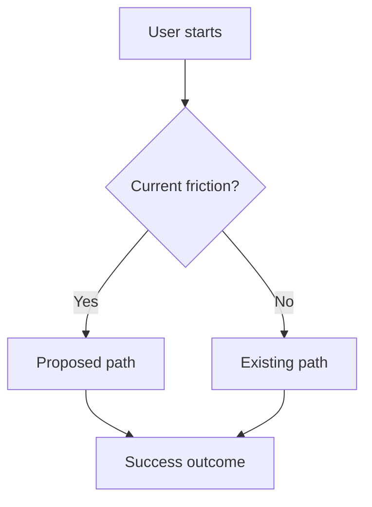

# PRD: {title}

- **Date**: {YYYY-MM-DD}
- **Owner**: {name}
- **Status**: draft | in-review | approved | shipped | deprecated

<!--
Use this for a product capability, user workflow, or customer-facing requirement set.
Use meta-prd.md instead when defining the requirements for a product system, agent,
process, template, evaluation loop, or operating model.

Before drafting, read rules/common/framing.md.

Owning specialist: cx-product-manager (see rules/common/doc-ownership.md).
Construct must route PRD authoring to cx-product-manager rather than drafting directly.
doing so is how requirements traceability, user grounding, and external research fire.

Write with a balance of short paragraphs, tables, and bullets. Bullets are for scans,
not the whole document. Keep em dashes rare; prefer commas, periods, or parentheses.
-->

## Summary
This PRD defines {title} for {primary user or customer segment}. It explains the current friction, the measurable outcome this work should unlock, and the smallest shippable path to prove the change works. Replace this paragraph with evidence-backed product context before review.

<!--
One paragraph (3-5 sentences) that a busy reader can use as the whole PRD.
What the change is, who it's for, why now, and what changes when it ships.
No solutions in this section that aren't decided. No ticket IDs. No team names.
-->

## Background
Today, {current workflow or system} creates avoidable friction for {affected users}. The evidence that matters for this PRD should include observed behavior, quantitative signals, or qualitative research, and the links below should let reviewers verify the claim without relying on memory.

<!--
Context the reader needs to evaluate this PRD without asking around.
Include relevant prior work (linked PRDs, ADRs, RFCs), observed signals, and
the current state of the user experience or system. State what is already
true today so the reader can compare against the proposed change.

Cite evidence: support tickets, interviews, telemetry, sales calls, research.
Avoid roadmap-speak ("this is a Q3 priority"); state what is happening to users.
-->

## Problem
{Affected users} cannot reliably achieve {desired outcome} because {constraint or failure mode}. The problem is important now because the current workaround is costly, error-prone, or blocks adoption for a clearly named segment.

<!--
The specific user or business outcome that is currently blocked. One or two
paragraphs. State the pain, not the solution.

Must NOT reference:
- Jira / Linear ticket IDs or "this came from ticket X"
- Roadmap items, OKR line items, or quarterly goals
- "The team decided we should build this"

Must reference:
- Observed user behavior, quantitative signals, or qualitative evidence
- The specific outcome that is not currently achievable
- The constraint that makes this non-trivial today
-->

## Goals
<!--
What success looks like, in outcome terms. Three to five goals max. Each
goal is the *change* you want, not the activity. Order by importance — when
the ordering is contested or drives what ships first, apply an explicit
method (see the strategy/prioritization-methods skill) rather than ranking
on gut feel.

Examples:
- Reduce p95 onboarding time from 12m to under 4m for new accounts.
- Eliminate the manual reconciliation step our top 20 customers do every Monday.
- Halve the support volume for "where is my data" questions.
-->

## Outcome
<!--
What is concretely different for users, the business, or the system once this
ships and is adopted. This is the observable end state: written from the
user's perspective when possible. The acceptance criteria below should be the
falsifiable evidence that this outcome was achieved.

A reader should be able to compare the current state (Background) to this
section and see the delta in plain language.
-->

## User flow

## In scope and out of scope

| | Description |
|---|---|
| **In scope** | <what this PRD covers and commits to ship> |
| **Out of scope** | <related work explicitly deferred: name the reason> |
| **Adjacent (deferred)** | <work that's a natural follow-up but not in this PRD> |

<!--
Be specific. "Authentication" is too vague; "OAuth login for the web dashboard,
not for the CLI" is right. The Out of scope list is a tool for protecting
schedule and reviewer attention: use it.
-->

## Phases

<!--
Phases are how this work ships, not how it's organized internally. Each phase
is independently shippable and provides observable user value (or a clearly
defined platform capability). Avoid "phase 1: backend, phase 2: frontend".
that's a task list, not a phasing.

Each phase below holds its own goal, status, functional requirements (FR),
and non-functional requirements (NFR), with acceptance criteria written
inline next to each requirement. Use `FR-<phase>.<n>` and `NFR-<phase>.<n>`
so requirements can be referenced from reviews and tests.

Status values: not started | in progress | shipped | deferred.

NFR categories to consider: performance, reliability, security, privacy,
accessibility, observability, compliance, cost. Numeric targets where possible.
-->

### Phase 1: <name>

- **Goal**: <what this phase delivers>
- **Status**: not started

**Functional**

- **FR-1.1**: <imperative statement of what the system must do>
  - *Acceptance*: <observable, falsifiable condition a reviewer can check without asking the author>
- **FR-1.2**: <...>
  - *Acceptance*: <...>

**Non-functional**

- **NFR-1.1**: <category>: <target with number>
  - *Acceptance*: <how this is measured and what counts as pass>

### Phase 2: <name>

- **Goal**: <what this phase delivers>
- **Status**: not started

**Functional**

- **FR-2.1**: <...>
  - *Acceptance*: <...>
- **FR-2.2**: <...>
  - *Acceptance*: <...>

**Non-functional**

- **NFR-2.1**: <category>: <target>
  - *Acceptance*: <...>

### Phase 3: <name>

- **Goal**: <what this phase delivers>
- **Status**: not started

**Functional**

- **FR-3.1**: <...>
  - *Acceptance*: <...>

**Non-functional**

- **NFR-3.1**: <category>: <target>
  - *Acceptance*: <...>

## Success metrics
<!--
How we will know this worked in production over time, beyond the per-requirement
acceptance criteria. Leading vs. lagging. Avoid vanity metrics.
-->

| Metric | Baseline | Target |
|---|---|---|
| {name} | {current} | {goal} |

## Constraints
<!--
Budget, timeline, platform, team, legal, technical debt: anything that shapes
the solution and isn't a requirement.
-->

## Dependencies
<!--
Teams, services, contracts, data sources, vendor timelines. Each dependency
should name an owner and the date it must be ready by.
-->

## Risks and mitigations

| Risk | Likelihood | Impact | Mitigation |
|---|---|---|---|
| <risk> | low / med / high | low / med / high | <how this is reduced or what we accept> |

## Open questions

| Question | Owner | Decision needed by |
|---|---|---|
| <unknown> | <name> | <YYYY-MM-DD> |

## References
<!-- Linked research, prior PRDs, ADRs, tickets, designs. -->
