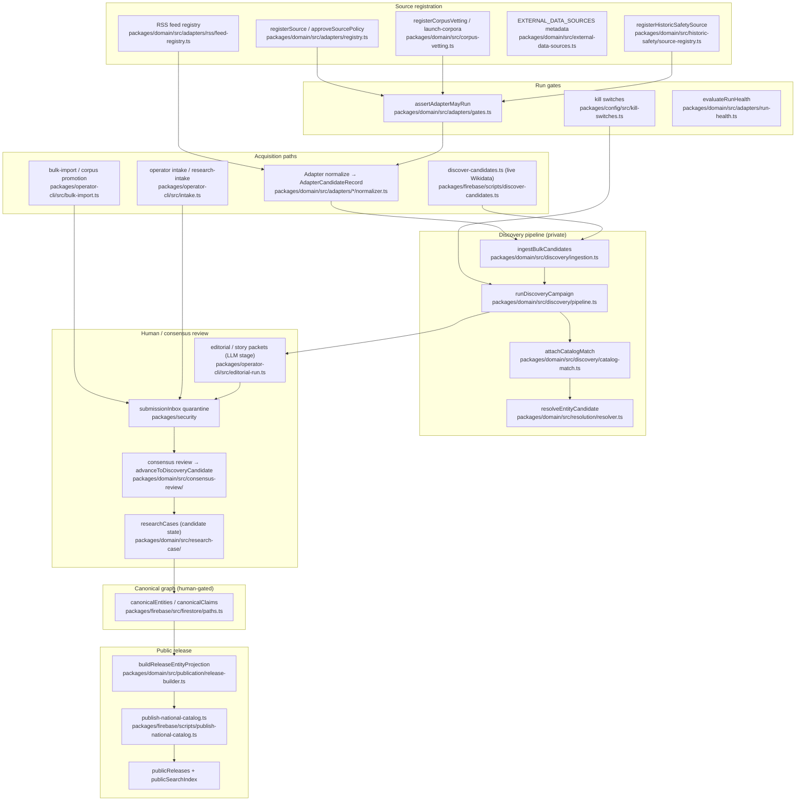

# Entity acquisition pipeline — current-state audit

**Purpose:** Durable, code-verified snapshot of how BlackStory registers sources, acquires entity candidates, resolves them against the canonical catalog, and (separately) publishes public releases. Intended for pipeline audits, bead planning, and onboarding.

**Date:** 2026-07-19  
**Branch:** `redesign/brand-map-beads` @ `41ddbfe`

---

## 1. Document purpose + branch context

### VERIFIED FACTS

- This audit was produced against the working tree on branch `redesign/brand-map-beads`, commit `41ddbfe`.
- Entity acquisition is split into **private research lanes** (discovery candidates, operator proposals, research cases) and **public release lanes** (publication releases, `publicReleases/*`, `publicSearchIndex/*`). Discovery code explicitly forbids public writes (`assertDiscoveryCannotPublish`, `assertCampaignCannotPublish`).
- Primary implementation lives in `packages/domain/`, orchestration in `packages/config/src/scheduled-jobs/`, persistence helpers in `packages/firebase/`, operator entry in `packages/operator-cli/`, scheduled execution in `functions/src/` and `workers/research-node/`.

### STRONG INFERENCES

- Most registry and query-pack stores are **in-memory contract layers** today; Firestore wiring for source registry, query packs, and discovery candidates is documented as deferred in `docs/research/source-registry.md` and `docs/research/discovery-pipeline.md`.

### UNRESOLVED QUESTIONS

- Which discovery campaign runs are actually persisted to Firestore `discoveryCampaignRuns/{runId}` in production vs. remaining dispatcher-only JSON output (builders exist; Admin writers are referenced but not traced end-to-end in this audit).

---

## 2. Pipeline diagram (registration → public release)

---

## 3. Source registry / source-list representations

| Path | Symbol / artifact | Purpose |
|------|-------------------|---------|
| `packages/domain/src/adapters/registry.ts` | `registerSource`, `approveSourcePolicy`, `SourceRegistryStore` | In-memory adapter + evidence-source registry; default state `disabled` |
| `packages/domain/src/adapters/types.ts` | `SourceAdapterContract`, `SourceRegistryEntry`, `AdapterCandidateRecord` | Contract fields, lifecycle states, normalized candidate shape |
| `packages/domain/src/adapters/gates.ts` | `assertAdapterMayRun`, `selectCanaryRecordIndices` | Fail-closed pre-run gate; canary sampling |
| `packages/domain/src/adapters/run-health.ts` | `evaluateRunHealth` | Quarantine on record-count / schema drift |
| `packages/domain/src/corpus-vetting.ts` | `registerCorpusVetting`, `CorpusVettingRecord` | Bulk-import corpus vetting; adapter id `bulk-corpus:<corpus>` |
| `packages/domain/src/launch-corpora.ts` | `buildLaunchCorpusVettingInputs`, `registerLaunchCorpora` | Seven named launch corpora (NRHP, HABS/HAER, etc.) |
| `packages/domain/src/external-data-sources.ts` | `EXTERNAL_DATA_SOURCES` | Pre-ingestion metadata for demographics/context datasets (not adapter registrations) |
| `packages/domain/src/historic-safety/source-registry.ts` | `registerHistoricSafetySource`, `HISTORIC_SAFETY_SOURCE_IDS` | EJI lynching + Tougaloo sundown towns; references launch corpora without re-registering |
| `packages/domain/src/adapters/rss/feed-registry.ts` | `addFeedToRegistry`, `FeedRegistryStore` | Per-feed RSS/Atom registry (separate from adapter policy) |
| `packages/domain/src/adapters/rss/curated-feeds.ts` | `CURATED_COMMUNITY_FEED_SEEDS` | Curated community feeds (ABS) + extra-care policy flags |
| `packages/domain/src/adapters/federal/index.ts` | `FEDERAL_ADAPTER_DEFINITIONS`, per-family definitions | LOC, NARA, NPS, school-history, federal DPLA (`dpla-items-v1`) |
| `packages/domain/src/adapters/index.ts` | barrel exports | Wikimedia, federal, RSS, IA, DPLA v2, Reddit, web-search, Common Crawl, census |
| `packages/domain/src/provenance/source.ts` | `EvidenceSource`, `assertEvidenceSourceValid` | Evidence-source model mirrored on registry entries |
| `packages/firebase/src/firestore/paths.ts` | `evidenceSources`, `sourceItems`, `sourceCaptures` | Intended Firestore persistence targets (adapter registry doc says deferred) |
| `docs/research/source-registry.md` | — | Contract documentation; states Firestore `SourceRegistryStore` is future work |
| `workers/research/src/black_book_research/adapters/` | Python mirror | Cloud Run job contract mirror (naming: `black_book_research`) |

### VERIFIED FACTS

- Every adapter registration starts **`disabled`** until `approveSourcePolicy` (`packages/domain/src/adapters/registry.ts:66`).
- Corpus vetting reuses the same registry primitives with adapter ids like `bulk-corpus:nrhp` (`packages/domain/src/corpus-vetting.ts` module doc).
- `EXTERNAL_DATA_SOURCES` explicitly does **not** call `registerSource`; it records acquisition metadata only (`packages/domain/src/external-data-sources.ts:8–14`).

### DEFECTS

- **Stale skill references:** `.claude/skills/black-book/research-intake/SKILL.md` and `case-drafting/SKILL.md` still cite `@blap/domain` and `@blap/operator-cli`; production code uses `@repo/*`.

---

## 4. Acquisition paths

| Path | Entry | Output | Public? |
|------|-------|--------|---------|
| **Scheduled discovery campaigns** | `dispatchDiscoveryCampaign` (`packages/config/src/scheduled-jobs/discovery-dispatcher.ts`) | `DiscoveryCampaignResult` (private candidates) | No |
| **RSS hourly** | `runRssDiscoveryCampaign` (`packages/domain/src/discovery/rss-campaign.ts`) | Accepted/quarantined candidates; excludes curated ABS by default | No |
| **Community obscurity (ABS weekly)** | `runCommunityObscurityCampaign` (`packages/domain/src/discovery/community-obscurity-campaign.ts`) | Obscurity-ranked leads + authority follow-ups | No |
| **Wikimedia + federal fixtures** | `runWikimediaFederalCampaign` (`packages/domain/src/discovery/wikimedia-federal-campaign.ts`) | Fan-out across 6 adapter ids | No |
| **Archive + DPLA v2** | `runArchiveDplaCampaign` (`packages/domain/src/discovery/archive-dpla-campaign.ts`) | IA + `dpla` (v2) candidates; excludes `dpla-items-v1` | No |
| **Web search** | `runWebSearchCampaign` (`packages/domain/src/discovery/web-search-campaign.ts`) | Brave/SearXNG; fails closed without `storageTermsConfirmed` | No |
| **Live Wikidata discovery script** | `packages/firebase/scripts/discover-candidates.ts` | Git-durable JSON under `fixtures/discovery-candidates/` | No |
| **Operator lead / URL intake** | `prepareLeadIntake`, `runResearchIntake` (`packages/operator-cli/src/intake.ts`, `research-intake.ts`) | Quarantined submission + draft research case | No until human promotion |
| **Bulk corpus import** | `prepareBulkLeadIntake` (`packages/operator-cli/src/bulk-import.ts`) | Quarantine rows via corpus-fast-track or standard consensus | No |
| **Discovery survivor intake** | `prepareDiscoverySurvivorIntake` (`packages/operator-cli/src/discovery-survivor-intake.ts`) | Queues campaign survivors into research pipeline | No |
| **Seed campaigns** | `packages/domain/src/seed-campaigns/records.ts` | Curated high-confidence seed records (NRHP, Rosenwald, HBCU) | No (fixture/bootstrap lane) |
| **Historic-safety datasets** | `registerHistoricSafetySources` | Layer-feed registrations (EJI, Tougaloo) | No |
| **External dataset scripts** | e.g. `ingest-hate-crime.ts`, `ingest-opportunity-atlas.ts` | Context/demographics Firestore collections, not entity discovery | Context layer only |

### VERIFIED FACTS

- All discovery campaign modules call `assertCampaignCannotPublish` or equivalent guard before returning (`packages/domain/src/discovery/campaign-runner.ts:74–82`).
- `discover-candidates.ts` writes to git fixtures and `.cache/discovery/`; module header states it never copies Wikipedia snippets into candidate payload (`packages/firebase/scripts/discover-candidates.ts:5–11`).

### UNRESOLVED QUESTIONS

- Live-mode SafeHttp fetch for scheduled discovery is documented as **not wired** in dispatcher (`discovery-dispatcher.ts` module doc: "SafeHttpClient fetch not wired yet"); production live behavior may still be fixture-first.

---

## 5. Candidate schemas

| Schema version | JSON Schema | TypeScript | Validators |
|----------------|-------------|------------|------------|
| `candidate-record.v1` | `packages/schemas/adapters/candidate-record.v1.schema.json` | `AdapterCandidateRecord` (`packages/domain/src/adapters/types.ts:90–97`) | `assertAdapterCandidateValid`, `validateAdapterCandidates` (`packages/domain/src/adapters/candidates.ts`) |
| `discovery-candidate.v1` | `packages/schemas/discovery/discovery-candidate.v1.schema.json` | `DiscoveryCandidateRecord` (`packages/domain/src/discovery/types.ts:94–114`) | Pipeline ingestion + quarantine handlers |
| Federal export payloads | `packages/schemas/adapters/federal/*.schema.json` | Parsed via `parseFederalFixtureBatch` | Per-family fixture tests |
| Wikimedia payloads | `packages/schemas/adapters/wikimedia/*.schema.json` | `normalizeWikimediaBulkBatch` | `packages/domain/src/adapters/wikimedia/` |
| Research case | `packages/schemas/research-case/research-case.v1.schema.json` | `ResearchCaseRecord` | Research-case workflow |
| Editorial packet | (domain-only) | `EditorialPacket` (`packages/domain/src/editorial/packet.ts`) | `validateEditorialDrafts` |
| Story research packet | (domain-only) | `StoryResearchPacket` (`packages/domain/src/story-research/packet.ts`) | `validateStoryResearchPacket` |

### VERIFIED FACTS

- `ADAPTER_CANDIDATE_SCHEMA_VERSION = 'candidate-record.v1'` (`packages/domain/src/adapters/candidates.ts:6`).
- `DISCOVERY_CANDIDATE_SCHEMA_VERSION = 'discovery-candidate.v1'` (`packages/domain/src/discovery/types.ts:16`).
- Every adapter candidate requires full provenance (`sourceId`, `adapterId`, `parserVersion`, `registryEntryId`, `runId`, `capturedAt`, `schemaVersion`) via `assertCandidateHasProvenance`.

---

## 6. Entity mention vs canonical entity representations

| Representation | Location | Role |
|----------------|----------|------|
| **Canonical entity** | `CanonicalEntity` (`packages/domain/src/entity.ts:71+`) | Authoritative graph node: `id`, `kind`, `displayName`, `aliases`, `identifiers`, kind-specific bags |
| **Resolution candidate** | `ResolutionCandidate` (`packages/domain/src/resolution/types.ts:17–27`) | Ephemeral match input derived from discovery candidates |
| **Discovery candidate** | `DiscoveryCandidateRecord` | Private pipeline record wrapping `adapterRecord` + signals + optional `catalogMatch` |
| **Mentioned entity ids (legacy/bootstrap)** | `mentionedEntityIds` on release source entities (`packages/domain/src/publication/release-builder.ts:73`) | Placeholder cross-refs in bootstrap catalog; **not fail-closed** at release build |
| **Topic vs mention split** | `splitLegacyTopicTags` (`packages/domain/src/taxonomy/split-topic-tags.ts`) | Routes legacy tags into `topicIds`, `mentionedEntityIds`, `keywords` |
| **Fact subjects** | `FactSubjectRef` (`packages/domain/src/graph/fact-subjects.ts`) | Typed edges from facts to canonical entity ids |
| **Relationship candidates** | `proposeRelationshipCandidates` (`packages/domain/src/graph/relationship-candidates.ts`) | Suggests edges from `mentionedEntityIds`, geohash, jurisdiction — triage only |
| **Prose entity links** | `parseProseEntityLinks` (`packages/domain/src/editorial/prose-links.ts`) | `[[entityId|Label]]` markup in editorial drafts |

### VERIFIED FACTS

- `resolveReleaseEntityReferences` deliberately **does not** validate `mentionedEntityIds` because they may still be legacy placeholder strings (`packages/domain/src/publication/release-builder.ts:28–31`).
- Discovery resolution never merges silently: outcomes are `proposed_match`, `review_required`, or `no_match` only (`packages/domain/src/resolution/types.ts:50`).

### STRONG INFERENCES

- `mentionedEntityIds` on public projections are not yet backed by a completed entity-resolution workstream; graph `mutual_mention` candidates are research-triage helpers, not published edges.

---

## 7. Resolution paths

| Path | Function | When used | Auto-apply? |
|------|----------|-----------|-------------|
| **Discovery catalog blocking** | `attachCatalogMatch` → `resolveEntityCandidate` (`packages/domain/src/discovery/catalog-match.ts`, `resolution/resolver.ts`) | Optional on `runDiscoveryCampaign` when `catalog` profiles supplied | No — attaches `catalogMatch` + optional `DuplicateReviewQueueItem` |
| **Resolution from discovery record** | `resolutionCandidateFromDiscovery` (`packages/domain/src/resolution/resolver.ts:328+`) | Converts discovery candidate to `ResolutionCandidate` | No |
| **Scoring thresholds** | `PROPOSE_THRESHOLD=0.86`, `REVIEW_THRESHOLD=0.55`, `AMBIGUITY_MARGIN=0.12` | Trusted identifier exact match weighted 0.65 (`EXACT_TRUSTED_IDENTIFIER_SCORE`) | Propose only above 0.86 without ambiguity |
| **Duplicate review queue** | `createDuplicateReviewQueueItem` | `review_required` outcomes | Human triage |
| **Applied resolution decision** | `applyResolutionDecision`, `reverseResolutionDecision` | Post-human review | Explicit audit trail (`ResolutionDecision` type) |
| **Catalog profile loading** | `loadDiscoveryCatalogProfiles` (`packages/firebase/src/discovery/catalog-profiles.ts`) | Scheduled runs when `DISCOVERY_CATALOG_FROM=firestore` | Read-only from `publicSearchIndex` |
| **Geocode / locate resolution** | `packages/domain/src/geocode/pipeline.ts`, `packages/operator-cli/src/locate.ts` | Location precision for entities | Separate from entity-identity resolution |
| **Relationship publish resolution** | `packages/domain/src/relationship-publish.ts` | Graph edge publication | Distinct from discovery candidate resolution |

### VERIFIED FACTS

- `resolveEntityCandidate` never writes canonical entities; it returns `ResolutionResult` only (`packages/domain/src/resolution/resolver.ts:269–310`).
- Scheduled discovery defaults **off** for catalog loading; opt-in via `DISCOVERY_CATALOG_FROM=firestore` (`functions/src/run-discovery.ts:77–79`).

---

## 8. Query packs and campaign types

### Query packs

| Component | Path |
|-----------|------|
| Builder / validation | `buildQueryPack`, `assertQueryPackValid` (`packages/domain/src/query-packs/pack.ts`) |
| Registry | `registerQueryPack`, `resolveQueryPackForRun` (`packages/domain/src/query-packs/registry.ts`) |
| Signal classification | `classifySignalStrength` (`packages/domain/src/query-packs/classification.ts`) |
| Discovery stamping | `stampDiscoveryRun` (`packages/domain/src/query-packs/discovery.ts`) |
| Public-safe term filter | `toPublicSafeTerms` (`packages/domain/src/query-packs/types.ts` exports) |
| JSON schema | `packages/schemas/query-packs/query-pack.v1.schema.json` |
| Gold fixture | `packages/domain/src/query-packs/fixtures/person-civil-rights-fixture.v1.json` |

### Campaign types (discovery)

| Campaign kind constant | Job id (roster) | Default query pack id | Schedule (UTC) |
|------------------------|-----------------|----------------------|----------------|
| `rss-discovery.v1` | `discovery-campaign-rss` | `qp-rss-discovery` | Hourly |
| `community-obscurity.v1` | `community-obscurity-discovery` | `qp-community-obscurity` | Weekly Sun 10:00 |
| `wikimedia-federal-discovery.v1` | `discovery-campaign-wikimedia-federal` | built in campaign | Weekly Mon 06:00 |
| `archive-dpla-discovery.v1` | `discovery-campaign-archive-dpla` | `qp-archive-dpla` | Weekly Tue 07:00 |
| web-search campaign | `discovery-campaign-web-search` | campaign-specific | Daily 08:30 |

Roster source: `packages/config/src/scheduled-jobs/roster.ts`; dispatcher job ids: `packages/config/src/scheduled-jobs/discovery-dispatcher.ts:43–48`.

### Seed campaign types

- `SEED_CAMPAIGN_IDS` in `packages/domain/src/seed-campaigns/types.ts` (e.g. `rosenwald-schools`, HBCU campaigns) — validated by `packages/domain/src/seed-campaigns/validators.ts`.

---

## 9. LLM invocation surfaces

| Surface | Path | Provider | Reaches canonical/public? |
|---------|------|----------|---------------------------|
| Editorial judge | `runEditorialJudge` (`packages/operator-cli/src/editorial-run.ts`) | `createLlmProvider`: mock, openrouter, ollama, hybrid | No — prepare-only; `--commit` stages quarantine packets |
| Enrichment judge | `runEnrichmentJudge` (`packages/operator-cli/src/enrichment-run.ts`) | Same provider port | No |
| Story research | `runStoryResearch` (`packages/operator-cli/src/story-research-run.ts`) | Same; skeleton from `assembleStorySkeleton` is deterministic | No — `/stories` not written |
| Optional campaign hook | `runOptionalEditorialHook` (`packages/domain/src/discovery/campaign-runner.ts`) | Injected hook in campaign tests/operators | No |
| Embeddings backfill | `packages/firebase/src/embeddings/backfill-cli.ts` | Gemini (separate from editorial LLM port) | Writes vectors for search index backfill, not entity prose |
| Kill switch | `llm-calls` (`packages/config/src/kill-switches.ts:98–103`) | Global stop for model invocation | N/A |

### VERIFIED FACTS

- `createLlmProvider` module doc: "Never used on the public render path" (`packages/operator-cli/src/llm-provider.ts:6`).
- Editorial system prompt requires JSON with `publicSummary`, `historicalContext`, etc., validated by domain gates before packet build (`packages/operator-cli/src/editorial-run.ts:84–92`, `validateEditorialDrafts`).

### STRONG INFERENCES

- Overnight hybrid script (`scripts/run-overnight-hybrid-enrichment.sh`) chains Wikimedia `discover-candidates` + `enrichment-run` with `COMMIT_ENRICHMENT=0` by default — still staging unless operator opts in.

---

## 10. Persistence boundaries

| Boundary | Collection / artifact | Writer | Reader |
|----------|-------------------------|--------|--------|
| Source registry (contract) | In-memory `SourceRegistryStore` | Tests, campaign setup (`ensureApproved*Registry`) | `assertAdapterMayRun` |
| Evidence sources (intended) | `evidenceSources/{id}` | Deferred per docs | — |
| Discovery candidates | Not a dedicated Firestore collection in code reviewed | Campaign result JSON / operator intake | `discovery-survivor-intake` |
| Discovery campaign runs | `discoveryCampaignRuns/{runId}` | `buildDiscoveryCampaignRunDoc` (Admin writers external) | Kill-switch + audit |
| Submission quarantine | `submissionInbox/{id}` | `commitOperatorIntake` with `--commit` | Admin moderation |
| Research cases | `researchCases/{id}` | Operator intake, consensus advance | Admin console |
| Canonical graph | `canonicalEntities`, `canonicalClaims`, subcollections | Human promotion path (not discovery) | Resolution profiles, release builder |
| Public release | `publicReleases/{releaseId}/entities/*`, `publicSearchIndex/*` | `publish-national-catalog.ts` | Web app, catalog pager |
| Git-durable discovery | `packages/firebase/fixtures/discovery-candidates/` | `discover-candidates.ts --apply` | Operator review |
| National catalog fixtures | `packages/firebase/fixtures/national-catalog/` | Manual/script ingestion | Release bootstrap |
| Query packs | In-memory registry | Campaign builders | `stampDiscoveryRun` |
| Kill switches | `killSwitches/{id}` | Admin API / ops | Dispatcher, Functions |

### VERIFIED FACTS

- Operator CLI: "There is no `--publish`, `--approve`, or `--promote` flag" (`packages/operator-cli/src/cli.ts:12–13`).
- `commitOperatorIntake` mutations target only `submissionInbox` and optionally `researchCases` (`packages/operator-cli/src/intake.ts:78–79`).

---

## 11. Schedulers

| Mechanism | Path | Jobs |
|-----------|------|------|
| Roster definitions | `packages/config/src/scheduled-jobs/roster.ts` | Discovery campaigns, reddit deletion sync, legal change monitoring, citation link health, external dataset refresh checks, gold corpus regression, recalibration report, backup verification |
| Dispatcher | `packages/config/src/scheduled-jobs/discovery-dispatcher.ts` | Routes 5 discovery job ids to job bodies under `jobs/` |
| Firebase Functions v2 | `functions/src/schedules.ts`, `functions/src/run-discovery.ts` | Cron mirror for discovery jobs (timeout cap 1800s) |
| Cloud Run Job | `workers/research-node/src/main.ts` | `DISCOVERY_*` env → `dispatchDiscoveryCampaign` |
| Systemd (host) | `scripts/systemd/blackstory-overnight-enrichment.service`, `.timer` | Overnight hybrid enrichment on Corsair |
| Shell orchestration | `scripts/run-overnight-hybrid-enrichment.sh`, `scripts/run-scheduled-searxng-discovery.sh` | Operator/host automation |
| GHA | Referenced in `docs/research/discovery-pipeline.md` | Fixture smoke + `workflow_dispatch` |
| Infra design stub | `infra/gcp/scheduler/scheduled-jobs.json` | Documented as `"status": design` for Cloud Scheduler mirror |

### VERIFIED FACTS

- All discovery roster entries use kill switch `research-campaigns` and `publicEffect: 'none'` (`packages/config/src/scheduled-jobs/roster.ts:42–45`).
- `community-obscurity-discovery` is `rosterStatus: 'real'` with weekly cadence (`roster.ts:69–90`).

---

## 12. Operator and agent entry points

| Entry | Command / surface | Package |
|-------|-------------------|---------|
| Operator CLI | `packages/operator-cli/src/bin.ts` → `cli.ts` | Primary automation surface |
| CLI commands | `submit-lead`, `research-intake`, `register-source`, `attach-evidence`, `bulk-import`, `propose-edge`, `discovery-run`, `community-obscurity-run`, `rss-campaign-run`, `discovery-dispatch`, `pending-list`, `editorial-run`, `enrichment-run`, `story-research-run`, `locate` | `packages/operator-cli/src/cli.ts:213+` |
| Admin quick-add | Shares `runResearchIntake` | `packages/operator-cli/src/research-intake.ts:9–10` |
| Firebase scripts | `discover-candidates.ts`, `publish-national-catalog.ts`, ingest scripts | `packages/firebase/scripts/` |
| Agent skills | `.claude/skills/black-book/*` | Editorial enrichment, discovery-run, research-intake, etc. |
| Python workers | `workers/research/`, `workers/publication/` | Mirror contracts for Cloud Run |

### VERIFIED FACTS

- Every CLI command prepares JSON by default; `--commit` required for Firestore writes (`packages/operator-cli/src/cli.ts:9–10`).
- `promotion-boundary.test.ts` enforces absence of publish/approve flags (referenced in CLI header).

---

## 13. Human approval gates

| Gate | Mechanism | Code reference |
|------|-----------|----------------|
| Adapter policy approval | `approveSourcePolicy`; disabled/quarantined cannot run | `registry.ts`, `gates.ts` |
| Corpus vetting + spot check | `assertCorpusVettedForBulkImport`, `selectSpotCheckSampleIndices` | `corpus-vetting.ts`, `corpus-promotion.ts` |
| Submission quarantine | `createQuarantinedSubmission` | `@repo/security` via `intake.ts` |
| Consensus review | `routeConsensusReview` → only `auto_advance` opens research case | `consensus-review/advance.ts:38–41` |
| Research case actions | `assertResearchCaseActionAuthorized` for evidence recording | `packages/firebase/src/firestore/research-case.ts` (referenced in intake doc) |
| Notability / publish gates | `evaluateNotabilityGate`, `evaluateFactPublishGate` | `release-builder.ts`, `relevance/notability-gate.ts` |
| Editorial / story validation | `validateEditorialDrafts`, `validateStoryResearchPacket` | Domain editorial + story-research |
| Admin story review | `apps/admin/src/app/stories/review/page.tsx` | Human decisions on story packets |
| Admin switches | `apps/admin/src/app/switches/page.tsx` | Kill switch UI |
| Web-search storage terms | `assertStorageTermsConfirmed` | `packages/domain/src/adapters/web-search/normalizer.ts` |
| Reddit adapter | Ships disabled pending Responsible Builder application | `packages/domain/src/adapters/reddit/contract.ts` (referenced in roster) |

---

## 14. Kill switches

| Switch id | Scope | Definition |
|-----------|-------|------------|
| `research-campaigns` | All scheduled discovery dispatch | `packages/config/src/kill-switches.ts:92–97` |
| `llm-calls` | All model invocation | `kill-switches.ts:98–103` |
| `publication` | Release activation / promotion | `kill-switches.ts:110–115` |
| `source-adapter-{adapterId}` | Per-adapter | `firestorePaths.sourceAdapterKillSwitch` |
| Federal adapter prefix | `federalAdapterKillSwitchId` | `packages/domain/src/adapters/federal/shared/kill-switch.ts` |
| IA adapter | `packages/domain/src/adapters/internet-archive/shared/kill-switch.ts` | Adapter-local |
| Firebase discovery read | `fetchResearchCampaignsKillSwitch`, `isResearchCampaignsKillSwitchEngagedIn` | `packages/firebase/src/discovery/kill-switch.ts` |
| Scheduled job scoped | `scheduledJobKillSwitchId(jobId)` | `packages/config/src/scheduled-jobs/kill-switch.ts` |
| Beta / launch | `packages/config/src/launch-gate/beta-kill-switch.ts` | Launch gate layer |
| Vector search (public API) | `apps/api-public/src/vector-search-kill-switch.ts` | Public search endpoint |

### VERIFIED FACTS

- Discovery campaign run docs always record `killSwitchId: 'research-campaigns'` and `publicEffect: 'none'` (`packages/firebase/src/discovery/campaign-run.ts:56–57`).
- `evaluateKillSwitch` uses fail-closed defaults for optional workloads (`packages/config/src/kill-switches.ts:28–29`).

---

## 15. Fixture-only / mock-only surfaces

| Surface | Mode | Evidence |
|---------|------|----------|
| Wikimedia+federal campaign | Default fixture JSON under `packages/domain/src/adapters/*/fixtures/` | `wikimedia-federal-campaign.ts:108–116` |
| Archive+DPLA campaign | Fixture JSON unless live JSON injected | `archive-dpla-campaign.ts` |
| Dispatcher default | `DISCOVERY_MODE=fixture` | `discovery-dispatcher.ts`, `workers/research-node/src/main.ts:38` |
| LLM mock provider | `createMockLlmProvider` | `llm-provider.ts:50–79` |
| Editorial / enrichment CLI | `--provider mock` default path in tests | `editorial-run.test.ts` |
| National catalog publish | Reads `packages/firebase/fixtures/national-catalog/` | `publish-national-catalog.ts` header |
| Seed campaigns | Static records in `seed-campaigns/records.ts` | No network |
| Gold corpus / relevance fixtures | `packages/domain/src/relevance/fixtures/` | Eval only |
| Admin console fixtures | `apps/admin/src/console/fixtures.ts` | UI dev fixtures |
| Python worker tests | Fixture JSON in `workers/research/.../fixtures/` | Offline tests |

---

## 16. Where model-generated values could reach canonical/public data

### VERIFIED FACTS (blocked paths)

- Discovery pipeline: `assertDiscoveryCannotPublish` forbids `write_public_projection`, `create_public_entity`, `activate_release`, `publish_snapshot` (`packages/domain/src/discovery/guard.ts:4–8`).
- Operator CLI has no publish flag; editorial/story output goes through quarantine intake (`cli.ts`, `editorial-intake.ts`, `story-intake.ts`).
- `assembleStorySkeleton` is deterministic with no LLM (`packages/domain/src/story-research/assemble.ts:2–4`).

### STRONG INFERENCES (risk paths requiring human action)

| Stage | Model output field | Next step | Public reach |
|-------|-------------------|-----------|--------------|
| Editorial run | `drafts.publicSummary`, `historicalContext`, `relatedEntityIds` | `prepareEditorialPacketIntake` + `--commit` | Staged in quarantine only; human must promote through research + release pipeline |
| Story research | Brief + skeleton paragraphs | `prepareStoryPacketIntake` + `--commit` | Admin story review queue; not auto-published |
| Editorial hook in campaigns | Optional post-rank LLM | Campaign JSON output | Private operator artifact |

### VERIFIED FACTS (non-LLM automatic public writes)

- **Citation link health sweep** may auto-repair dead links to archived copies (`publicEffect: 'link-repair-archived-copy'`, `roster.ts:191–192`) — mechanical URL swap only.

### UNRESOLVED QUESTIONS

- Whether any production workflow commits editorial packets without admin review (code supports `--commit` to quarantine; downstream promotion path not fully traced here).

---

## 17. Nominally independent sources sharing upstream

| Pair | Shared upstream | Boundary in code |
|------|-----------------|------------------|
| Federal `dpla-items-v1` vs community `dpla` (v2) | DPLA aggregation program / item metadata | Split campaigns: `wikimedia-federal-campaign.ts:14–15` vs `archive-dpla-campaign.ts:48–52`; distinct adapter ids and contracts |
| NPS NRHP launch corpus vs NPS federal adapter | NPS custodian | Separate registry entries: `bulk-corpus:nrhp` vs `nps-national-register-v1` (`corpus-vetting.ts` doc vs `federal/nps/definition.ts`) |
| Wikimedia fixture campaign vs `discover-candidates.ts` | Wikidata / Wikipedia APIs | Fixture campaign for scheduler; live script writes git fixtures — parallel lanes |
| RSS hourly vs community obscurity | Same RSS adapter contract + feed registry | `rss-campaign.ts:5–6` excludes `CURATED_COMMUNITY_FEED_SEEDS`; obscurity lane uses curated feeds only |
| Internet Archive vs Wayback | IA adapter family | Shared `internet-archive` package; Wayback sub-module for SPN |
| EJI lynching vs documented-massacres-riots corpus | EJI custodian | Historic-safety registration vs launch corpus pointer (`historic-safety/source-registry.ts:38–41`) |
| Mapping Inequality HOLC | DSL/NARA | Registered once in launch corpora; referenced by historic-safety layer without re-ingest |

---

## 18. Code references index (path + symbol)

| Concern | Path | Symbols |
|---------|------|---------|
| Source registration | `packages/domain/src/adapters/registry.ts` | `registerSource`, `approveSourcePolicy` |
| Adapter gate | `packages/domain/src/adapters/gates.ts` | `assertAdapterMayRun` |
| Candidate validation | `packages/domain/src/adapters/candidates.ts` | `stampCandidateProvenance`, `validateAdapterCandidates` |
| Discovery orchestration | `packages/domain/src/discovery/pipeline.ts` | `runDiscoveryCampaign` |
| Catalog match | `packages/domain/src/discovery/catalog-match.ts` | `attachCatalogMatch` |
| Entity resolution | `packages/domain/src/resolution/resolver.ts` | `resolveEntityCandidate`, `resolutionCandidateFromDiscovery` |
| Publication guard | `packages/domain/src/discovery/guard.ts` | `assertDiscoveryCannotPublish` |
| Campaign dispatch | `packages/config/src/scheduled-jobs/discovery-dispatcher.ts` | `dispatchDiscoveryCampaign` |
| Scheduled discovery | `functions/src/run-discovery.ts` | `runScheduledDiscovery` |
| Operator intake | `packages/operator-cli/src/intake.ts` | `prepareOperatorIntake`, `commitOperatorIntake` |
| Editorial LLM | `packages/operator-cli/src/editorial-run.ts` | `runEditorialJudge` |
| Story research | `packages/operator-cli/src/story-research-run.ts` | `runStoryResearch` |
| Release build | `packages/domain/src/publication/release-builder.ts` | `buildReleaseEntityProjection` |
| Firestore paths | `packages/firebase/src/firestore/paths.ts` | `FIRESTORE_ROOT`, `firestorePaths` |
| Kill switches | `packages/config/src/kill-switches.ts` | `evaluateKillSwitch`, `CORE_KILL_SWITCH_IDS` |
| Consensus → case | `packages/domain/src/consensus-review/advance.ts` | `advanceToDiscoveryCandidate` |
| Corpus bulk | `packages/operator-cli/src/bulk-import.ts` | `prepareBulkLeadIntake` |
| ABS curated feed | `packages/domain/src/adapters/rss/curated-feeds.ts` | `CURATED_COMMUNITY_FEED_SEEDS` |

---

## 19. Dead code / duplicate abstractions / stale references

### VERIFIED FACTS

- **TypeScript + Python duplicate contracts:** `workers/research/src/black_book_research/` mirrors `packages/domain/` adapters, discovery, query-packs, resolution (`docs/research/source-registry.md:37`, `discovery-pipeline.md:48`). Intentional parallel; drift risk if not synced.
- **In-memory registry triplication:** Adapter registry, query-pack registry, corpus vetting store, historic-safety store — all in-memory with Firestore deferred.
- **Stale `@blap/*` in skills:** `.claude/skills/black-book/research-intake/SKILL.md`, `case-drafting/SKILL.md` — not used by build.
- **Legacy naming in workers/tests:** `black_book_research`, `admin@blackbook.local`, `black-book-efaaf` project id — rebrand-stable `@repo/*` in code; Firebase project id unchanged per `packages/config/src/identity.ts`.
- **`mentionedEntityIds` fail-open at release:** Documented technical debt in `release-builder.ts` header.
- **Dispatcher live fetch:** Comment states SafeHttp not wired (`discovery-dispatcher.ts:5–6`).

### STRONG INFERENCES

- `workers/publication/` Python release module may duplicate `release-builder.ts` logic for Cloud Run — not byte-compared in this audit.

### DEFECTS

1. Stale `@blap/*` imports documented in Black Book skills (should be `@repo/*`).
2. Dual DPLA adapter families require operator discipline to avoid conflating federal fixture lane with live v2 lane.
3. Firestore persistence gaps (source registry, query packs, discovery candidates) mean production state may not match in-memory contract tests.

---

## 20. Trace summaries

### 20.1 American Blackstory RSS (community obscurity)

**VERIFIED FACTS**

1. Feed seeded as `feed_the_american_blackstory` in `CURATED_COMMUNITY_FEED_SEEDS` (`curated-feeds.ts:48–73`).
2. Weekly job `community-obscurity-discovery` runs `runCommunityObscurityCampaign` (`community-obscurity-campaign.ts`, `roster.ts:69–90`).
3. Extra-care policy: snippet-only, authority harvest on, catalog propose-match, `cannotPublishAlone` (`curated-feeds.ts:23–36`).
4. Obscurity scoring via `scoreObscurity` / `rankByObscurity` methodology `obscurity.v1` (`discovery/obscurity.ts`).
5. Generic hourly RSS campaign **excludes** curated feeds by default (`rss-campaign.ts:5–6`, `excludeCuratedCommunityFeeds`).
6. Operator dry-run: `community-obscurity-run` CLI with `--feed-xml` fixture (`docs/research/discovery-pipeline.md:104–108`).

**Flow:** Feed XML → `normalizeFeedXml` → `runDiscoveryCampaign` → authority harvest → obscurity rank → operator JSON (optional editorial/enrichment) → quarantine intake with `--commit`.

---

### 20.2 DPLA

**VERIFIED FACTS**

1. **Federal fixture lane:** adapter id `dpla-items-v1` (`federal/dpla/definition.ts:11`) participates in `runWikimediaFederalCampaign` only.
2. **Community live lane:** adapter id `dpla` / DPLA v2 (`adapters/dpla/contract.ts:18`) used by `runArchiveDplaCampaign`; sub-budget 200 of 500 (`archive-dpla-campaign.ts:62–66`).
3. Normalizers: `normalizeDplaBatch` (v2), `parseFederalFixtureBatch` (federal export).
4. Schema fixtures: `packages/schemas/adapters/federal/dpla-export.v1.schema.json`.

**STRONG INFERENCES**

- Same custodian (DPLA/CPL transition noted in v2 contract notes) but **intentionally separate** registry entries and campaigns to isolate fixture federal exports from live API v2 search.

---

### 20.3 Wikimedia / federal

**VERIFIED FACTS**

1. Campaign kind `wikimedia-federal-discovery.v1` (`wikimedia-federal-campaign.ts:60`).
2. Six adapter ids: `wikimedia`, `loc`, `nara`, `nps`, `school-history`, `dpla-items-v1` (`PARTICIPATING_ADAPTER_IDS`).
3. Sub-budget: Wikimedia reserve 100 when budget ≥ 100 + federal count (`WIKIMEDIA_SUB_BUDGET_RESERVE`).
4. Default fixtures: `adapters/wikimedia/fixtures/wikimedia-bulk-batch.json` + federal `sample-export.json` per family.
5. Parallel live script: `discover-candidates.ts` hits English Wikipedia API + Wikidata; outputs git fixtures, not scheduler dispatch.

---

### 20.4 Editorial enrichment

**VERIFIED FACTS**

1. CLI: `editorial-run` / `enrichment-run` (`cli.ts:579+`).
2. Pipeline: subjects JSON → `runEditorialJudge` → `buildEditorialPacket` → validation → optional `prepareEditorialPacketIntake` + `--commit`.
3. Catalog for linkification: `loadEditorialCatalogFromFirestore` / `mergeJsonCatalogOverFirestore` (`editorial-catalog-firestore.ts`).
4. Vectors: `suggestRelatedEntitiesFromVectors` when embeddings provided.
5. Skill: `.claude/skills/black-book/editorial-enrichment/SKILL.md`.
6. Overnight: `scripts/run-overnight-hybrid-enrichment.sh` chains discovery + enrichment with hybrid LLM.

**Never publishes:** module headers + no publish CLI flag.

---

### 20.5 Story-research packet

**VERIFIED FACTS**

1. CLI: `story-research-run` (`cli.ts:691+`).
2. LLM produces brief JSON; deterministic `assembleStorySkeleton` builds cite-map-bound draft (`story-research/assemble.ts`).
3. `validateStoryResearchPacket` enforces dignity/citation gates before intake.
4. Intake: `prepareStoryPacketIntake` → quarantine (`story-intake.ts`).
5. Admin review: `apps/admin/src/app/stories/review/page.tsx`.

---

### 20.6 Resolution proposal (discovery catalog blocking)

**VERIFIED FACTS**

1. Trigger: optional `catalog` on `runDiscoveryCampaign` (`pipeline.ts:51`).
2. `attachCatalogMatch` calls `resolveEntityCandidate` (`catalog-match.ts:54–64`).
3. Outcomes: `proposed_match` (confidence ≥ 0.86, unambiguous), `review_required`, `no_match` (`resolver.ts:282–310`).
4. Review queue: `createDuplicateReviewQueueItem` for ambiguous/low-confidence (`catalog-match.ts:71–78`).
5. **No symbol named `ResolutionProposal`** — proposals are `ResolutionResult` + optional `DuplicateReviewQueueItem`; applied merges use `applyResolutionDecision` separately.
6. Scheduled opt-in: catalog loaded from `publicSearchIndex` when `DISCOVERY_CATALOG_FROM=firestore` (`run-discovery.ts:77–94`).

---

## Summary table: lane → public data distance

| Lane | Stops at | Public without human? |
|------|----------|----------------------|
| Discovery campaigns | Private candidates / run JSON | No |
| Editorial / enrichment | Quarantine packets | No |
| Story research | Quarantine + admin review | No |
| Operator lead intake | submissionInbox + draft case | No |
| Bulk corpus import | Quarantine (+ spot check) | No |
| Citation link sweep | Archived URL repair | Yes (mechanical only) |
| publish-national-catalog | publicReleases | Yes (script; fixture-driven today) |

---

*Audit generated from code and tests under `packages/`, `functions/`, `workers/`, `apps/admin`, `packages/operator-cli`, and `docs/research/` as of 2026-07-19.*
