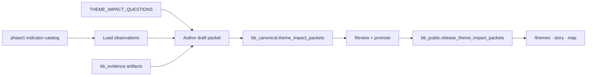

<!--
  Practical design for ThemeImpactPacket: field contract, Postgres mapping, domain types,
  surface notes, and redlining pilot checklist. Implements ADR-029.
-->

# Theme impact packet system — design

**Status:** Design locked (2026-07-22); v1 scaffold noted  
**ADR:** [ADR-029](../adr/ADR-029-theme-impact-packets.md)  
**Catalog:** [theme-impact-canonical-questions.md](./theme-impact-canonical-questions.md)  
**Domain:** `theme-impact-questions.ts`, `theme-impact-packet.ts`, `phase1-indicator-catalog.ts`  
**v1 migration:** `supabase/migrations/20260722160000_theme_impact_packets.sql` → `bb_reference.theme_impact_packets`  
**Methodology:** [juxtaposition-not-causation.md](../methodology/juxtaposition-not-causation.md)

## 1. Purpose

A **ThemeImpactPacket** is the composable public answer to one canonical question (`Q1`–`Q9`).
It references shared stats and evidence rows, declares geography and policy eras, labels method
stance and gaps, and projects unchanged to theme browse, story embeds, and map context panels.

This document is the implementation blueprint between the locked question catalog and the
**one metro × `redlining` pilot**.

## 2. Packet identity and lifecycle

| Stage | Storage | Who writes | Public read |
|-------|---------|------------|-------------|
| **v1 scaffold** | `bb_reference.theme_impact_packets` (`status` column) | research/publication staff | Yes when `status = 'published'` (RLS) |
| Draft (target) | `bb_canonical.theme_impact_packets` | research, publication staff | No |
| Candidate (target) | linked from `bb_canonical.publication_candidates` (optional) | publication | Admin preview only |
| Published (target) | `bb_public.release_theme_impact_packets` (+ optional snapshot JSON) | publication worker on promote | Yes (active release only) |

**v1 note:** The scaffold table is the working store for `/themes` fixtures and the first pilot
load. When the pilot enters ADR-004 release activation, migrate authoring to canonical + project
into `bb_public` — do not leave production publish SoT on the status-column table alone.

**Primary key (logical):** `{ question_id, theme_id, scope_key }` where `scope_key` encodes
pilot geography (e.g. `metro:chicago-il`) or `national` for spine packets. Entity-bound
variants add `entity_id` to `scope_key` or a dedicated column.

**Release invariant (ADR-004 target):** projection rows are insert-only per release; rollback switches
`bb_public.active_release`.

## 3. Field table

Core document fields (canonical draft + projected copy). JSONB column names in §4.

| Field | Type | Required | Description |
|-------|------|----------|-------------|
| `packet_id` | string | yes | Stable id (`tip-redlining-chi-q3-v1`) |
| `question_id` | `Q1`…`Q9` | yes | Must exist in `THEME_IMPACT_QUESTIONS` |
| `theme_id` | `ThemeImpactThemeId` | yes | Redundant check against question row |
| `answer_shape` | enum | yes | From question catalog (`artifact_timeline`, `geography`, …) |
| `title` | string | yes | Public headline (specific, not sweeping) |
| `summary` | string | no | Short lede; evidence-first |
| `policy_eras` | `{ id, label, span?, anchor_claim_ids? }[]` | conditional | Required when question uses era framing |
| `geography` | object | yes | See §3.1 |
| `observation_refs` | ref[] | conditional | Pointers to `statistical_observations.id` |
| `derived_refs` | ref[] | conditional | Pointers to `derived_measurements.id` |
| `claim_refs` | ref[] | conditional | Heritage `claims.id` for narrative / gated causal |
| `artifact_refs` | ref[] | conditional | `source_item_id`, optional `capture_id`, display role |
| `entity_context_binding_refs` | string[] | no | `entity_context_bindings.id` for entity-bound views |
| `entity_id` | string | no | Primary heritage entity when packet is place-bound (`Q4`) |
| `method_stance` | `juxtaposition` \| `gated_causal_claim` | yes | Default `juxtaposition` |
| `method_note` | string | yes | Human-readable stance (era roll-up, crosswalk notes) |
| `gap_states` | object | yes | See §3.2 |
| `citations` | `{ label, url?, claim_id?, observation_id? }[]` | yes | Human-facing citation list for UI footer |
| `disclaimer_key` | string | yes | e.g. `juxtaposition-v1` — maps to fixed product copy |
| `status` | `draft` \| `review` \| `published` | yes | Draft lane only until projected |
| `content_hash` | string | yes | Hash of composed public payload at publish |
| `created_at` / `updated_at` | timestamptz | yes | Audit |

### 3.1 `geography` object

```json
{
  "scope": "metro",
  "scope_key": "metro:chicago-il",
  "jurisdiction_ids": ["17031", "17043"],
  "boundary_version": "county-2020",
  "display_label": "Chicago metropolitan area (Cook + DuPage counties)",
  "holc_crosswalk_note": "HOLC polygons joined via 2020 county crosswalk — see method_note"
}
```

Flexible by theme (catalog §1). Always declare unit + `boundary_version` when indicators are
present. Map panels may narrow to a single `jurisdiction_id`; browse pages may use multi-county
metro scope.

### 3.2 `gap_states` object

```json
{
  "insufficient_evidence": false,
  "insufficient_evidence_reason": null,
  "modeled_metric_ids": ["oa-incarceration-outcome-black-tract"],
  "missing_series": ["hmda-denial-rate-black-county"],
  "era_coverage_gaps": ["cra_contemporary"]
}
```

| Flag | UI requirement |
|------|----------------|
| `insufficient_evidence: true` | Show explicit “insufficient evidence at this geography/era” — not an empty chart |
| `modeled_metric_ids` non-empty | Badge **Modeled estimate** on affected values; never label as observed custody counts |
| `missing_series` | Optional operator-facing list; public copy may summarize as “not yet published here” |

### 3.3 Ref row shapes (JSONB arrays)

**`observation_refs`**

```json
{
  "observation_id": "obs-acs-homeownership-black-17031-2022",
  "metric_id": "acs-homeownership-rate-black-county",
  "policy_era_id": "fair_housing",
  "role": "primary_outcome",
  "display_order": 1
}
```

**`derived_refs`**

```json
{
  "derived_id": "drv-era-delta-homeownership-holc-d-17031",
  "method_id": "era_delta",
  "policy_era_id": "holc_fha",
  "role": "era_change",
  "display_order": 2
}
```

**`claim_refs`**

```json
{
  "claim_id": "claim-fha-underwriting-1938",
  "role": "origins",
  "cleared_for_causal_language": false
}
```

Set `method_stance: 'gated_causal_claim'` only when at least one ref has
`cleared_for_causal_language: true` per confidence gate.

**`artifact_refs`**

```json
{
  "source_item_id": "si-holc-manual-1936",
  "capture_id": "cap-2026-01-12-holc-manual",
  "artifact_class": "primary_government_document",
  "timeline_date": "1936",
  "role": "timeline_anchor"
}
```

## 4. Postgres mapping

### 4.0 v1 scaffold (shipped)

`bb_reference.theme_impact_packets` — see migration `20260722160000_theme_impact_packets.sql`.
Columns: `id`, `question_id`, `theme_id`, `title`, `summary`, `policy_eras`, `geography`,
`method_stance`, `method_note`, `observations`, `derived`, `artifacts`, `gap_states`,
`entity_id` / `binding_purpose`, `status`, timestamps. RLS: published for anon; staff all.

### 4.1 Target DDL (ADR-004 promote)

Draft table **`bb_canonical.theme_impact_packets`** (research write; staff read):

| Column | Type | Notes |
|--------|------|-------|
| `packet_id` | text PK | |
| `question_id` | text NOT NULL | CHECK against allowlist Q1–Q9 |
| `theme_id` | text NOT NULL | |
| `scope_key` | text NOT NULL | UNIQUE with question_id |
| `entity_id` | text | FK → entities when place-bound |
| `answer_shape` | text NOT NULL | |
| `title` | text NOT NULL | |
| `summary` | text | |
| `policy_eras` | jsonb NOT NULL DEFAULT `'[]'` | |
| `geography` | jsonb NOT NULL | |
| `observation_refs` | jsonb NOT NULL DEFAULT `'[]'` | |
| `derived_refs` | jsonb NOT NULL DEFAULT `'[]'` | |
| `claim_refs` | jsonb NOT NULL DEFAULT `'[]'` | |
| `artifact_refs` | jsonb NOT NULL DEFAULT `'[]'` | |
| `entity_context_binding_refs` | jsonb NOT NULL DEFAULT `'[]'` | |
| `method_stance` | text NOT NULL CHECK IN (`juxtaposition`, `gated_causal_claim`) | |
| `method_note` | text NOT NULL | |
| `gap_states` | jsonb NOT NULL | |
| `citations` | jsonb NOT NULL DEFAULT `'[]'` | |
| `disclaimer_key` | text NOT NULL DEFAULT `'juxtaposition-v1'` | |
| `status` | text NOT NULL | draft / review |
| `metadata` | jsonb NOT NULL DEFAULT `'{}'` | |
| `created_at` / `updated_at` | timestamptz | |

Projection table **`bb_public.release_theme_impact_packets`**:

| Column | Type | Notes |
|--------|------|-------|
| `release_id` | uuid FK | `bb_publication.releases` |
| `packet_id` | text | |
| `payload` | jsonb NOT NULL | Frozen public document (field table §3) |
| `content_hash` | text NOT NULL | |
| `search_text` | text | Optional tsvector feed for `/themes` |
| PK | `(release_id, packet_id)` | Immutable insert |

**Shared base tables (compose-only, no duplication):**

| Base | Schema.table | Packet use |
|------|--------------|------------|
| Metric definitions | `bb_reference.statistical_series` | Resolve `metric_id` labels/units |
| Observations | `bb_reference.statistical_observations` | `observation_refs[].observation_id` |
| Derived / modeled | `bb_reference.derived_measurements` | `derived_refs[].derived_id`; honor `status` |
| Juxtaposition | `bb_reference.entity_context_bindings` | `entity_context_binding_refs` |
| Claims | `bb_canonical.claims` + versions | `claim_refs`; causal gate |
| Artifacts | `bb_evidence.source_items`, captures | `artifact_refs` |

RLS: anon SELECT on projection table **only** via view joining `bb_public.active_release`
(ADR-026 pattern). Canonical draft table: no anon policies.

## 5. Domain type mapping (target)

Add to `@repo/domain` (follow-on bead) — names align with existing statistics module:

```typescript
type ThemeImpactMethodStance = 'juxtaposition' | 'gated_causal_claim';

type ThemeImpactPacketRef = {
  readonly observationId?: string;
  readonly derivedId?: string;
  readonly claimId?: string;
  readonly sourceItemId?: string;
  readonly policyEraId?: string;
  readonly role: string;
  readonly displayOrder?: number;
};

type ThemeImpactGapStates = {
  readonly insufficientEvidence: boolean;
  readonly insufficientEvidenceReason?: string;
  readonly modeledMetricIds: readonly string[];
  readonly missingSeries?: readonly string[];
  readonly eraCoverageGaps?: readonly string[];
};

type ThemeImpactPacket = {
  readonly packetId: string;
  readonly questionId: string; // validated against THEME_IMPACT_QUESTIONS
  readonly themeId: ThemeImpactThemeId;
  readonly answerShape: ThemeImpactAnswerShape;
  readonly title: string;
  readonly summary?: string;
  readonly policyEras: readonly { readonly id: string; readonly label: string }[];
  readonly geography: ThemeImpactGeography;
  readonly observationRefs: readonly ThemeImpactPacketRef[];
  readonly derivedRefs: readonly ThemeImpactPacketRef[];
  readonly claimRefs: readonly ThemeImpactPacketRef[];
  readonly artifactRefs: readonly ThemeImpactPacketRef[];
  readonly entityContextBindingRefs?: readonly string[];
  readonly entityId?: string;
  readonly methodStance: ThemeImpactMethodStance;
  readonly methodNote: string;
  readonly gapStates: ThemeImpactGapStates;
  readonly citations: readonly { readonly label: string; readonly url?: string }[];
  readonly disclaimerKey: string;
};
```

**Validation helpers (target):**

- `assertThemeImpactPacketQuestionValid(packet)` — `question_id` + `theme_id` + `answer_shape`
  match `getThemeImpactQuestion`.
- `resolvePhase1BindingsForQuestion(question_id)` — already exists; use at authoring to suggest
  metrics, not to auto-fill observations.
- `assertThemeImpactPacketProvenance(resolved)` — every ref resolves; quartet present on each
  observation; derived inputs listed.

## 6. Relationship to Phase 1 catalog and question registry

| Layer | Module | Role |
|-------|--------|------|
| Question registry | `theme-impact-questions.ts` | **Which** questions exist; metric bindings (`phase1`, `proposed`, `derived`) |
| Metric definitions | `phase1-indicator-catalog.ts` | **What** Phase 1 series measure; seeds `statistical_series` |
| Observations | loaders → `statistical_observations` | **Values** packets reference by id |
| Packet | this system | **Composition** + era/geography/method/gap presentation |

**Binding flow for `Q3` (example):**

1. Question row lists `phase1` metric ids (homeownership, income, poverty, wealth, …).
2. Catalog definitions supply units, source tables, geography type.
3. Loaders ingest observations for pilot `jurisdiction_ids`.
4. Author builds packet with `observation_refs` (+ optional `derived_refs` for `era_delta`,
   `black_white_income_gap`).
5. Publish projects frozen payload; UI resolves refs to numbers + citations.

**Proposed metrics** (`holc-grade-area-share-city`, HMDA aggregates) appear in question bindings
but remain **`registry_state: disabled`** until ingestion beads open — packets should list them
in `gap_states.missing_series` until observations exist.

## 7. Surface wireframe notes

Same DTO; layout differs. Copper accent only for orientation (active question, selected era).

### 7.1 `/themes` browse

```
/themes/redlining
├── Theme header (title, posture line)
├── Policy era chips (holc_fha | fair_housing | cra_contemporary)
├── Question cards Q1–Q4 (P0 pilot)
│   ├── Question text (from registry)
│   ├── method_stance badge (Juxtaposition default)
│   ├── gap badge if insufficient_evidence or modeled
│   └── Deep link → /themes/redlining/q3?scope=metro:chicago-il
└── Footnote: disclaimer_key copy
```

Question detail page renders full packet: timeline (Q1), map snapshot (Q2), era chart grid (Q3),
place narrative (Q4).

### 7.2 Story embed

```
[ Story body ]
┌─ Theme impact embed ─────────────────────┐
│ Q3 · Housing-credit eras · Chicago metro │
│ [ era chart · homeownership + income ]      │
│ Citations (human list)                    │
│ ⓘ Context indicators … not causation      │
└──────────────────────────────────────────┘
```

Embed references `packet_id` + `release_id`; no inline stat literals without ref resolution.

### 7.3 Map context panel

```
Place entity panel
├── Heritage claims (existing)
├── Theme impact strip (when binding or metro packet exists)
│   ├── Linked question label (e.g. Q4 place narrative)
│   ├── 2–3 indicators from entity_context_bindings OR packet observation_refs
│   └── Fixed juxtaposition disclaimer
└── Link → full theme packet page
```

Map uses `entity_context_binding_refs` when present; otherwise falls back to metro-scoped packet
slice filtered by panel `jurisdiction_id`.

## 8. Redlining pilot readiness checklist

**Metro:** one chosen CBSA (operator selects; document in packet `scope_key`).

| # | Gate | Owner |
|---|------|-------|
| 1 | `Q1`–`Q4` draft packets authored for metro scope | research / publication |
| 2 | `mapping-inequality-holc` rights reviewed; HOLC observations or artifacts refs live — [Chicago pilot cite-only posture](./holc-chicago-pilot-attribution.md) | ingestion + evidence |
| 3 | Phase 1 ACS observations loaded for pilot counties | reference loaders |
| 4 | `entity_context_bindings` for at least one graded place entity (`Q4`) | curation |
| 5 | Every public number resolves with provenance quartet + human citation | QA |
| 6 | `method_stance` juxtaposition on all pilot packets unless gated claim cleared | editorial |
| 7 | `gap_states` honest for missing HMDA / wealth series — [explicit defer posture](./chicago-pilot-hmda-wealth-defer.md) | editorial |
| 8 | Release projection + active release smoke test | publication worker |
| 9 | `/themes/redlining` renders Q1–Q4 from active release | web |
| 10 | One story embed + one map panel consume same `packet_id`s | web |
| 11 | Geo-integrity gate passes for implicated entities | publication |
| 12 | No auto-causal language in copy review | editorial |

**Out of pilot scope:** `Q5`–`Q9`, public MCP, PostgREST theme views (optional after pilot QA).

## 9. Operator authoring flow (summary)



## 10. References

- [ADR-029](../adr/ADR-029-theme-impact-packets.md)
- [theme-impact-canonical-questions.md](./theme-impact-canonical-questions.md)
- [context-data-source-matrix.md](./context-data-source-matrix.md)
- [postgres-schema.md](../data/postgres-schema.md) — `bb_reference.statistical_*`
- Migration `20260721220000_statistical_series_observations.sql`
