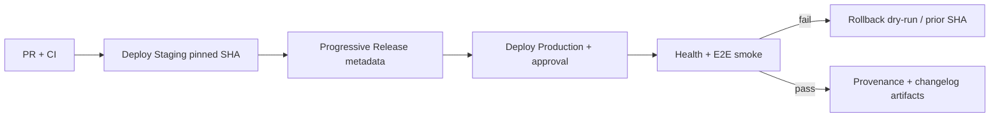

# Runbook: Production release pipeline

**Scope:** End-to-end release procedure for BlackStory — from merged PR through staging
validation, progressive release metadata, protected production approval, explicit App Hosting
promote, post-deploy health checks, and rollback rehearsal.

**Solo-dev hotfix loop (preferred for one-person prod bugs):** see
[solo-dev-hotfix.md](./solo-dev-hotfix.md) — branch from `main`, tiny PR, preflight lockfile +
`force-dynamic`, promote SHA staging→prod, smoke entity pages. Do **not** promote large
divergent feature branches to fix web prod.

**Repo acceptance:** Firestore migrate / surface deploy / rollback helpers stay **dry-run safe**.
App Hosting **promote is live** (`promote-app-hosting.sh`) when Environment WIF vars are set;
without WIF, run the same script locally with Firebase CLI auth. Automatic App Hosting rollouts
remain disabled.

**Architecture anchors:** [ADR-006](../adr/ADR-006-github-actions-deployment.md),
[ADR-011](../adr/ADR-011-firestore-system-of-record.md) (Firestore rules/indexes before traffic;
Postgres migrations parked).

---

## Pipeline overview



| Stage | Workflow | Gate |
|-------|----------|------|
| PR validation | `.github/workflows/ci.yml` | Required status checks (unchanged) |
| Security scans | `.github/workflows/security.yml` | High/critical findings block release |
| Staging deploy | `.github/workflows/deploy-staging.yml` | Pinned `commit_sha`; optional `staging` branch push |
| Release metadata | `.github/workflows/progressive-release.yml` | Changelog + provenance for tested SHA |
| Production deploy | `.github/workflows/deploy-production.yml` | Protected `production` environment approval |
| Uptime canary | `.github/workflows/canary-uptime.yml` | Optional; reset baseline after verified deploy |

---

## AC #1 — Automatic App Hosting rollouts are disabled

Automatic App Hosting rollouts **must remain disabled** in the Firebase console and in any
GitHub→Firebase integration. Production traffic moves only through explicit promote steps in
`deploy-staging.yml` / `deploy-production.yml`.

**Human steps (once Blaze + backends exist):**

1. Open Firebase console → App Hosting → backend (`black-book-web-production`).
2. Confirm **automatic rollouts** / GitHub auto-deploy hooks are **off**.
3. Repeat for `black-book-web-staging` if used.
4. Record evidence (screenshot or CLI output) in the release ticket.

**Repo enforcement:**

- `node infra/github/release-pipeline/assert-no-auto-rollout.mjs` (also runs in deploy workflows)
- `apps/web/apphosting.production.yaml` documents the policy
- Deploy workflows use `promote-app-hosting.sh` (live OIDC promote) — never `on: push: branches: [main]`

---

## AC #2 — Deploy only the tested commit (pinned SHA)

Never deploy `main` or `@latest`. Every deploy workflow requires a full 40-character git SHA that
passed CI on that exact commit.

**Staging:**

```bash
gh workflow run deploy-staging.yml \
  -f commit_sha="$(git rev-parse HEAD)" \
  -f confirm=deploy-staging
```

Requires GitHub Environment `staging` vars `GCP_WORKLOAD_IDENTITY_PROVIDER` and
`GCP_SERVICE_ACCOUNT` (after `infra/github/scripts/apply-wif.sh --apply`). Until WIF is live,
promote the same SHA locally:

```bash
bash infra/github/release-pipeline/promote-app-hosting.sh "$(git rev-parse HEAD)" staging
```

Or push to the `staging` branch (uses `github.sha` from the push event).

**Production:**

```bash
TESTED_SHA="<40-char-sha-from-staging>"
gh workflow run progressive-release.yml \
  -f commit_sha="$TESTED_SHA" \
  -f confirm=release

gh workflow run deploy-production.yml \
  -f commit_sha="$TESTED_SHA" \
  -f prior_release_sha="<optional-prior-good-sha>" \
  -f confirm=deploy
```

Local promote (same script GHA runs) when Environment `production` WIF vars are not set yet:

```bash
bash infra/github/release-pipeline/promote-app-hosting.sh "$TESTED_SHA" production
```

Download `deployment-provenance-<sha>` artifact and verify `git.commitSha` matches `TESTED_SHA`.

---

## AC #3 — Production requires protected environment approval

Configure the GitHub `production` environment before the first live deploy:

```bash
gh api --method PUT "repos/OWNER/REPO/environments/production" \
  --input infra/github/oidc/environments/production.json
```

Set environment variables (names only — no JSON SA keys):

| Variable | Purpose |
|----------|---------|
| `GCP_PROJECT_ID` | `black-book-efaaf` |
| `GCP_WORKLOAD_IDENTITY_PROVIDER` | WIF provider resource name |
| `GCP_SERVICE_ACCOUNT` | `github-deploy@black-book-efaaf.iam.gserviceaccount.com` |
| `HEALTH_CHECK_URL` | HTTPS production health endpoint (optional until live) |
| `CI_REQUIRE_HEALTH_CHECK` | Set `1` to fail-closed when URL unset |
| `E2E_BASE_URL` | Post-deploy smoke target (optional until live) |
| `CI_REQUIRE_E2E` | Set `1` to fail-closed when E2E URL unset |

Jobs with `environment: production` pause for required reviewers configured in
`infra/github/oidc/environments/production.json`.

---

## AC #4 — Migrations / rules sequencing before traffic

Per [ADR-020](../adr/ADR-020-supabase-postgres-system-of-record.md), **Supabase Postgres** is the
product system of record (`bb_public.*`). **Firebase App Hosting** remains the web/admin runtime
host, and **Firebase Storage / GCS** remains the blob store. Firestore is wind-down / rollback only
([firebase-wind-down.md](../data/firebase-wind-down.md)) — not a live public-read backend.

Before App Hosting or API surfaces receive incompatible traffic:

1. **Postgres migrations / schema** applied to the target Supabase project (when schema changed)
2. **Storage rules** (if blob ACL changed) — still under `infra/firebase/`
3. **App Hosting explicit promote** (pinned SHA) — do not disable this path
4. **Cloud Run / api-public deploy** with `PUBLIC_DATA_SOURCE=postgres` + `DATABASE_URL` (if API changed)
5. **Firestore rules/indexes** only when touching rollback/legacy surfaces (optional during wind-down)

**Human commands (after checkout of pinned SHA):**

```bash
# Blob ACL (keep — Storage is still live)
firebase deploy --only storage \
  --project=black-book-efaaf --config=infra/firebase/firebase.json

# Web/admin host (keep — App Hosting is still live)
bash infra/github/release-pipeline/promote-app-hosting.sh "$TESTED_SHA" production

# Optional during wind-down only:
# firebase deploy --only firestore:rules,firestore:indexes \
#   --project=black-book-efaaf --config=infra/firebase/firebase.json
```

CI may still run `migrate-firestore-dry-run.sh` as a historical gate; live public reads use Postgres.

---

## AC #5 — Rollback procedure (tested dry-run)

On failed health check or E2E smoke, `deploy-production.yml` triggers `rollback-on-failure` which
runs `rollback-dry-run.sh`.

**Local dry-run test (safe — no cloud writes):**

```bash
GOOD_SHA="$(git rev-parse HEAD~1)"
BAD_SHA="$(git rev-parse HEAD)"
bash infra/github/release-pipeline/rollback-dry-run.sh "$GOOD_SHA" "$BAD_SHA" production
node infra/github/release-pipeline/release-pipeline.test.mjs
```

**Operator rollback (live):**

1. Engage publication kill switch — see [incident-response.md](./incident-response.md)
2. Re-run `deploy-production.yml` with `commit_sha=<prior-good-sha>`
3. Promote prior App Hosting rollout for that SHA
4. Repoint `publicMeta/activeRelease` if publication metadata changed — see
   [recovery-rollback-rehearsal.md](./recovery-rollback-rehearsal.md)
5. Run `canary-uptime.yml` with `reset_baseline: true` after verification

---

## Security scans

`security.yml` runs on PRs and `main` pushes. Before production:

- Confirm latest `security.yml` run is green for the deploy SHA
- Optionally run staging DAST:

```bash
gh workflow run security.yml \
  -f staging_base_url="https://staging.example.blackbook.app" \
  -f staging_identity_label="ds-security-dast-release-001"
```

---

## Release provenance and changelog

Artifacts:

| File | Producer |
|------|----------|
| `artifacts/deployment-provenance.json` | `write-provenance.mjs` |
| `artifacts/release-changelog.md` | `generate-changelog.mjs` |

Schema: `infra/github/release-metadata/deployment-provenance.schema.json`

Validate locally:

```bash
node infra/github/release-pipeline/write-provenance.mjs  # requires PROVENANCE_* env
node infra/github/release-pipeline/validate-provenance.mjs artifacts/deployment-provenance.json
```

---

## Local validation (no cloud)

```bash
node infra/github/release-pipeline/release-pipeline.test.mjs
node scripts/release/run-pipeline-checks.mjs
node scripts/validate-github-governance.mjs
```

---

## Human cloud prerequisites (deferred until remote + Blaze)

See [production-cloud-apply-checklist.md](./production-cloud-apply-checklist.md) sections 1–4:

1. GitHub remote + rulesets + WIF (`infra/github/scripts/apply-wif.sh --apply`)
2. Protected `production` environment
3. Firebase Blaze + App Hosting backends with **automatic rollouts disabled**
4. Firestore named databases + rules deploy targets

**Status:** DEFERRED — repo delivers workflow shape and dry-run scripts only.
