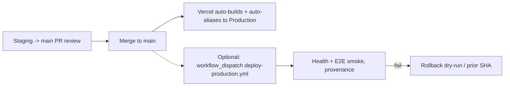

# Runbook: Production release pipeline

> **2026-08-15:** Admin App Hosting + Cloud Run `black-book-admin-production` are deleted. Do not
> recreate them. **2026-09-11 (repo-z3g1f):** the standalone `apps/admin` Vercel project was itself
> retired — admin is now a staff-gated route group inside `apps/web`, deployed with public web as
> one Vercel project. The Admin/App-Hosting and Firestore-rules steps below are historical. Public
> web / Vercel guidance is current and now covers admin too.

**Scope:** End-to-end release procedure for BlackStory — from merged PR through staging
validation, the staging → main release merge, post-deploy health checks, and rollback rehearsal.

**There is no manual Vercel promote gate.** Public web (and admin, which now deploys inside the
same `apps/web` Vercel project) has no separate "Promote to Production" step. Vercel's git
integration builds and aliases every commit landed on `main` straight to `blackstory.app` and
`www.blackstory.app`, automatically, with no human step in between (confirmed 2026-08-05 on PR
\#116 and again 2026-08-12 on PR \#130 — repo-8ary, repo-h1b2). **The real release gate is the
staging → main PR itself** — the deliberate, separate action described in this repo's root
`CLAUDE.md` under "Branching & Release Policy." Approve that PR only when `staging` is in a state
you want live, because merging it **is** the production release.

**Solo-dev hotfix loop (preferred for one-person prod bugs):** see
[solo-dev-hotfix.md](./solo-dev-hotfix.md) — branch from `main`, tiny PR, preflight lockfile +
`force-dynamic`, merge to `main`, smoke Production directly (merging already shipped it — there is
no separate promote step to run first). Do **not** merge large divergent feature branches to fix
web prod; the merge commit goes live immediately.

**Repo acceptance:** Firestore migrate / surface deploy / rollback helpers stay **dry-run safe**.
**Public web** (including admin) deploys via **Vercel** git integration on merge to `main` — no
separate promote. `.github/workflows/deploy-production.yml` does not gate that traffic; it is a
separately workflow-dispatched pipeline for provenance recording and optional post-hoc health/E2E
checks against a pinned SHA, and its Cloud Run "surface" steps are a dry-run plan, not a live
deploy (see its own "no live apply" comment). Deploy workflows do not promote App Hosting, which is
retired.

**Architecture anchors:** [ADR-006](../adr/ADR-006-github-actions-deployment.md),
[ADR-027](../adr/ADR-027-vercel-public-web-hosting.md),
[ADR-011](../adr/ADR-011-firestore-system-of-record.md) (Firestore rules/indexes before traffic;
Postgres migrations parked).

---

## Pipeline overview


```mermaid
flowchart LR
  PR[Staging -> main PR review] --> MERGE[Merge to main]
  MERGE --> WEB[Vercel auto-builds + auto-aliases to Production]
  MERGE -.-> OPT[Optional: workflow_dispatch deploy-production.yml]
  OPT --> HC[Health + E2E smoke, provenance]
  HC -->|fail| RB[Rollback dry-run / prior SHA]
```

Public web (and admin) traffic changes at the `MERGE` step, not at `OPT`. The optional workflow
records provenance and can run health/E2E checks against a pinned SHA after the fact; it is not
what puts the merge commit in front of users.

| Stage | Workflow | Gate |
|-------|----------|------|
| PR validation | `.github/workflows/ci.yml` | Required status checks (unchanged) |
| Security scans | `.github/workflows/security.yml` | High/critical findings block release |
| Staging deploy | `.github/workflows/deploy-staging.yml` | Pinned `commit_sha`; optional `staging` branch push |
| **Public web + admin release** | **Vercel git integration** | **staging → main PR review/merge (see CLAUDE.md Branching & Release Policy) — merge itself is the production deploy; no separate promote** |
| Release metadata (optional, post-hoc) | `.github/workflows/progressive-release.yml` | Changelog + provenance for a pinned SHA |
| Production pipeline (optional, post-hoc) | `.github/workflows/deploy-production.yml` | Protected `production` environment approval gates provenance/health checks only, not Vercel traffic |
| Uptime canary | `.github/workflows/canary-uptime.yml` | Optional; reset baseline after verified deploy |

---

## AC #1 — Automatic App Hosting rollouts are disabled (admin)

**Historical — App Hosting itself was deleted 2026-08-15 and admin moved into `apps/web` on
2026-09-11 (repo-z3g1f); nothing below this line needs doing.** Public web (and admin, now part of
the same deploy) Production traffic moves automatically when a commit lands on `main` — Vercel's
git integration builds and aliases it to Production with no explicit promote step (repo-8ary,
repo-h1b2). What this AC actually guards is that nothing in this repo's own GitHub Actions
workflows adds an *additional*, unattended auto-deploy path (App Hosting's old auto-rollout hooks).

**Human steps (admin backend) — historical, App Hosting no longer exists:**

1. ~~Open Firebase console → App Hosting → backend (`black-book-admin-production`).~~
2. ~~Confirm **automatic rollouts** / GitHub auto-deploy hooks are **off**.~~
3. ~~Record evidence (screenshot or CLI output) in the release ticket.~~

**Repo enforcement:**

- `node infra/github/release-pipeline/assert-no-auto-rollout.mjs` (also runs in deploy workflows)
- `apphosting.admin.yaml` documents the policy
- Deploy workflows record Vercel expectations and run gates — they do **not** call App Hosting
  promote helpers; never `on: push: branches: [main]` for production deploy

Public web App Hosting configs are retired; there is no `black-book-web-*` promote path.

---

## AC #2 — Deploy only the tested commit (pinned SHA)

Never deploy `main` or `@latest` for Cloud Run. Every workflow_dispatch deploy workflow requires a
full 40-character git SHA that passed CI on that exact commit — but public web has no such
dispatch step; see below.

**Public web (Vercel) — merge is the deploy:**

1. Merge the staging → main PR — this is the release action (CLAUDE.md Branching & Release
   Policy); do it only when `staging` is in a state you want live.
2. Vercel's git integration builds the merge commit and aliases it straight to
   `blackstory.app` / `www.blackstory.app` as Production — automatically, within seconds, with no
   dashboard step and no `vercel promote` command to run.
3. Smoke Production directly (there is no separate Preview-then-promote step for `main`; Preview
   builds only exist for non-`main` branches/PRs).
4. Confirm the live SHA (Vercel dashboard deployment detail, or `x-vercel-id` / deployment API)
   matches the merge commit — this is verification after the fact, not a gate before it.

**Staging (APIs):**

```bash
gh workflow run deploy-staging.yml \
  -f commit_sha="$(git rev-parse HEAD)" \
  -f confirm=deploy-staging
```

Requires GitHub Environment `staging` vars `GCP_WORKLOAD_IDENTITY_PROVIDER` and
`GCP_SERVICE_ACCOUNT` (after `infra/github/scripts/apply-wif.sh --apply`). Public web staging is a
Vercel Preview built from the `staging` branch — smoke it before opening the staging → main PR.

Admin has no separate rollout step: since 2026-09-11 (repo-z3g1f) `/admin` is a staff-gated route
group inside `apps/web` itself, not a separate app or Vercel project — it deploys automatically
with the same public web Vercel build described above. (App Hosting `black-book-admin-production`
was deleted 2026-08-15 and does not exist; do not run `firebase apphosting:rollouts:create` against
it.) Credential isolation for admin's write-capable database access now lives at the credential
layer (`ADMIN_DATABASE_URL`, distinct from the public `DATABASE_URL`), not the process layer.

**Production pipeline (APIs; optional and post-hoc for public web):**

```bash
TESTED_SHA="<40-char-sha, e.g. the staging -> main merge commit>"
gh workflow run progressive-release.yml \
  -f commit_sha="$TESTED_SHA" \
  -f confirm=release

gh workflow run deploy-production.yml \
  -f commit_sha="$TESTED_SHA" \
  -f prior_release_sha="<optional-prior-good-sha>" \
  -f confirm=deploy
```

For public web/admin this pipeline runs *after* the fact — the merge already shipped the SHA to
Vercel Production. What it adds is provenance and optional health/E2E checks against that pinned
SHA; its Cloud Run "surface deploy" step is a dry-run plan, not a live deploy. Download the
`deployment-provenance-<sha>` artifact and verify `git.commitSha` matches `TESTED_SHA`.

---

## AC #3 — `deploy-production.yml` requires protected environment approval

This approval gates the optional, workflow_dispatch-only `deploy-production.yml` pipeline
(provenance, changelog, and health/E2E checks). **It does not gate Vercel public web/admin
traffic** — that already moved when the staging → main PR was merged, per AC #2. Configure the
GitHub `production` environment before relying on this pipeline's checks:

```bash
gh api --method PUT "repos/OWNER/REPO/environments/production" \
  --input infra/github/oidc/environments/production.json
```

Set environment variables (names only — no JSON SA keys):

| Variable | Purpose |
|----------|---------|
| `GCP_PROJECT_ID` | `black-book-efaaf` |
| `GCP_WORKLOAD_IDENTITY_PROVIDER` | WIF provider resource name |
| `GCP_SERVICE_ACCOUNT` | `github-deploy@black-book-efaaf.iam.gserviceaccount.com` |
| `HEALTH_CHECK_URL` | HTTPS production health endpoint (optional until live) |
| `CI_REQUIRE_HEALTH_CHECK` | Set `1` to fail-closed when URL unset |
| `E2E_BASE_URL` | Post-deploy smoke target (optional until live) |
| `CI_REQUIRE_E2E` | Set `1` to fail-closed when E2E URL unset |

Jobs with `environment: production` pause for required reviewers configured in
`infra/github/oidc/environments/production.json`.

---

## AC #4 — Migrations / rules sequencing before traffic

Per [ADR-020](../decisions-carryover.md) (`docs/adr/` was purged 2026-07-24; the precedence rule is
restated in `docs/decisions-carryover.md`), **Supabase Postgres** is the
product system of record (`bb_public.*`). **Admin** is a staff-gated route group inside `apps/web`
(since 2026-09-11, repo-z3g1f) — it has no separate host or promote step, it deploys with public
web. **Firebase Storage / GCS** remains the blob store. Firestore is
wind-down / rollback only ([firebase-wind-down.md](../data/firebase-wind-down.md)) — not a live
public-read backend. **Public web** is Vercel (ADR-027).

Before public web / API surfaces receive incompatible traffic:

1. **Postgres migrations / schema** applied to the target Supabase project (when schema changed)
2. **Storage rules** (if blob ACL changed) — still under `infra/firebase/`
3. **Merge staging → main** — when public web or admin changed, this one PR merge is the deploy
   (Vercel builds and aliases it to Production automatically; there is no separate promote command)
4. **Cloud Run / api-public deploy** with `PUBLIC_DATA_SOURCE=postgres` + `DATABASE_URL` (if API changed)
5. **Firestore rules/indexes** only when touching rollback/legacy surfaces (optional during wind-down)

**Human commands (after checkout of pinned SHA):**

```bash
# Blob ACL (keep — Storage is still live)
firebase deploy --only storage \
  --project=black-book-efaaf --config=infra/firebase/firebase.json

# Public web + admin: no command here — merging the staging -> main PR (step 3 above)
# already deployed it via Vercel's git integration.

# Optional during wind-down only:
# firebase deploy --only firestore:rules,firestore:indexes \
#   --project=black-book-efaaf --config=infra/firebase/firebase.json
```

CI may still run `migrate-firestore-dry-run.sh` as a historical gate; live public reads use Postgres.

---

## AC #5 — Rollback procedure (tested dry-run)

On failed health check or E2E smoke, `deploy-production.yml` triggers `rollback-on-failure` which
runs `rollback-dry-run.sh`.

**Local dry-run test (safe — no cloud writes):**

```bash
GOOD_SHA="$(git rev-parse HEAD~1)"
BAD_SHA="$(git rev-parse HEAD)"
bash infra/github/release-pipeline/rollback-dry-run.sh "$GOOD_SHA" "$BAD_SHA" production
node infra/github/release-pipeline/release-pipeline.test.mjs
```

**Operator rollback (live):**

1. Engage publication kill switch — see [incident-response.md](./incident-response.md)
2. **Public web + admin:** on Vercel, redeploy/promote the prior known-good Production deployment
   (dashboard "Instant Rollback" or `vercel promote <deployment-url>`) — this is a genuine rollback
   action, distinct from the forward release path in AC #2, which has no equivalent manual step
   (one deployment covers both surfaces — admin has no separate host to roll back)
3. **APIs:** Re-run `deploy-production.yml` with `commit_sha=<prior-good-sha>`
4. Repoint `publicMeta/activeRelease` if publication metadata changed — see
   [recovery-rollback-rehearsal.md](./recovery-rollback-rehearsal.md)
5. Run `canary-uptime.yml` with `reset_baseline: true` after verification

---

## Security scans

`security.yml` runs on PRs and `main` pushes. Before production:

- Confirm latest `security.yml` run is green for the deploy SHA
- Optionally run staging DAST:

```bash
gh workflow run security.yml \
  -f staging_base_url="https://staging.example.blackbook.app" \
  -f staging_identity_label="ds-security-dast-release-001"
```

---

## Release provenance and changelog

Artifacts:

| File | Producer |
|------|----------|
| `artifacts/deployment-provenance.json` | `write-provenance.mjs` |
| `artifacts/release-changelog.md` | `generate-changelog.mjs` |

Schema: `infra/github/release-metadata/deployment-provenance.schema.json`

Validate locally:

```bash
node infra/github/release-pipeline/write-provenance.mjs  # requires PROVENANCE_* env
node infra/github/release-pipeline/validate-provenance.mjs artifacts/deployment-provenance.json
```

---

## Local validation (no cloud)

```bash
node infra/github/release-pipeline/release-pipeline.test.mjs
node scripts/release/run-pipeline-checks.mjs
node scripts/validate-github-governance.mjs
```

---

## Human cloud prerequisites (deferred until remote + Blaze)

See [production-cloud-apply-checklist.md](./production-cloud-apply-checklist.md) sections 1–4:

1. GitHub remote + rulesets + WIF (`infra/github/scripts/apply-wif.sh --apply`)
2. Protected `production` environment
3. Firebase Blaze + admin App Hosting backend with **automatic rollouts disabled**
4. Firestore named databases + rules deploy targets

**Status:** DEFERRED — repo delivers workflow shape and dry-run scripts only.
