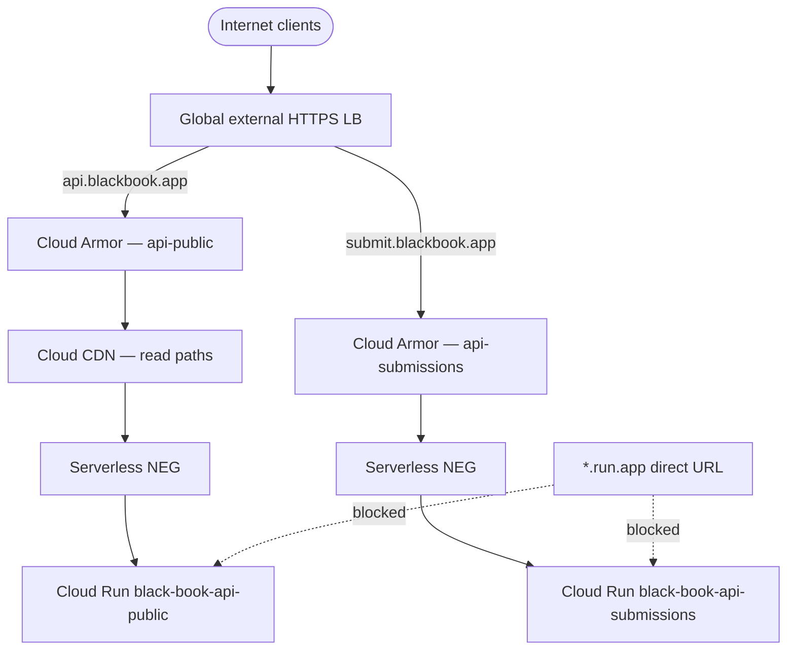

# Protected public API ingress and Cloud Armor (BB-023)

**Status:** Design + declarative stubs in-repo. Live GCP resources are **not** provisioned by
this bead.  
**Machine source:** [`../../infra/gcp/armor/ingress-matrix.json`](../../infra/gcp/armor/ingress-matrix.json)  
**ADR:** [ADR-005](../adr/ADR-005-service-surface-separation.md), [ADR-010](../adr/ADR-010-security-and-abuse-assumptions.md)  
**Threats:** [T-01](./threat-model.md#t-01-volumetric-and-application-layer-denial-of-service), [T-19](./threat-model.md#t-19-search-scraping-and-corpus-extraction)

## Objective

Expose `api-public` and `api-submissions` to the internet **only** through a global external
HTTP(S) load balancer with Cloud Armor. Block direct access to Cloud Run `*.run.app` URLs.
Cache safe read responses at the edge. Provide emergency deny controls that do not require an
application redeploy.

## Architecture



## Surfaces in scope

| Surface | Hostname (design) | Cloud Run service | CDN | Armor policy |
|---------|-------------------|-------------------|-----|--------------|
| `api-public` | `api.blackbook.app` | `black-book-api-public` | Yes (read paths) | `black-book-api-public-armor` |
| `api-submissions` | `submit.blackbook.app` | `black-book-api-submissions` | No | `black-book-api-submissions-armor` |

Out of scope for BB-023: `api-internal` (private ingress), `admin` (IAP + LB), `web` (App Hosting CDN).

## Cloud Armor policy summary

Both policies include:

| Priority | Control | Default |
|----------|---------|---------|
| 10 | Emergency deny slot | `allow` (flip to `deny(403)` via gcloud) |
| 100–120 | Preconfigured WAF (SQLi, XSS, RCE) | `deny(403)` |
| 200–210 | Rate-based ban per IP | `deny(429)` with ban duration |
| 900 | Geographic restriction placeholder | **Disabled** (`preview`, match `false`) |
| max | Default allow | `allow` |

Submissions limits are **stricter** than public read (lower per-minute thresholds, longer bans).
Policy JSON: [`../../infra/gcp/armor/policies/`](../../infra/gcp/armor/policies/).

## Geographic controls

**Default: OFF.** Do not enable country/region blocks without documented abuse evidence,
impact review, and rollback plan. See
[`../../infra/gcp/armor/geo-controls.md`](../../infra/gcp/armor/geo-controls.md).

## Direct Cloud Run URL posture

Both public APIs deploy with:

```text
ingress = internal-and-cloud-load-balancing
```

This ensures:

- Traffic from the global LB (via serverless NEG) reaches the service.
- Direct `https://SERVICE-xxx.run.app` requests from the public internet **fail**.

Negative test procedure: [`../../infra/gcp/armor/load-test-plan.md`](../../infra/gcp/armor/load-test-plan.md) § `direct-url-negative-test`.

> **Note:** [`infra/gcp/surfaces/surface-matrix.json`](../../infra/gcp/surfaces/surface-matrix.json)
> still lists legacy `ingress: "all"` for historical BB-021 stubs. **BB-023 supersedes** that
> deploy target for public APIs — apply `internal-and-cloud-load-balancing` at provisioning time.

## Cloud CDN

Enabled on `api-public` for cacheable GET responses (`/v1/search`, `/v1/entities/*`,
`/v1/locations/nearby`, `/health`). Submissions must never be edge-cached.

Details: [`../../infra/gcp/armor/cdn-design.md`](../../infra/gcp/armor/cdn-design.md).

## Emergency deny (no code deploy)

Pre-provisioned Armor rule **priority 10** on each policy. Activation:

```bash
gcloud compute security-policies rules update 10 \
  --security-policy=black-book-api-public-armor \
  --action=deny-403 \
  --project=black-book-efaaf
```

Full runbook: [`../../infra/gcp/armor/emergency-deny-runbook.md`](../../infra/gcp/armor/emergency-deny-runbook.md).

## Metrics and alerts

Monitor throttles (429), WAF denials (403), backend 5xx, and adaptive protection alerts.
Checklist: [`../../infra/gcp/armor/metrics-alerts-checklist.md`](../../infra/gcp/armor/metrics-alerts-checklist.md).

## Acceptance mapping

| Criterion | Evidence in repo |
|-----------|------------------|
| Internet traffic only through LB | `ingress-matrix.json` → `internetTrafficOnlyThroughLb`; `armor-policy.test.mjs` |
| Direct `run.app` fails | `cloudRunIngress` fields; `load-test-plan.md` |
| Rate limits return 429 | Policy `rateLimitOptions.exceedAction`; load-test stub |
| Denials/throttles observable | `metrics-alerts-checklist.md` |
| Emergency deny without deploy | Rule 10 + `emergency-deny-runbook.md` + `emergency-deny-snippet.yaml` |

## Validation commands

```bash
cd infra/gcp/armor
node --test armor-policy.test.mjs
```

Schema validation command in [`../../infra/gcp/armor/README.md`](../../infra/gcp/armor/README.md).

## Human provisioning (ordered)

1. Apply Cloud Armor policies (`policies/*.json`).
2. Create serverless NEGs and backend services; enable CDN on public backend only.
3. Create global external HTTPS load balancer, certificates, and DNS records.
4. Update Cloud Run ingress to `internal-and-cloud-load-balancing` for both public APIs.
5. Run load-test plan stub (staging); wire Monitoring alerts.
6. Update `ingress-matrix.json` `status` to `applied` when complete.

## Related

- [Service surfaces](./service-surfaces.md) (BB-021)
- [Abuse cases](./abuse-cases.md) — AC-01, AC-02, AC-19
- [ALB / NEG design](../../infra/gcp/armor/alb-neg-design.md)
- Follow-on beads: BB-025 (app quotas), BB-034 (telemetry), BB-059 (live load tests)
