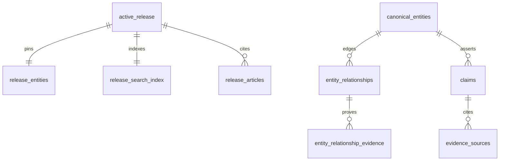

# v10 schema and cost audit

**Status:** source-validated draft (2026-08-31).  
**Parent:** [`../design-direction-v10.md`](../design-direction-v10.md).  
**Branch:** `cursor/v10-modernization`.

## Persistence one-liner

**Write:** canonical/research (`bb_canonical`, `bb_research`, …) → publication → `bb_public` release projections + Storage/CDN artifacts.  
**Read:** active-release pointer + CDN/SQL catalogs for map/list/search; point SQL for Place.  
No Prisma/Drizzle live path; Firebase not on the public read path.

## ERD (compact)



Typed relationship vocabulary (20 types) lives on `bb_canonical.entity_relationships` — see migration `20260729203000_entity_relationships_type_check.sql`.

## Measured sizes (ops-cited; no artifacts in repo)

| Artifact / pull | Size / scale |
|---|---|
| `entities.json` | ~14–16 MB |
| Full `release_entities` SQL | ~7.4 MB / ~4k rows |
| Full `search_index` | ~2.1 MB / ~4k docs |
| `/atlas/catalog` gzipped | ~949 KB |
| Door `/` after shell split | ~33.6 KB gzipped HTML (was multi-MB RSC) |

## Query access graph

```text
Door `/`
 ├─ getSharedPublicEntities (full catalog — cost risk) → HTML pin plate
 └─ about copy (static)

Atlas `/explore`
 ├─ shell + getSharedPublicEntities (bootstrap)
 ├─ GET /atlas/catalog (CDN; entities + graph + cites)
 └─ selected record preview on demand

Records `/records`
 └─ full PublicEntityView catalog → in-memory facets (cost risk; must keep ungeocoded)

Place `/place/[slug]`
 ├─ point-get release_entities (+ neighbor batches)
 └─ citing stories (may scan release_articles — cost risk)

Search `/search/api`
 └─ search_index artifact/SQL → in-memory facets (KEEP)

Books / Law / Data
 └─ materialized_snapshots or release_* tables (KEEP)
```

## KEEP AS IS

- Active-release pointer + `release_entities` / `search_index` as public SoR
- CDN release artifacts + watermark skip on publish
- Place/entity point-get + bounded neighbor batches
- Atlas shell vs separately cacheable catalog split
- Separate search_index (no full-entity rebuild for typeahead)
- In-memory facets over denormalized catalog/index
- Graph TTL + single-flight; public-read egress monitoring
- Small `pg.Pool` (pooler URL)
- **Release catalog over viewport SQL** at ~4k entities (CDN catalog ~949KB gz for atlas; entities artifact ~14–16MB). No bbox SQL today; do not replace with ideology.

## Cost findings

| Current cost driver | Evidence | Cause | UX impact | Recommended change | Expected savings | Confidence | Migration risk |
|---|---|---|---|---|---|---|---|
| Full `release_entities` SQL on artifact miss | ~253GB/20d incident cited in ops notes; ~7.4MB/~4k rows | CDN miss falls through to SQL | Latency + egress spike | Keep artifact origin hot; alert on misses | Large on miss days | High | Low |
| Door + Records hydrate full catalog | `door-home.tsx`, `records/page.tsx` | Shared full-entity load | Slow TTFB; memory | Door: skip Atlas shell (done). Records: request-scoped index cache (done). search_index slim blocked until evidence/confidence is projected | Medium–High | High | Medium |
| Place cites via full articles list | `home-first-paint` cite resolution | No per-entity cites index | Place cost grows with corpus | Per-entity cites snapshot in release | High at scale | High | Medium |
| `/atlas/catalog` cold rebuild + cites | ~949KB gz | Cold path rebuild | First Explore slow | Cache cites with catalog | Medium | Medium | Low |
| In-place edits without bumping `activated_at` | 30m cache key staleness | Watermark not in key | Stale public data | Include hash/watermark in cache key | Correctness | High | Low |

## Map architecture decision

**Option A (release catalog) wins** at current scale.  
Option B (viewport SQL) and Option C (tiles) deferred until catalog growth makes full hydrate dominate (well beyond ~4k).

## Schema gaps for richer Place UX

- Public projection of typed `entity_relationships` (batched, depth-limited) for Constellation
- Per-entity citing-stories index (avoid full article scan)
- Optional compact Place read model bundling identity + geo + evidence summary + edge counts
- Do **not** hydrate full evidence arrays into map catalog

## Observability before/after Place work

Measure: Place request DB query count, bytes, cite resolution path, relationship batch size, LCP on `/place/*`.
